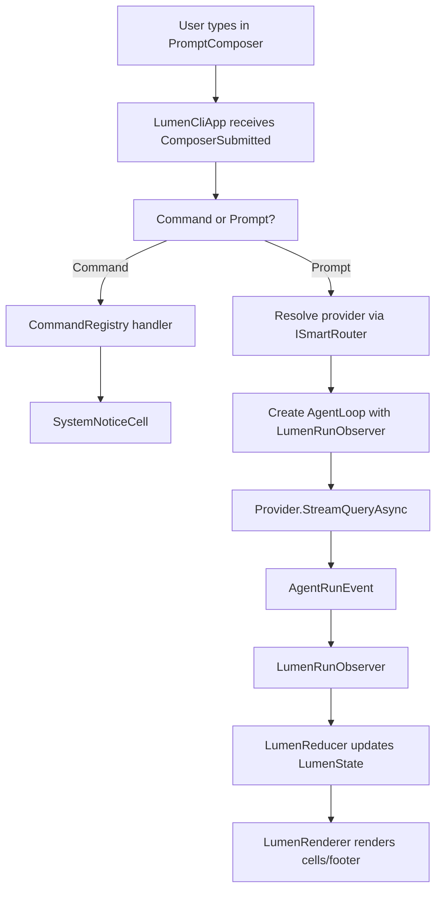
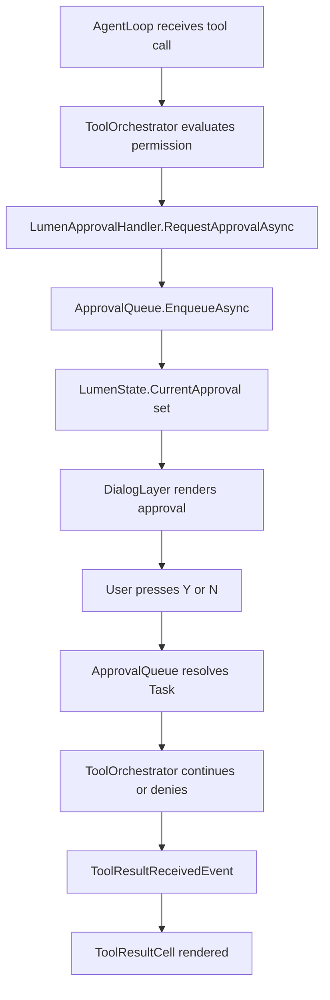
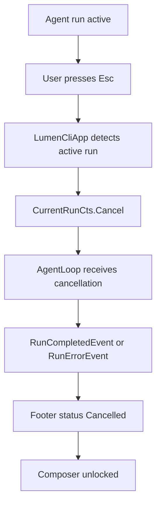

# Project Lumen: Claude4Net CLI UI Redesign

## 0. 문서 목적

이 문서는 `Claude4Net` CLI UI 개선 작업의 단일 실행 계획서다.

작업자는 이 문서만 보고도 구현을 시작할 수 있어야 한다. 별도로 `gemini-cli`, `codex`, `unkown` 참고 프로젝트를 다시 열 필요가 없도록, 세 프로젝트에서 배워야 할 UI 설계 패턴을 이 문서 안에 모두 요약하고 `Claude4Net` 코드베이스에 맞는 구현 설계로 변환한다.

이 작업의 코드 네임은 **Project Lumen**이다.

## 0.1 샌드박스 제약

Project Lumen 작업자는 `Claude4Net-App` 디렉터리 밖을 읽을 수 없다고 가정한다.

즉, 작업자는 다음 경로를 직접 열 수 없다.

- `D:/Project/CKP/Test/openclaude/gemini-cli`
- `D:/Project/CKP/Test/openclaude/codex`
- `D:/Project/CKP/Test/openclaude/unkown`

따라서 이 문서는 외부 참고 프로젝트의 핵심 설계 정보를 모두 내부화해야 한다.

작업 규칙:

- 외부 참고 프로젝트를 다시 보려고 하지 않는다.
- 이 문서의 `참고 프로젝트에서 가져올 패턴`과 `외부 참고 프로젝트 상세 요약 부록`을 기준으로 구현한다.
- 실제 코드는 `Claude4Net-App` 내부 파일만 수정한다.
- 외부 프로젝트의 코드를 복사하지 않는다.
- 외부 프로젝트의 UX 구조와 책임 분리 방식만 Claude4Net 구조에 맞게 재구현한다.
- 구현 중 모호한 부분이 있으면 외부 프로젝트를 찾는 대신, 이 문서의 `목표 아키텍처`, `구현 마일스톤`, `상세 작업 카드`를 우선한다.

이 문서가 의도하는 작업자 경험은 다음과 같다.

```text
작업자는 Claude4Net-App 안에 들어온다.
이 문서를 읽는다.
현재 Claude4Net 코드 지도 섹션을 따라 관련 파일을 연다.
마일스톤 L010부터 순서대로 구현한다.
외부 참고 프로젝트는 전혀 열지 않는다.
```

## 0.2 문서 추적 주의

현재 저장소의 `.gitignore`는 `Documents/` 디렉터리를 ignore한다.

따라서 이 계획서를 커밋 대상에 포함하려면 강제 add가 필요하다.

```powershell
git add -f Documents/Project_Lumen_CLI_UI_Design_Plan.md
```

이 문서 자체를 수정하는 작업자는 다음을 지킨다.

- `Documents/`가 ignore되어도 파일은 실제로 존재하므로 삭제하지 않는다.
- 문서 커밋이 필요하면 `git add -f`를 사용한다.
- 이미 수정 중인 다른 문서, 특히 `Documents/구현계획.md`는 이 작업 범위가 아니면 건드리지 않는다.

## 1. 한 줄 목표

현재 로그 중심의 `Claude4Net.Cli`를, 실시간 에이전트 상태, 스트리밍 응답, 도구 호출, 권한 승인, 세션 상태를 한 화면에서 안정적으로 다루는 제품형 터미널 UI로 재설계한다.

## 2. 문제 정의

현재 `Claude4Net`은 런타임 능력에 비해 CLI 경험이 약하다.

엔진은 이미 다음 기능을 갖고 있다.

- 멀티 프로바이더 라우팅
- Gemini, Gemini CLI, Claude, Ollama provider
- AgentLoop 기반 reasoning loop
- 도구 호출과 batch 실행
- 권한 모드와 diff preview 승인
- 이벤트 소싱 기반 세션 저장
- Dashboard 브로드캐스트
- RAG memory
- self-healing
- checkpoint, resume, replay
- Discord 입출력
- command registry

하지만 CLI 화면은 아직 다음 문제가 있다.

- `Program.cs`와 `AgentLoop.cs`가 직접 `Console.Write`, `Console.WriteLine`, `AnsiConsole.MarkupLine`을 호출한다.
- `CliOutputHandler.WriteAsync`와 `CompleteAsync`가 사실상 no-op이라 UI 출력 인터페이스가 CLI에 활용되지 않는다.
- interactive input이 `Console.ReadLine()` 기반이라 자동완성, history search, multi-line editing, queued command, mode indicator 구현이 어렵다.
- ESC 입력이 현재 작업만 취소하기보다 전체 `mainCts` 취소와 강하게 결합되어 있다.
- 승인 흐름이 `CliUserApprovalHandler.PendingApproval` static 필드에 의존한다.
- 도구 호출, thinking, RAG, routing, self-healing 상태가 화면 모델로 축적되지 않고 즉시 로그로 흘러간다.
- Dashboard에는 이벤트가 잘 가는데 CLI는 동일한 이벤트를 구조적으로 사용하지 못한다.

Project Lumen의 핵심은 엔진을 다시 쓰는 것이 아니라, 엔진이 이미 만들어내는 상태와 이벤트를 CLI 화면에 적절히 연결하는 것이다.

## 3. 참고 프로젝트에서 가져올 패턴

이 섹션은 외부 참고 프로젝트의 핵심만 추출한 것이다.

### 3.1 Gemini CLI에서 가져올 것

Gemini CLI는 TypeScript, React, Ink 기반 CLI다. 중요한 점은 화면 구조가 단순하고 계층이 선명하다는 것이다.

가져올 패턴:

- 최상위 앱 컨테이너가 상태 provider와 레이아웃을 감싼다.
- 화면은 크게 `MainContent`, `Composer`, `DialogManager`, `Footer`로 나뉜다.
- 입력창은 단순 `ReadLine`이 아니라 별도 컴포넌트다.
- 명령어 추천, 입력 히스토리, footer hint가 입력창 주변에 배치된다.
- UI는 런타임 로직과 직접 섞이지 않는다.

Claude4Net 변환:

- `LumenCliApp`이 최상위 컨테이너 역할을 한다.
- 화면 구조는 `ChatSurface`, `BottomPane`, `DialogLayer`, `Footer`로 나눈다.
- 명령어 처리는 기존 `CommandRegistry`를 유지하되, 표시와 추천은 `CommandSuggester`로 분리한다.

### 3.2 Codex CLI에서 가져올 것

Codex CLI는 Rust, Ratatui, Crossterm 기반 TUI다. 중요한 점은 이벤트 루프와 renderable history cell 구조다.

가져올 패턴:

- 앱 내부 이벤트를 `AppEvent` 형태로 정규화한다.
- 렌더링 가능한 transcript 단위를 `HistoryCell`로 추상화한다.
- 입력창과 하단 상태 영역은 `BottomPane`이 소유한다.
- 메인 대화 영역은 streaming, tool result, error, notice를 cell 단위로 렌더링한다.
- 스타일 규칙은 코드 전체에 흩뿌리지 않고 중앙 theme에서 관리한다.
- 테스트는 snapshot 또는 deterministic render output으로 검증한다.

Claude4Net 변환:

- `LumenEvent`를 만들어 CLI 내부 이벤트를 정규화한다.
- `IHistoryCell`을 만들어 user, assistant, tool call, tool result, approval, system notice를 모두 같은 방식으로 렌더링한다.
- `LumenTheme`에서 색과 텍스트 스타일을 관리한다.
- 초기 구현은 Spectre.Console 기반으로 가되, 상태와 cell 모델은 나중에 풀스크린 TUI로 확장 가능하게 만든다.

### 3.3 Unknown, 즉 Claude Code 계열 CLI에서 가져올 것

`unkown` 폴더는 사실상 Claude Code 계열 TypeScript/React Ink CLI다. 구조는 매우 크고 복잡하지만, UI 기능의 참고 사양으로 가치가 크다.

가져올 패턴:

- 입력창은 하나의 제품처럼 설계한다.
- prompt footer에 현재 mode, loading 상태, provider 상태, shortcut hint를 표시한다.
- 권한 요청은 일반 질문이 아니라 dialog/panel로 표시한다.
- 메시지는 assistant text, thinking, tool use, tool result, attachment, compact summary처럼 타입별 렌더러로 나눈다.
- app state는 중앙 store와 selector를 통해 부분 구독한다.
- keybinding은 코드 곳곳의 if 문이 아니라 registry로 관리한다.
- fast path CLI 옵션은 전체 UI를 띄우기 전에 처리한다.

Claude4Net 변환:

- `PromptComposer`와 `PromptFooter`를 분리한다.
- `LumenApprovalHandler`가 approval request를 UI dialog로 넘기고 결과를 기다린다.
- `HistoryCells` 아래에 cell별 클래스를 둔다.
- `LumenState`는 mutable state를 모으되, 변경은 `LumenReducer` 또는 명시적 메서드를 통해 처리한다.
- `KeyBindingRegistry`가 `Enter`, `Esc`, `Ctrl+C`, `Ctrl+R`, `Up`, `Down`, `Tab`, `Ctrl+L` 등을 관리한다.

## 4. 현재 Claude4Net 관련 코드 지도

### 4.1 CLI 진입점

파일:

- `Claude4Net.Cli/Program.cs`

현재 책임:

- DI 구성
- provider, tool, runtime service 등록
- dashboard 시작
- permission mode 파싱
- smoke path 처리
- doctor path 처리
- dynamic plugin reload
- 로고 출력
- piped input 처리
- interactive input 처리
- ESC 감시
- Discord listener 시작
- `AgentLoop` 생성과 실행
- `CliOutputHandler` 정의

문제:

- 하나의 파일이 bootstrap, app loop, input loop, rendering, output adapter를 모두 담당한다.
- UI를 교체하려면 `Program.cs` 전체를 건드려야 한다.

Project Lumen에서의 목표:

- `Program.cs`는 bootstrap과 mode selection만 담당한다.
- interactive mode는 `LumenCliApp.RunAsync()`로 위임한다.
- piped mode와 smoke/doctor fast path는 기존처럼 가볍게 유지한다.

### 4.2 런타임 루프

파일:

- `Claude4Net.Runtime/AgentLoop.cs`

현재 책임:

- broker에서 `InputContext` 수신
- system command 처리
- routing
- RAG retrieval
- provider stream 처리
- thinking/text/tool call 처리
- tool batch 실행
- event store append
- dashboard broadcast
- memory 저장
- self-healing
- context compression

문제:

- stream 처리 중 `Console.Write(evt.Delta)`, `Console.Write(".")`, `Console.Write("!")`를 직접 호출한다.
- tool call/result도 직접 `AnsiConsole.MarkupLine`으로 출력한다.
- UI가 원하는 상세 상태를 받기 어렵다.

Project Lumen에서의 목표:

- `AgentLoop`는 직접 콘솔 출력하지 않는다.
- 대신 `IAgentRunObserver` 또는 `IOutputHandler` 확장을 통해 구조화 이벤트를 전달한다.
- 기존 Dashboard event store 흐름은 유지한다.

### 4.3 권한 승인

파일:

- `Claude4Net.Runtime/CliUserApprovalHandler.cs`

현재 책임:

- tool approval 요청 표시
- diff preview 표시
- `PendingApproval` static `TaskCompletionSource`로 사용자 입력 대기

문제:

- static pending approval은 UI 상태 관리와 충돌하기 쉽다.
- 입력 루프가 approval 상태를 직접 검사한다.
- 승인 UI가 독립 컴포넌트가 아니다.

Project Lumen에서의 목표:

- `LumenApprovalHandler`가 approval request를 queue에 넣고 UI가 render한다.
- `PromptComposer`는 approval dialog가 열렸을 때 일반 입력 대신 `y/n/a/d` 같은 approval key를 처리한다.
- diff preview는 `ApprovalDiffCell` 또는 `ApprovalDialog`로 표시한다.

### 4.4 입출력 추상화

파일:

- `Claude4Net.SDK/Messaging.cs`

현재 모델:

```csharp
public interface IOutputHandler
{
    Task WriteAsync(string text);
    Task CompleteAsync(string finalMessage);
    Task SendFileAsync(string filePath, string? text = null);
}

public record InputContext(string Text, IOutputHandler Output, IUserApprovalHandler? Approval = null);

public interface IInputBroker
{
    bool TryWrite(InputContext context);
    ValueTask<InputContext> ReadAsync(CancellationToken cancellationToken = default);
}
```

문제:

- `WriteAsync`는 final text인지 streaming delta인지 구분이 없다.
- tool call, tool result, status, approval 같은 UI 이벤트를 표현할 수 없다.

Project Lumen에서의 목표:

- 기존 `IOutputHandler`는 Discord와 호환성을 위해 유지한다.
- CLI 전용 구조화 이벤트를 위해 `IAgentRunObserver`를 추가한다.
- `AgentLoop`는 observer가 없으면 기존 behavior에 가까운 fallback을 유지한다.

### 4.5 이벤트 모델

파일:

- `Claude4Net.SDK/Events/AgentEvents.cs`

현재 이벤트:

- `SessionStartedEvent`
- `UserPromptReceivedEvent`
- `AgentThoughtEvent`
- `ToolCalledEvent`
- `ToolResultEvent`
- `FinalResponseGeneratedEvent`
- `StateTransitionEvent`
- `TaskAttemptStartedEvent`
- `TaskAttemptCompletedEvent`
- `VerificationCompletedEvent`

Project Lumen에서의 사용:

- 이 이벤트들은 transcript/history cell 생성에 사용한다.
- 다만 streaming delta는 `AgentThoughtEvent`보다 더 자주 발생하므로 별도 runtime observer event가 필요하다.

## 5. 설계 원칙

### 5.1 엔진과 UI 분리

`Claude4Net.Runtime`은 UI 프레임워크를 몰라야 한다.

허용:

- runtime이 `IAgentRunObserver` 같은 일반 인터페이스로 이벤트 전달
- runtime이 SDK event store에 이벤트 기록
- CLI가 runtime observer를 구현

금지:

- runtime에서 `LumenRenderer` 직접 호출
- runtime에서 interactive keyboard state 접근
- runtime에서 CLI-only class 참조

### 5.2 기존 기능 보존

다음은 깨지면 안 된다.

- `--smoke-exit`
- `doctor`
- piped input
- `--dashboard`
- Discord integration
- `CommandRegistry`
- `IOutputHandler` 기반 외부 출력
- event store append
- Dashboard broadcast
- tests

### 5.3 단계적 전환

처음부터 완전한 alternate screen TUI를 만들지 않는다.

권장 단계:

1. 구조화된 UI 이벤트와 history cell 모델 추가
2. 기존 scrollback 터미널에서 보기 좋은 layout 구현
3. composer/keybinding 개선
4. approval dialog 개선
5. 필요할 때 fullscreen/alternate buffer 확장

### 5.4 Spectre.Console 우선

현재 프로젝트는 이미 `Spectre.Console`을 사용한다. 새 UI도 우선 `Spectre.Console` 기반으로 만든다.

단, `Console.ReadLine()`만으로는 고급 입력이 어렵다. interactive composer는 `Console.ReadKey(intercept: true)`를 사용해 직접 입력 버퍼를 관리한다.

### 5.5 상태는 한 곳에 모은다

화면 상태는 `LumenState`가 가진다.

상태 예:

- session id
- workspace path
- provider/model
- permission mode
- transcript cells
- current streaming assistant text
- current tool calls
- current approval request
- composer buffer
- selected suggestion
- footer notices
- current run status
- cancellation state
- dashboard status
- discord status

### 5.6 Lumen v1은 단일 활성 실행만 허용한다

Lumen v1에서는 동시에 여러 agent run을 돌리지 않는다.

허용:

- 하나의 active run
- run 중 ESC로 취소
- run 중 approval dialog 응답
- run 완료 후 다음 prompt 입력

보류:

- run 중 새 prompt queueing
- background multi-run
- 여러 agent run을 한 화면에서 병렬 표시

이유:

- 현재 `AgentLoop`, provider history, approval flow, `AppState.SessionId`는 단일 대화 흐름을 기본으로 한다.
- parallel run은 UI뿐 아니라 provider history와 event store의 의미도 같이 정리해야 한다.
- Claude Code 계열의 queued command 패턴은 v2 기능으로 둔다.

구현 규칙:

- `LumenState.RunStatus`가 `Thinking`, `Streaming`, `RunningTool`, `AwaitingApproval` 중 하나이면 새 prompt submit을 막는다.
- 단, approval 응답과 cancellation key는 계속 받는다.
- 사용자가 run 중 입력을 시도하면 footer notice로 `Run is active. Press Esc to cancel.` 정도만 표시한다.

## 6. 목표 사용자 경험

### 6.1 시작 화면

현재:

- Figlet logo
- YOLO 안내
- ESC 안내

Lumen 목표:

- 상단에 작고 선명한 header
- 현재 workspace, provider, model, permission mode 표시
- dashboard가 켜졌다면 URL 표시
- 사용 가능한 핵심 shortcut 표시
- 과도한 경고 문구는 footer/status notice로 이동

예시:

```text
Claude4Net Lumen
Workspace  D:\Project\CKP\Test\openclaude\Claude4Net-App
Provider   gemini / gemini-3.1-flash-lite-preview
Mode       Prompt
Dashboard  http://localhost:5000

>
```

### 6.2 대화 중 화면

사용자가 prompt를 입력하면 history에 user cell이 추가된다.

assistant가 streaming을 시작하면:

- footer 또는 status line에 `Thinking... gemini T1`
- thinking delta는 점으로 흘리지 않고 상태 cell 또는 spinner로 표시
- text delta는 assistant cell에 누적
- tool call start는 tool call cell로 표시
- tool result는 success/error cell로 표시

### 6.3 도구 호출 표시

예시:

```text
Tool
  file_read
  path: Claude4Net.Cli/Program.cs
  status: running
```

완료 후:

```text
Tool result
  file_read succeeded in 42 ms
  378 lines read
```

에러:

```text
Tool result
  bash failed
  Command timed out after 300s
```

### 6.4 권한 승인

파일 수정 도구가 approval을 요청하면 composer가 잠기고 approval dialog가 열린다.

예시:

```text
Approval Required
Tool: file_edit
Path: Claude4Net.Cli/Program.cs
Reason: workspace file modification

Proposed Diff
  - old line
  + new line

[Y] allow once   [N] deny   [D] details
```

처리 규칙:

- `Y`: 승인
- `N`: 거절
- `D`: diff 상세 toggle
- `Esc`: 거절 또는 dialog close. 기본은 거절
- 일반 prompt 입력은 approval 중 비활성화

### 6.5 하단 composer

필수 기능:

- single-line 입력
- multi-line paste 보존
- Up/Down history navigation
- `/` 또는 `!` 시작 시 command suggestion
- Tab completion
- Esc run cancel
- Ctrl+C graceful exit
- Ctrl+L screen clear

후속 기능:

- Ctrl+R history search
- Vim mode
- queued command
- model/provider quick switch
- file at-mention

### 6.6 Footer

Footer에는 다음을 표시한다.

- 현재 상태: idle, thinking, streaming, running tool, awaiting approval, error
- provider/model
- permission mode
- token/context pressure
- active tasks count
- dashboard status
- shortcut hint

예시:

```text
gemini | Prompt | 2 tools | dashboard on | Enter send  Esc cancel  /help commands
```

## 7. 목표 아키텍처

### 7.1 신규 폴더 구조

`Claude4Net.Cli` 아래에 다음 구조를 추가한다.

```text
Claude4Net.Cli/
  Bootstrap/
    CliServiceRegistration.cs
    CliOptions.cs
    CliModeDetector.cs

  Ui/
    LumenCliApp.cs
    LumenState.cs
    LumenTheme.cs
    LumenClock.cs
    LumenRenderOptions.cs

    Events/
      LumenEvent.cs
      LumenEventDispatcher.cs
      LumenReducer.cs

    Rendering/
      LumenRenderer.cs
      RenderFrame.cs
      ChatSurface.cs
      BottomPane.cs
      FooterRenderer.cs
      DialogLayer.cs

    Rendering/HistoryCells/
      IHistoryCell.cs
      UserPromptCell.cs
      AssistantMessageCell.cs
      StreamingAssistantCell.cs
      ThinkingCell.cs
      ToolCallCell.cs
      ToolResultCell.cs
      SystemNoticeCell.cs
      ErrorCell.cs
      ApprovalRequestCell.cs
      FileAttachmentCell.cs

    Input/
      PromptComposer.cs
      PromptBuffer.cs
      PromptHistory.cs
      KeyBinding.cs
      KeyBindingRegistry.cs
      CommandSuggester.cs
      PasteDetector.cs

    Approval/
      LumenApprovalHandler.cs
      ApprovalRequest.cs
      ApprovalQueue.cs
      ApprovalResult.cs

    Output/
      LumenOutputHandler.cs
      LumenRunObserver.cs
      LumenEventBroadcasterAdapter.cs
```

### 7.2 Runtime 또는 SDK에 추가할 일반 인터페이스

새 인터페이스는 UI 전용이 아니라 agent run 관찰용이다.

권장 위치:

- `Claude4Net.SDK/Messaging.cs` 또는 새 파일 `Claude4Net.SDK/AgentRunEvents.cs`

초안:

```csharp
namespace Claude4Net.SDK;

public interface IAgentRunObserver
{
    Task OnRunEventAsync(AgentRunEvent @event, CancellationToken ct = default);
}

public sealed class NullAgentRunObserver : IAgentRunObserver
{
    public static readonly NullAgentRunObserver Instance = new();
    public Task OnRunEventAsync(AgentRunEvent @event, CancellationToken ct = default) => Task.CompletedTask;
}

public abstract record AgentRunEvent(DateTimeOffset Timestamp);

public sealed record RunStartedEvent(
    string SessionId,
    string Provider,
    string Model,
    string Prompt
) : AgentRunEvent(DateTimeOffset.UtcNow);

public sealed record RoutingSelectedEvent(
    string Provider,
    string Model,
    string? Reason
) : AgentRunEvent(DateTimeOffset.UtcNow);

public sealed record ThinkingStartedEvent(
    int Turn
) : AgentRunEvent(DateTimeOffset.UtcNow);

public sealed record ThinkingDeltaEvent(
    string Delta
) : AgentRunEvent(DateTimeOffset.UtcNow);

public sealed record TextDeltaEvent(
    string Delta
) : AgentRunEvent(DateTimeOffset.UtcNow);

public sealed record AssistantMessageCompletedEvent(
    string Text
) : AgentRunEvent(DateTimeOffset.UtcNow);

public sealed record ToolCallQueuedEvent(
    string ToolUseId,
    string ToolName,
    object? Input
) : AgentRunEvent(DateTimeOffset.UtcNow);

public sealed record ToolResultReceivedEvent(
    string ToolUseId,
    bool IsError,
    object? Content
) : AgentRunEvent(DateTimeOffset.UtcNow);

public sealed record StatusNoticeEvent(
    string Level,
    string Message
) : AgentRunEvent(DateTimeOffset.UtcNow);

public sealed record RunErrorEvent(
    string Message,
    string? Details = null
) : AgentRunEvent(DateTimeOffset.UtcNow);

public sealed record RunCompletedEvent(
    string FinalMessage,
    bool HasError
) : AgentRunEvent(DateTimeOffset.UtcNow);
```

주의:

- 이름이 기존 `Claude4Net.SDK.Events`의 persisted event와 겹치지 않게 `AgentRunEvent`로 구분한다.
- persisted event는 세션 기록용이고, run event는 UI 실시간 표시용이다.

### 7.3 AgentLoop 변경 방향

`AgentLoop` 생성자에 observer를 optional로 추가한다.

현재:

```csharp
public AgentLoop(
    ToolOrchestrator orchestrator,
    IServiceProvider serviceProvider,
    IInputBroker broker,
    ISmartRouter router,
    IEmbeddingProvider? embedding = null,
    IAgentEventBroadcaster? broadcaster = null)
```

변경:

```csharp
public AgentLoop(
    ToolOrchestrator orchestrator,
    IServiceProvider serviceProvider,
    IInputBroker broker,
    ISmartRouter router,
    IEmbeddingProvider? embedding = null,
    IAgentEventBroadcaster? broadcaster = null,
    IAgentRunObserver? runObserver = null)
{
    _runObserver = runObserver ?? NullAgentRunObserver.Instance;
}
```

helper:

```csharp
private Task ReportAsync(AgentRunEvent @event, CancellationToken ct = default)
{
    return _runObserver.OnRunEventAsync(@event, ct);
}
```

직접 출력 대체 예:

현재:

```csharp
AnsiConsole.Markup($"[grey]Thinking... ({providerName} T{turnCount}) [/]");
```

변경:

```csharp
await ReportAsync(new ThinkingStartedEvent(turnCount), ct);
```

현재:

```csharp
Console.Write(evt.Delta);
turnTextBuilder.Append(evt.Delta);
```

변경:

```csharp
turnTextBuilder.Append(evt.Delta);
await ReportAsync(new TextDeltaEvent(evt.Delta), ct);
```

현재:

```csharp
Console.Write(".");
```

변경:

```csharp
await ReportAsync(new ThinkingDeltaEvent(evt.Delta), ct);
```

현재:

```csharp
AnsiConsole.MarkupLine($"[grey]?? [bold yellow]Tool Call:[/] {Markup.Escape(tc.Name)}[/]");
```

변경:

```csharp
await ReportAsync(new ToolCallQueuedEvent(tc.Id, tc.Name, tc.Input), ct);
```

현재:

```csharp
AnsiConsole.MarkupLine($"  [green]?? {escapedId}:[/] [grey]{escapedSummary}[/]");
```

변경:

```csharp
await ReportAsync(new ToolResultReceivedEvent(result.ToolUseId, result.IsError, result.Content), ct);
```

초기 단계에서는 모든 직접 출력을 한 번에 없애지 않아도 된다. 다만 새 Lumen interactive mode에서는 중복 출력이 생기므로, interactive mode에서는 observer 출력만 사용하도록 gate를 둔다.

### 7.4 Lumen 내부 이벤트

`AgentRunEvent`는 runtime에서 올라오는 이벤트다. CLI 내부 이벤트는 `LumenEvent`로 둔다.

예:

```csharp
namespace Claude4Net.Cli.Ui.Events;

public abstract record LumenEvent;

public sealed record UserInputSubmitted(string Text) : LumenEvent;
public sealed record ComposerChanged(string Text, int Cursor) : LumenEvent;
public sealed record KeyPressed(ConsoleKeyInfo Key) : LumenEvent;
public sealed record AgentEventReceived(AgentRunEvent Event) : LumenEvent;
public sealed record CommandExecuted(string Command, string ResultMarkup) : LumenEvent;
public sealed record StatusNoticeRaised(string Message, string Level = "info") : LumenEvent;
public sealed record ApprovalRequested(ApprovalRequest Request) : LumenEvent;
public sealed record ApprovalResolved(string RequestId, bool Approved) : LumenEvent;
public sealed record RenderRequested : LumenEvent;
public sealed record CancelRequested : LumenEvent;
public sealed record ExitRequested : LumenEvent;
```

`LumenReducer`는 `LumenEvent`를 받아 `LumenState`를 갱신한다.

### 7.5 LumenState

초안:

```csharp
public sealed class LumenState
{
    public string SessionId { get; set; } = "";
    public string? WorkspacePath { get; set; }
    public string Provider { get; set; } = "gemini";
    public string Model { get; set; } = "";
    public PermissionMode PermissionMode { get; set; }

    public List<IHistoryCell> History { get; } = new();
    public StreamingAssistantCell? CurrentStreamingCell { get; set; }
    public ApprovalRequest? CurrentApproval { get; set; }

    public PromptBuffer Composer { get; } = new();
    public PromptHistory PromptHistory { get; } = new();
    public IReadOnlyList<CommandSuggestion> Suggestions { get; set; } = Array.Empty<CommandSuggestion>();
    public int SelectedSuggestionIndex { get; set; }

    public LumenRunStatus RunStatus { get; set; } = LumenRunStatus.Idle;
    public string StatusMessage { get; set; } = "";
    public bool DashboardEnabled { get; set; }
    public string? DashboardUrl { get; set; }
    public bool DiscordEnabled { get; set; }
    public bool IsExitRequested { get; set; }
    public bool IsCancellationRequested { get; set; }

    public List<SystemNoticeCell> Notices { get; } = new();
}

public enum LumenRunStatus
{
    Idle,
    Routing,
    Thinking,
    Streaming,
    RunningTool,
    AwaitingApproval,
    Completed,
    Error,
    Cancelled
}
```

### 7.6 HistoryCell

모든 transcript item은 `IHistoryCell`로 렌더링한다.

```csharp
public interface IHistoryCell
{
    string Id { get; }
    DateTimeOffset Timestamp { get; }
    IRenderable Render(LumenRenderContext context);
    string ToPlainText();
}
```

cell 종류:

- `UserPromptCell`
- `AssistantMessageCell`
- `StreamingAssistantCell`
- `ThinkingCell`
- `ToolCallCell`
- `ToolResultCell`
- `SystemNoticeCell`
- `ErrorCell`
- `ApprovalRequestCell`
- `FileAttachmentCell`

`IRenderable`은 Spectre.Console의 renderable이다.

예:

```csharp
public sealed class ToolCallCell : IHistoryCell
{
    public string Id { get; init; } = Guid.NewGuid().ToString();
    public DateTimeOffset Timestamp { get; init; } = DateTimeOffset.Now;
    public string ToolUseId { get; init; } = "";
    public string ToolName { get; init; } = "";
    public object? Input { get; init; }
    public ToolCellStatus Status { get; set; } = ToolCellStatus.Pending;

    public IRenderable Render(LumenRenderContext context)
    {
        var grid = new Grid();
        grid.AddColumn();
        grid.AddRow($"[yellow]Tool[/] [bold]{Markup.Escape(ToolName)}[/]");
        grid.AddRow($"[grey]{Markup.Escape(FormatInput(Input))}[/]");
        return new Panel(grid)
            .Border(BoxBorder.Rounded)
            .BorderColor(context.Theme.ToolBorder);
    }

    public string ToPlainText() => $"Tool {ToolName}: {FormatInput(Input)}";
}
```

### 7.7 Renderer

`LumenRenderer`는 state를 읽어 화면을 그린다.

초기 구현 방식:

- full-screen alternate buffer는 사용하지 않는다.
- 기존 터미널 scrollback을 존중한다.
- history cell은 이벤트가 생길 때 append render한다.
- footer/composer는 render refresh한다.

후속 구현 방식:

- `AnsiConsole.Live` 또는 custom buffered rendering으로 footer를 안정적으로 갱신한다.
- terminal height를 계산하여 viewport를 만든다.
- scrollback과 virtual list를 도입한다.

초기 `LumenRenderer` 책임:

```csharp
public sealed class LumenRenderer
{
    public void RenderHeader(LumenState state);
    public void RenderCell(IHistoryCell cell, LumenState state);
    public void RenderFooter(LumenState state);
    public void RenderComposer(LumenState state);
    public void RenderApprovalDialog(ApprovalRequest request, LumenState state);
    public void RenderError(string message, string? details = null);
}
```

중요:

- renderer는 state를 변경하지 않는다.
- renderer는 command 실행, agent 실행을 하지 않는다.
- renderer는 text escaping을 책임진다.

### 7.8 PromptComposer

`PromptComposer`는 `Console.ReadLine()` 대체 컴포넌트다.

필수 동작:

- key 단위 입력 수신
- buffer insert/delete
- cursor left/right
- home/end
- enter submit
- shift-enter 또는 paste multi-line 보존
- up/down prompt history
- command suggestion navigation
- tab completion
- esc cancellation

초기 단순 버전:

```csharp
public sealed class PromptComposer
{
    public PromptBuffer Buffer { get; } = new();

    public ComposerResult HandleKey(ConsoleKeyInfo key, LumenState state)
    {
        // Enter: submit
        // Backspace: delete
        // Left/Right: move cursor
        // Up/Down: history or suggestion
        // Tab: complete suggestion
        // Esc: cancel current run or clear buffer
    }
}
```

결과:

```csharp
public abstract record ComposerResult;
public sealed record ComposerNoop : ComposerResult;
public sealed record ComposerChanged : ComposerResult;
public sealed record ComposerSubmitted(string Text) : ComposerResult;
public sealed record ComposerCancelRequested : ComposerResult;
public sealed record ComposerExitRequested : ComposerResult;
```

### 7.9 CommandSuggester

기존 `CommandRegistry.GetCommands()`를 사용한다.

동작:

- buffer가 `/` 또는 `!`로 시작할 때 활성화
- command name prefix matching
- description 표시
- tab으로 선택 적용

예:

```text
/sta
  /status   Show current session status
```

### 7.10 ApprovalQueue

`LumenApprovalHandler`는 `IUserApprovalHandler`, `IRichApprovalHandler`를 구현한다.

```csharp
public sealed class LumenApprovalHandler : IRichApprovalHandler
{
    private readonly ApprovalQueue _queue;

    public Task<bool> RequestApprovalAsync(string tool, string args)
    {
        var request = ApprovalRequest.Basic(tool, args);
        return _queue.EnqueueAsync(request);
    }

    public Task<bool> RequestApprovalWithDiffAsync(string tool, string args, FileDiffPreview diff)
    {
        var request = ApprovalRequest.WithDiff(tool, args, diff);
        return _queue.EnqueueAsync(request);
    }
}
```

`ApprovalQueue`:

```csharp
public sealed class ApprovalQueue
{
    public ApprovalRequest? Current { get; }
    public event Action<ApprovalRequest>? ApprovalRequested;

    public Task<bool> EnqueueAsync(ApprovalRequest request);
    public bool TryResolve(string requestId, bool approved);
}
```

UI loop:

- approval request가 올라오면 `state.CurrentApproval` 설정
- renderer가 dialog 표시
- key input `Y/N`으로 resolve
- resolve 후 composer 복귀

### 7.11 LumenRunObserver

`LumenRunObserver`는 runtime의 `AgentRunEvent`를 받아 CLI state event로 변환한다.

```csharp
public sealed class LumenRunObserver : IAgentRunObserver
{
    private readonly LumenEventDispatcher _dispatcher;

    public Task OnRunEventAsync(AgentRunEvent @event, CancellationToken ct = default)
    {
        _dispatcher.Dispatch(new AgentEventReceived(@event));
        return Task.CompletedTask;
    }
}
```

`LumenReducer`에서 처리:

- `RunStartedEvent`: status running, user prompt cell 추가
- `ThinkingStartedEvent`: thinking cell 또는 footer update
- `TextDeltaEvent`: current streaming cell append
- `AssistantMessageCompletedEvent`: streaming cell finalize
- `ToolCallQueuedEvent`: tool call cell 추가
- `ToolResultReceivedEvent`: matching tool cell status update 또는 result cell 추가
- `RunErrorEvent`: error cell 추가
- `RunCompletedEvent`: status idle/completed

### 7.12 LumenCliApp

`LumenCliApp`은 interactive mode의 중심이다.

책임:

- header render
- input loop
- command dispatch
- agent run dispatch
- cancellation token 관리
- approval queue 처리
- state update와 render orchestration

초안:

```csharp
public sealed class LumenCliApp
{
    private readonly IServiceProvider _services;
    private readonly IInputBroker _broker;
    private readonly LumenState _state;
    private readonly LumenRenderer _renderer;
    private readonly PromptComposer _composer;
    private readonly LumenApprovalHandler _approvalHandler;
    private CancellationTokenSource? _currentRunCts;
    private Task? _currentRunTask;

    public async Task<int> RunAsync(CancellationToken appCt)
    {
        _renderer.RenderHeader(_state);
        _renderer.RenderFooter(_state);
        _renderer.RenderComposer(_state);

        while (!_state.IsExitRequested && !appCt.IsCancellationRequested)
        {
            var key = Console.ReadKey(intercept: true);
            await HandleKeyAsync(key, appCt);
        }

        return 0;
    }
}
```

명령 실행:

```csharp
private async Task HandleSubmittedInputAsync(string input, CancellationToken appCt)
{
    if (string.IsNullOrWhiteSpace(input)) return;

    if (IsCommand(input))
    {
        await ExecuteCommandAsync(input);
        return;
    }

    StartAgentRun(input, appCt);
}
```

Agent 실행:

```csharp
private void StartAgentRun(string input, CancellationToken appCt)
{
    if (_currentRunTask is { IsCompleted: false })
    {
        _dispatcher.Dispatch(new StatusNoticeRaised("Run is already active. Press Esc to cancel."));
        return;
    }

    _currentRunCts = CancellationTokenSource.CreateLinkedTokenSource(appCt);
    var output = new LumenOutputHandler(_dispatcher);
    var observer = new LumenRunObserver(_dispatcher);

    var router = _services.GetRequiredService<ISmartRouter>();
    var decision = router.Route(input);
    var provider = ResolveProvider(decision.SelectedProvider);

    var broadcaster = DashboardServer.Services?.GetService<IAgentEventBroadcaster>();
    var agent = new AgentLoop(
        _services.GetRequiredService<ToolOrchestrator>(),
        _services,
        _broker,
        router,
        _services.GetRequiredService<IEmbeddingProvider>(),
        broadcaster,
        observer);

    _currentRunTask = Task.Run(async () =>
    {
        try
        {
            await agent.RunAsync(input, output, provider, decision.SelectedModel, _approvalHandler, _currentRunCts.Token);
        }
        catch (OperationCanceledException)
        {
            _dispatcher.Dispatch(new AgentEventReceived(new RunCompletedEvent("", false)));
        }
        catch (Exception ex)
        {
            _dispatcher.Dispatch(new AgentEventReceived(new RunErrorEvent(ex.Message, ex.ToString())));
        }
    }, CancellationToken.None);
}
```

주의:

- 초기에는 `ListenAsync` 대신 `RunAsync`를 사용하는 편이 단순하다.
- 단, UI input loop 안에서 `await agent.RunAsync(...)`를 직접 기다리면 approval deadlock이 생길 수 있다.
- 따라서 Lumen interactive mode에서는 `RunAsync`를 background task로 시작하고, main UI loop는 계속 key input을 처리한다.
- 현재 producer-consumer 구조는 Discord와 멀티 입력에 유리하지만, interactive composer v1에서는 직접 실행이 UI 제어에 유리하다.
- Discord 입력을 같이 받을 필요가 있다면 broker consumer task를 유지하고, CLI 입력도 broker에 넣는 구조로 확장한다.

## 8. Program.cs 리팩터링 계획

### 8.1 Bootstrap 분리

현재 DI 등록 코드를 `CliServiceRegistration`로 이동한다.

```csharp
public static class CliServiceRegistration
{
    public static ServiceProvider BuildServiceProvider(string[] args)
    {
        var services = new ServiceCollection();
        // existing registration moved here
        return services.BuildServiceProvider();
    }
}
```

### 8.2 옵션 파싱 분리

```csharp
public sealed class CliOptions
{
    public bool StartDashboard { get; init; }
    public bool SmokeExit { get; init; }
    public bool IsDoctor { get; init; }
    public string? DoctorArgs { get; init; }
    public PermissionMode? PermissionMode { get; init; }
    public bool UseLegacyConsole { get; init; }
}
```

`--legacy-cli` 옵션을 추가하면 문제 발생 시 기존 CLI로 돌아갈 수 있다.

### 8.3 Program.cs 목표 형태

```csharp
AppState.LoadDiscordApprovers();

var options = CliOptions.Parse(args);
var serviceProvider = CliServiceRegistration.BuildServiceProvider(args);

ApplyPermissionMode(options);

if (options.IsDoctor)
    return await RunDoctorAsync(options, serviceProvider);

if (options.SmokeExit)
    return await RunSmokeExitAsync(serviceProvider);

await StartDashboardIfRequestedAsync(options);
ReloadPlugins(serviceProvider);

if (Console.IsInputRedirected)
    return await PipedCliRunner.RunAsync(serviceProvider, CancellationToken.None);

if (options.UseLegacyConsole)
    return await LegacyCliRunner.RunAsync(serviceProvider, CancellationToken.None);

return await serviceProvider.GetRequiredService<LumenCliApp>().RunAsync(CancellationToken.None);
```

### 8.4 Lumen DI 등록 세부

`Claude4Net.Cli`는 SDK-style csproj이므로 새 `.cs` 파일은 보통 자동으로 컴파일에 포함된다.

따라서 새 NuGet package를 추가하지 않는 한 `Claude4Net.Cli.csproj` 수정은 필요하지 않다.

`CliServiceRegistration`로 DI 등록을 옮긴 뒤 Lumen 관련 서비스는 다음처럼 등록한다.

```csharp
services.AddSingleton<LumenState>();
services.AddSingleton<LumenTheme>();
services.AddSingleton<LumenEventDispatcher>();
services.AddSingleton<LumenReducer>();
services.AddSingleton<LumenRenderer>();
services.AddSingleton<PromptComposer>();
services.AddSingleton<CommandSuggester>();
services.AddSingleton<ApprovalQueue>();
services.AddSingleton<LumenApprovalHandler>();
services.AddSingleton<LumenCliApp>();
```

주의:

- 기존 `IUserApprovalHandler` 등록은 legacy CLI와 non-Lumen 경로를 위해 유지한다.
- Lumen interactive mode에서는 `AgentLoop.RunAsync(..., approval: lumenApprovalHandler, ...)`처럼 override approval handler를 넘긴다.
- `ToolOrchestrator` 생성자에 들어가는 기본 approval handler를 바로 Lumen으로 바꾸면 Discord 또는 legacy path가 영향을 받을 수 있다.
- `LumenRunObserver`와 `LumenOutputHandler`는 run마다 생성해도 된다. 이 둘은 현재 run의 dispatcher/state와 강하게 연결되기 때문이다.

### 8.5 csproj와 패키지 정책

Project Lumen v1은 새 외부 패키지를 추가하지 않는다.

사용 가능:

- `Spectre.Console`
- `Microsoft.Extensions.DependencyInjection`
- 현재 이미 참조 중인 프로젝트와 SDK 타입

추가 금지:

- Terminal.Gui
- curses 계열 wrapper
- full-screen TUI 전용 새 패키지
- React/Ink 계열 포팅

이유:

- 현재 CLI 프로젝트는 이미 `Spectre.Console`을 참조한다.
- v1 목표는 안정적인 구조화 CLI이지, 새 terminal framework 실험이 아니다.
- 새 패키지는 테스트와 배포 리스크를 늘린다.

## 9. Runtime 변경 상세

### 9.1 직접 콘솔 출력 감축 목록

`AgentLoop.cs`에서 다음 출력은 observer event로 대체한다.

- session initialized
- consumer loop started
- routing selected
- RAG context retrieved
- self-healing triggered
- max reflection reached
- context compression start/end
- thinking start
- text delta
- thinking delta
- tool call
- tool result
- error
- circuit breaker

주의:

- system command 출력은 초기에는 유지 가능하다.
- `/status`, `!replay`, `!tools`처럼 table/panel을 직접 출력하는 command들은 나중에 `CommandResult` 모델로 분리한다.

### 9.2 `RunAsync`의 streaming 처리

변경 전:

- thinking delta는 `.`
- tool call start는 `!`
- text delta는 raw console write

변경 후:

- thinking delta는 status update
- tool call start는 `ToolCallCell`
- text delta는 `StreamingAssistantCell.Append(delta)`

### 9.3 command 처리 방향

현재 command는 `Func<string, IServiceProvider, Task<string>>`을 반환한다. 일부 command는 내부에서 `AnsiConsole.Write(table)`도 직접 한다.

초기 Lumen에서는:

- 기존 command handler를 그대로 호출
- 반환 문자열을 `SystemNoticeCell`로 표시
- command 내부 직접 출력은 허용

후속 Lumen에서는:

- `CommandResult` 모델 도입
- `MarkupText`, `Table`, `Panel`, `Json`, `PlainText` 형태로 반환

초안:

```csharp
public abstract record CommandResult;
public sealed record CommandTextResult(string Markup) : CommandResult;
public sealed record CommandRenderableResult(IRenderable Renderable, string PlainText) : CommandResult;
public sealed record CommandExitResult(string Message) : CommandResult;
```

이 변경은 크므로 Project Lumen v1의 필수 범위는 아니다.

## 10. 스타일 가이드

### 10.1 색상

중앙 theme:

```csharp
public sealed class LumenTheme
{
    public Color Accent { get; init; } = Color.Cyan1;
    public Color Brand { get; init; } = Color.Orange1;
    public Color Success { get; init; } = Color.Green;
    public Color Warning { get; init; } = Color.Yellow;
    public Color Error { get; init; } = Color.Red;
    public Color Muted { get; init; } = Color.Grey;
    public Color Tool { get; init; } = Color.Yellow;
    public Color User { get; init; } = Color.Cyan1;
    public Color Assistant { get; init; } = Color.White;
}
```

규칙:

- 일반 assistant text는 흰색 또는 기본색
- 보조 정보는 grey
- 상태와 selection은 cyan
- 성공은 green
- 오류는 red
- tool call은 yellow
- brand는 orange
- 과도한 blink 사용 금지
- 긴 텍스트는 panel보다 plain block 우선

### 10.2 레이아웃

초기 scrollback UI:

```text
Header

History cell
History cell
History cell

Footer
Composer
```

후속 fullscreen UI:

```text
┌ Header ─────────────────────────────────────┐
│ ChatSurface                                 │
│                                             │
│                                             │
├ DialogLayer, optional ──────────────────────┤
│ BottomPane                                  │
│ Footer                                      │
│ Composer                                    │
└─────────────────────────────────────────────┘
```

### 10.3 텍스트 규칙

- UI 내부 설명문을 장황하게 쓰지 않는다.
- 상태는 짧게 표시한다.
- 오류는 사용자가 다음 행동을 알 수 있게 표시한다.
- tool input은 너무 길면 접는다.
- diff는 색상과 prefix를 유지한다.

## 11. 구현 마일스톤

### L001. 문서와 안전장치

목표:

- Project Lumen 계획 문서 추가
- 기존 코드 변경 없이 설계 합의

작업:

- 이 문서 추가
- 구현 브랜치 이름 제안: `feature/cli-lumen-ui`

완료 기준:

- 문서가 `Documents/Project_Lumen_CLI_UI_Design_Plan.md`에 존재
- 외부 참고 프로젝트 없이 구현 가능한 수준의 설계 포함

### L010. Bootstrap 분리

목표:

- `Program.cs`를 줄일 준비를 한다.

작업:

- `Claude4Net.Cli/Bootstrap/CliOptions.cs` 추가
- `Claude4Net.Cli/Bootstrap/CliServiceRegistration.cs` 추가
- `Program.cs`의 DI 등록을 `CliServiceRegistration`로 이동
- `--legacy-cli` 옵션 추가
- 기존 behavior 유지

완료 기준:

- `dotnet build -p:UseAppHost=false` 통과
- `dotnet test` 통과
- `--smoke-exit` 통과
- `doctor` fast path 통과
- interactive 기존 CLI가 `--legacy-cli`로 실행 가능

### L020. AgentRunEvent observer 도입

목표:

- runtime에서 UI로 구조화 이벤트를 보낼 통로를 만든다.

작업:

- `Claude4Net.SDK/AgentRunEvents.cs` 추가
- `IAgentRunObserver`, `NullAgentRunObserver`, event records 추가
- `AgentLoop` 생성자에 optional observer 추가
- `AgentLoop.ReportAsync` helper 추가
- `RunAsync` 핵심 지점에 observer event 추가
- 기존 console 출력은 일단 유지하거나 feature flag로 제어

완료 기준:

- 기존 tests 통과
- observer 없이 기존 동작 유지
- test double observer로 `TextDeltaEvent`, `ToolCallQueuedEvent`, `RunCompletedEvent` 수신 테스트 가능

권장 테스트:

- `Claude4Net.Tests/K038LumenRunObserverTests.cs`
- mock provider가 text delta와 tool call을 내보낼 때 observer event 순서 검증

### L030. Lumen state와 history cell 모델 추가

목표:

- 렌더링 가능한 화면 모델을 만든다.

작업:

- `Claude4Net.Cli/Ui/LumenState.cs`
- `Claude4Net.Cli/Ui/LumenTheme.cs`
- `Claude4Net.Cli/Ui/Rendering/HistoryCells/IHistoryCell.cs`
- 주요 cell 클래스 추가
- `LumenReducer`가 `AgentRunEvent`를 history cell로 변환

완료 기준:

- user prompt, assistant stream, tool call, tool result, error가 cell로 표현됨
- cell은 `ToPlainText()` 제공
- renderable 생성 시 Markup escaping 적용

권장 테스트:

- reducer가 `TextDeltaEvent`를 streaming cell에 append하는지 검증
- `ToolResultReceivedEvent`가 matching tool call cell을 completed로 바꾸거나 result cell을 추가하는지 검증

### L040. Renderer v1

목표:

- Spectre.Console 기반으로 Lumen 화면을 출력한다.

작업:

- `LumenRenderer`
- `ChatSurface`
- `FooterRenderer`
- `DialogLayer`
- `BottomPane`
- render context 추가

완료 기준:

- header 출력
- history cell 출력
- footer 출력
- composer prompt 출력
- terminal width가 좁아도 예외 없이 렌더

주의:

- 초기에는 완벽한 redraw보다 안정적인 append render를 우선한다.
- screen clear는 `Ctrl+L`에서만 수행한다.

### L050. Lumen output과 observer 연결

목표:

- `AgentLoop`의 실시간 이벤트가 Lumen 화면에 표시되게 한다.

작업:

- `LumenRunObserver` 구현
- `LumenOutputHandler` 구현
- `LumenEventDispatcher` 구현
- observer event 수신 시 state update와 render 호출

완료 기준:

- user prompt 입력 후 assistant streaming이 Lumen cell로 보임
- tool call/result가 cell로 보임
- final response 완료 시 footer가 idle로 돌아옴

### L060. PromptComposer v1

목표:

- `Console.ReadLine()`을 대체하는 key-driven composer를 만든다.

작업:

- `PromptBuffer`
- `PromptComposer`
- `PromptHistory`
- `KeyBindingRegistry`
- `CommandSuggester`

필수 key:

- `Enter`: submit
- `Backspace`: delete previous char
- `Delete`: delete current char
- `LeftArrow`, `RightArrow`: cursor move
- `Home`, `End`: cursor move
- `UpArrow`, `DownArrow`: history or suggestion
- `Tab`: apply suggestion
- `Escape`: cancel current run if running, otherwise clear composer
- `Ctrl+C`: exit prompt
- `Ctrl+L`: clear screen

완료 기준:

- 기본 prompt 입력 가능
- command suggestion 표시
- prompt history 동작
- run 중 ESC가 전체 앱 종료가 아니라 현재 run cancellation으로 동작

### L070. LumenCliApp v1

목표:

- interactive mode에서 Lumen 앱을 실행한다.

작업:

- `LumenCliApp` 구현
- `Program.cs`에서 interactive mode를 Lumen으로 연결
- `--legacy-cli` fallback 유지
- agent 실행 cancellation token을 run 단위로 관리

완료 기준:

- `dotnet run --project Claude4Net.Cli`가 Lumen UI로 시작
- `/help`, `/status`, `/login`, `/exit` command 처리
- 일반 prompt가 agent run으로 전달
- ESC로 현재 run 취소
- Ctrl+C로 안전 종료

### L080. Approval dialog v1

목표:

- static `PendingApproval` 대신 UI-managed approval flow를 만든다.

작업:

- `ApprovalRequest`
- `ApprovalQueue`
- `LumenApprovalHandler`
- `ApprovalRequestCell` 또는 `ApprovalDialog`
- approval 중 composer lock
- `Y/N/D/Esc` 처리

완료 기준:

- write/edit/bash sensitive operation에서 approval dialog 표시
- file diff preview 표시
- `Y` 승인 시 tool 실행 계속
- `N` 또는 `Esc` 거절 시 tool result error로 기록
- 기존 `CliUserApprovalHandler`는 legacy mode에서 유지

### L090. Command result 정리

목표:

- command 출력이 Lumen history에 잘 들어오게 한다.

작업:

- command 실행 결과를 `SystemNoticeCell`로 표시
- command 내부 직접 `AnsiConsole.Write(table)` 사용 지점 목록화
- 자주 쓰는 command부터 renderable result로 전환

우선순위:

1. `/help`
2. `/status`
3. `/tools`
4. `/skills`
5. `/checkpoint`
6. `/replay`

완료 기준:

- command 실행 후 prompt layout이 깨지지 않음
- 긴 table 출력 후에도 composer가 정상 복귀

### L100. Piped input과 Discord 호환성 검증

목표:

- Lumen이 interactive CLI만 바꾸고 자동화/Discord를 깨지 않게 한다.

작업:

- `Console.IsInputRedirected` path는 기존 runner 유지
- Discord listener는 기존 `IInputBroker` 경로 유지
- `IOutputHandler` 기존 동작 유지
- Lumen-only observer는 interactive mode에서만 활성화

완료 기준:

- piped input smoke 통과
- Discord service compile 통과
- 기존 `DiscordOutputHandler` 수정 불필요

### L110. Render 품질과 안정화

목표:

- 실제 사용 가능한 수준으로 다듬는다.

작업:

- terminal width 대응
- long line wrapping
- long tool input truncation
- diff truncation/detail toggle
- footer notices 정리
- duplicate output 제거
- run cancellation race 정리

완료 기준:

- 80 column terminal에서 깨지지 않음
- 120 column terminal에서 보기 좋음
- 장문 assistant response가 이상하게 중복 출력되지 않음
- tool result가 너무 길면 summary 우선 표시

### L120. 테스트와 릴리즈 게이트

목표:

- Lumen 도입 후 안정성 확보

필수 명령:

```powershell
dotnet build -p:UseAppHost=false
dotnet test
dotnet .\Claude4Net.Cli\bin\Debug\net10.0\Claude4Net.Cli.dll --smoke-exit
dotnet run --project Claude4Net.Cli -- doctor --output-format json
```

권장 추가 테스트:

- `K038LumenRunObserverTests`
- `K039LumenReducerTests`
- `K040LumenComposerTests`
- `K041LumenApprovalTests`

## 12. 구현 순서 권장안

가장 안전한 순서:

1. `AgentRunEvent`와 observer 추가
2. `AgentLoop`에 observer report만 추가
3. test로 event 순서 검증
4. `LumenState`와 `HistoryCell` 추가
5. `LumenRunObserver`가 state를 업데이트하게 함
6. `LumenRenderer` append render 구현
7. `PromptComposer` 구현
8. `LumenCliApp` 연결
9. approval dialog 교체
10. 직접 console 출력 제거
11. command 출력 정리
12. render polish

피해야 할 순서:

- 처음부터 `Program.cs`를 대규모로 갈아엎기
- 처음부터 fullscreen alternate buffer 구현
- approval handler와 composer와 AgentLoop를 한 PR에서 모두 바꾸기
- `IOutputHandler`를 깨는 변경
- Discord path를 Lumen path에 강제 편입

## 13. 상세 작업 카드

### 카드 A: `AgentRunEvents.cs` 추가

작업 파일:

- `Claude4Net.SDK/AgentRunEvents.cs`

내용:

- `IAgentRunObserver`
- `NullAgentRunObserver`
- `AgentRunEvent` base record
- run event records

완료 조건:

- SDK compile
- no dependency on Spectre.Console
- no dependency on CLI project

### 카드 B: `AgentLoop` observer 연결

작업 파일:

- `Claude4Net.Runtime/AgentLoop.cs`

수정:

- constructor parameter 추가
- private field `_runObserver`
- `ReportAsync` helper
- `RunAsync` 내부 report 추가

event mapping:

- start: `RunStartedEvent`
- routing: `RoutingSelectedEvent`
- thinking start: `ThinkingStartedEvent`
- thinking delta: `ThinkingDeltaEvent`
- text delta: `TextDeltaEvent`
- final assistant text: `AssistantMessageCompletedEvent`
- tool call: `ToolCallQueuedEvent`
- tool result: `ToolResultReceivedEvent`
- error: `RunErrorEvent`
- done: `RunCompletedEvent`

완료 조건:

- observer 없을 때 기존 tests 유지
- observer 있을 때 event 수신

### 카드 C: Lumen state 모델

작업 파일:

- `Claude4Net.Cli/Ui/LumenState.cs`
- `Claude4Net.Cli/Ui/LumenTheme.cs`
- `Claude4Net.Cli/Ui/Events/LumenReducer.cs`

내용:

- state
- run status enum
- reducer
- helper methods

완료 조건:

- pure state update tests 가능

### 카드 D: History cells

작업 파일:

- `Claude4Net.Cli/Ui/Rendering/HistoryCells/*.cs`

내용:

- `IHistoryCell`
- cell classes

완료 조건:

- 각 cell은 `Render`와 `ToPlainText` 제공
- Markup escaping 적용

### 카드 E: Renderer

작업 파일:

- `Claude4Net.Cli/Ui/Rendering/LumenRenderer.cs`
- `ChatSurface.cs`
- `FooterRenderer.cs`
- `BottomPane.cs`
- `DialogLayer.cs`

내용:

- header
- cell append
- footer
- composer
- approval dialog

완료 조건:

- 사람이 실행했을 때 대화 흐름이 읽힘
- `--legacy-cli` fallback 가능

### 카드 F: Composer

작업 파일:

- `Claude4Net.Cli/Ui/Input/*.cs`

내용:

- key input handling
- prompt buffer
- history
- command suggestion
- paste detection

완료 조건:

- `/help` suggestion
- Enter submit
- Up/Down history
- Ctrl+C exit
- ESC cancel

### 카드 G: Lumen app

작업 파일:

- `Claude4Net.Cli/Ui/LumenCliApp.cs`
- `Claude4Net.Cli/Program.cs`

내용:

- app loop
- command execution
- agent execution
- cancellation
- render orchestration

완료 조건:

- interactive mode Lumen 실행
- smoke/doctor/piped 유지

### 카드 H: Approval

작업 파일:

- `Claude4Net.Cli/Ui/Approval/*.cs`

내용:

- queue
- handler
- dialog render
- key resolution

완료 조건:

- file edit diff 승인 가능
- deny path 정상

### 카드 I: Cleanup

작업 파일:

- `AgentLoop.cs`
- `Program.cs`
- `CliUserApprovalHandler.cs`

내용:

- duplicate console output 제거
- legacy path 정리
- comments encoding 문제 발견 시 별도 작업으로 정리

완료 조건:

- Lumen mode에서 중복 출력 없음
- legacy mode에서 기존 동작 유지

## 14. 데이터 흐름

### 14.1 일반 prompt 흐름



### 14.2 tool approval 흐름



### 14.3 cancellation 흐름



## 15. Backward compatibility

Project Lumen은 다음 호환성을 지켜야 한다.

### 15.1 CLI flags

유지:

- `--dashboard`
- `--permission-mode`
- `--smoke-exit`
- `doctor`

추가:

- `--legacy-cli`

### 15.2 Piped input

`Console.IsInputRedirected`일 때는 composer를 사용하지 않는다.

이유:

- automation과 CI에서는 raw stdout이 중요하다.
- Lumen UI escape/control output이 pipe에 섞이면 안 된다.

### 15.3 Discord

Discord path는 현재 `IInputBroker`, `DiscordOutputHandler`, `DiscordApprovalHandler` 기반이다.

Lumen v1에서 변경하지 않는다.

### 15.4 Dashboard

Dashboard broadcaster는 그대로 둔다.

`AgentLoop.AppendEventAsync`는 기존처럼 event store와 broadcaster를 호출한다.

Lumen observer는 Dashboard event를 대체하지 않는다.

## 16. 위험 요소와 대응

### 위험 1: 출력 중복

원인:

- `AgentLoop`가 직접 console 출력하고 Lumen도 출력할 수 있다.

대응:

- Lumen mode에서는 `AgentLoop` direct console output을 suppress한다.
- 단기적으로 `AppState.IsInteractive` 또는 새 `AppState.UseStructuredCliOutput` flag를 둘 수 있다.
- 장기적으로 direct output 제거.

### 위험 2: `Console.ReadKey`와 background output 충돌

원인:

- agent run 중에도 output event가 발생하고, 동시에 input loop가 key를 읽는다.

대응:

- renderer 접근에 lock 사용
- state 변경과 render는 dispatcher queue에서 단일 thread 처리
- 초기에는 agent run 중 composer를 limited mode로 둔다.

### 위험 3: Approval deadlock

원인:

- approval request가 UI queue에 들어갔지만 input loop가 run await로 막히면 사용자가 답할 수 없다.

대응:

- agent run은 background task로 실행한다.
- main UI loop는 계속 key input을 처리한다.
- approval은 queue와 event로 표시한다.

중요:

`await agent.RunAsync(...)`를 UI input loop 안에서 직접 기다리면 approval 처리가 막힐 수 있다. 따라서 Lumen app은 run task를 background로 시작하고 UI loop는 살아 있어야 한다.

권장:

```csharp
_currentRunTask = Task.Run(() => agent.RunAsync(...), appCt);
```

단, exception은 task continuation에서 state로 보고한다.

### 위험 4: Spectre render flicker

원인:

- 매 key마다 전체 화면을 다시 그리면 flicker가 생긴다.

대응:

- v1은 append render 위주로 구현
- composer line만 간단히 redraw
- v2에서 buffered render 도입

### 위험 5: command handler 직접 출력

원인:

- `CommandRegistry` 일부 command가 `AnsiConsole.Write(table)`을 직접 호출한다.

대응:

- Lumen v1에서는 허용
- command 실행 전 composer line 마감
- 실행 후 footer/composer 재렌더
- v2에서 `CommandResult`로 리팩터링

### 위험 6: 기존 테스트 대량 실패

원인:

- `AgentLoop` constructor 변경
- output path 변경

대응:

- observer parameter optional로 추가
- 기존 constructor call이 깨지지 않게 overload 유지 가능
- no-op observer default

## 17. 테스트 전략

### 17.1 Unit tests

추가 권장:

- `K038LumenRunObserverTests`
- `K039LumenReducerTests`
- `K040LumenComposerTests`
- `K041LumenApprovalTests`

테스트 대상:

- observer event order
- reducer state update
- text delta accumulation
- tool call/result matching
- command suggestion
- approval resolve
- cancellation state

### 17.2 Integration tests

필수:

```powershell
dotnet build -p:UseAppHost=false
dotnet test
dotnet .\Claude4Net.Cli\bin\Debug\net10.0\Claude4Net.Cli.dll --smoke-exit
dotnet run --project Claude4Net.Cli -- doctor --output-format json
```

수동 테스트:

1. `dotnet run --project Claude4Net.Cli`
2. `/help`
3. `/status`
4. 일반 prompt 입력
5. file read 요청
6. file edit 요청 후 approval deny
7. file edit 요청 후 approval allow
8. ESC로 실행 취소
9. Ctrl+C로 종료
10. `--legacy-cli` 실행

### 17.3 Render verification

수동 확인 기준:

- 80 column에서 footer text가 심하게 깨지지 않는다.
- 긴 tool input은 접힌다.
- diff panel은 읽을 수 있다.
- prompt 입력 중 assistant output이 composer를 덮지 않는다.
- run 완료 후 composer가 정상 복귀한다.

## 18. 완료 기준

Project Lumen v1 완료는 다음을 의미한다.

- interactive CLI가 `LumenCliApp`으로 실행된다.
- 사용자는 이전처럼 prompt와 command를 입력할 수 있다.
- assistant streaming text가 구조화된 message cell로 표시된다.
- tool call/result가 구조화된 cell로 표시된다.
- approval request가 dialog로 표시되고 keyboard로 승인/거절 가능하다.
- footer에 provider/model/permission/status/shortcut hint가 표시된다.
- ESC가 현재 run cancellation으로 동작한다.
- smoke, doctor, piped input, dashboard, Discord path가 깨지지 않는다.
- `--legacy-cli` fallback이 존재한다.

## 19. 비범위

Lumen v1에서 하지 않는다.

- 완전한 alternate buffer fullscreen TUI
- mouse support
- virtualized scrollback
- Vim mode 완성
- Ctrl+R fuzzy history search 완성
- file at-mention 완성
- Dashboard redesign
- Discord UI redesign
- CommandRegistry 전면 재설계
- provider protocol 변경

이 항목들은 Lumen v2 이후로 둔다.

## 20. Lumen v2 후보

Lumen v1 이후 고려:

- fullscreen mode
- transcript search
- scrollback viewport
- message action menu
- model/provider picker
- file picker
- multi-agent task panel
- compact summary cell
- token usage bar
- background task panel
- session replay viewer
- snapshot render tests

## 21. 최종 권장 구현 방향

가장 중요한 설계 결정은 이것이다.

`Claude4Net`의 런타임은 이미 강하다. Lumen은 새 엔진이 아니라 새 터미널 표면이다.

따라서 구현자는 다음 순서를 지켜야 한다.

1. Runtime에서 구조화 이벤트를 꺼낸다.
2. CLI에서 그 이벤트를 state로 받는다.
3. state를 history cell과 footer로 렌더링한다.
4. 입력과 approval을 UI loop 안으로 가져온다.
5. 마지막에 기존 직접 console output을 줄인다.

이 순서로 가면 작은 PR 여러 개로 안전하게 진행할 수 있고, 언제든 `--legacy-cli`로 되돌릴 수 있다.

## 22. 첫 PR 권장 범위

첫 PR은 작게 잡는다.

포함:

- `AgentRunEvents.cs`
- `AgentLoop` observer optional 추가
- `RunAsync` 일부 event report
- observer unit test

포함하지 않음:

- renderer
- composer
- approval replacement
- Program.cs 대규모 리팩터링

첫 PR 완료 후 두 번째 PR에서 `LumenState`, `HistoryCell`, `Renderer`를 추가한다.

이렇게 하면 Project Lumen은 리스크를 낮추면서도 방향성을 잃지 않는다.

## 23. 외부 참고 프로젝트 상세 요약 부록

이 부록은 작업자가 `Claude4Net-App` 밖을 볼 수 없다는 전제에서 작성한다.

이 섹션만 읽어도 세 참고 CLI가 어떤 UI 구조를 가졌는지 이해할 수 있어야 한다.

### 23.1 Gemini CLI 상세 요약

Gemini CLI는 TypeScript, React, Ink 기반 CLI다.

가장 중요한 특징은 "단순하지만 잘 나뉜 화면 구조"다. 복잡한 terminal framework보다 React component tree와 context provider를 통해 앱 UI를 관리한다.

#### 핵심 구조

개념적 구조:

```text
interactiveCli.tsx
  -> gemini.tsx
    -> AppContainer
      -> App
        -> DefaultAppLayout
          -> MainContent
          -> Composer
          -> DialogManager
          -> Footer
```

각 책임:

- `interactiveCli.tsx`: interactive CLI 시작점. 터미널 설정, 앱 mount, provider 초기화 담당.
- `gemini.tsx`: 실제 Gemini CLI 앱을 구성하는 중간 진입점.
- `AppContainer`: 최상위 provider 묶음. 설정, 상태, command, auth 같은 앱 전역 context를 제공.
- `App`: 사용자 interaction의 중심. message state, current turn, loading state를 관리.
- `DefaultAppLayout`: 화면 배치 담당. main content와 bottom composer/footer를 분리.
- `MainContent`: transcript와 streaming output 표시.
- `Composer`: 사용자 입력 영역.
- `DialogManager`: modal, confirm, help, command palette 같은 임시 UI 표시.
- `Footer`: provider, mode, shortcut hint, status 표시.

#### Gemini에서 배울 점

1. 화면을 "대화 영역"과 "입력 영역"으로 확실히 분리한다.
2. 입력창은 단순 stdin wrapper가 아니라 별도 컴포넌트다.
3. 명령어 추천과 footer hint는 composer 주변에서 관리한다.
4. 앱 전역 상태는 provider/context로 전달하고, 깊은 컴포넌트가 직접 runtime을 만지지 않는다.
5. layout component는 로직을 최소화하고 배치만 담당한다.

#### Claude4Net 적용 형태

Gemini 구조를 C#에 그대로 옮기면 다음과 같다.

```text
LumenCliApp
  -> LumenState
  -> LumenRenderer
    -> ChatSurface
    -> BottomPane
      -> PromptComposer
      -> PromptFooter
    -> DialogLayer
```

대응표:

| Gemini 개념 | Claude4Net Lumen 개념 |
| --- | --- |
| AppContainer | LumenCliApp + DI container |
| App | LumenCliApp |
| DefaultAppLayout | LumenRenderer |
| MainContent | ChatSurface |
| Composer | PromptComposer |
| DialogManager | DialogLayer |
| Footer | PromptFooter/FooterRenderer |
| Context Providers | LumenState + services |

#### 구현자가 기억할 것

Gemini CLI에서 가져올 것은 "React"가 아니라 "역할 분리"다.

Claude4Net은 .NET/Spectre.Console 프로젝트이므로 React component tree를 만들 필요는 없다. 대신 class와 interface로 같은 경계를 만든다.

### 23.2 Codex CLI 상세 요약

Codex CLI는 Rust, Ratatui, Crossterm 기반 TUI다.

가장 중요한 특징은 "이벤트 루프 + renderable history cell"이다.

#### 핵심 구조

개념적 구조:

```text
main.rs
  -> app.rs
    -> App
      -> AppEvent loop
      -> ChatWidget
      -> BottomPane
        -> ChatComposer
        -> Footer
      -> HistoryCell implementations
```

각 책임:

- `main.rs`: CLI 시작점. terminal setup, app 실행.
- `app.rs`: 앱 event loop. keyboard, model events, tool events, render request를 받아 state를 갱신.
- `AppEvent`: 내부 이벤트 메시지. 사용자 입력, agent output, tool result, redraw request를 한 통로로 정규화.
- `ChatWidget`: 메인 대화 화면. transcript와 streaming cell 렌더링.
- `BottomPane`: 하단 영역. composer, footer, modal 상태를 소유.
- `ChatComposer`: input buffer, cursor, submit, key handling.
- `Footer`: provider/model/status/shortcut 표시.
- `HistoryCell`: transcript에 들어가는 각 항목의 렌더링 단위.

#### Codex에서 배울 점

1. UI는 직접 runtime을 호출하지 않고 event로 움직인다.
2. 모든 transcript 항목을 cell로 만든다.
3. streaming 중인 assistant message도 하나의 cell이다.
4. tool call과 tool result는 로그 문자열이 아니라 별도 cell이다.
5. bottom pane은 composer와 footer를 함께 관리한다.
6. style guide가 중앙화되어 있다.
7. render snapshot 테스트가 가능하도록 state -> render output 흐름을 deterministic하게 유지한다.

#### HistoryCell 개념

Codex식 history cell은 다음 의미다.

```text
대화 화면에 표시되는 하나의 논리적 블록
```

예:

- user prompt
- assistant response
- assistant streaming response
- thinking indicator
- tool call
- tool result
- error
- system notice
- approval request
- file attachment

Claude4Net에는 이미 persisted event가 있다.

- `UserPromptReceivedEvent`
- `AgentThoughtEvent`
- `ToolCalledEvent`
- `ToolResultEvent`
- `FinalResponseGeneratedEvent`

이 event들을 그대로 terminal line으로 찍지 말고 `IHistoryCell`로 변환해야 한다.

#### Codex 스타일 규칙 요약

Codex 쪽 스타일 원칙을 Claude4Net에 맞춰 요약하면 다음과 같다.

- 기본 assistant text는 과하게 꾸미지 않는다.
- 보조 정보는 dim/grey로 둔다.
- 선택, 상태, 힌트는 cyan 계열을 쓴다.
- 성공은 green.
- 오류는 red.
- tool call은 yellow 또는 muted accent.
- 브랜드 포인트는 한 색만 제한적으로 쓴다.
- 긴 출력은 panel로 과하게 감싸지 말고 읽기 쉽게 접는다.

#### Claude4Net 적용 형태

Codex 구조를 C#에 적용하면 다음과 같다.

```text
LumenEventDispatcher
  -> LumenReducer
    -> LumenState
      -> List<IHistoryCell>
      -> PromptBuffer
      -> CurrentApproval
      -> RunStatus
  -> LumenRenderer
```

대응표:

| Codex 개념 | Claude4Net Lumen 개념 |
| --- | --- |
| AppEvent | LumenEvent |
| App | LumenCliApp |
| ChatWidget | ChatSurface |
| BottomPane | BottomPane |
| ChatComposer | PromptComposer |
| Footer | FooterRenderer |
| HistoryCell | IHistoryCell |
| Ratatui style | LumenTheme |

#### 구현자가 기억할 것

Codex에서 가져올 것은 "Rust TUI 구현"이 아니라 "상태와 이벤트 중심 구조"다.

Claude4Net의 `AgentLoop`는 현재 직접 console에 쓰고 있으므로, Lumen은 가장 먼저 `AgentRunEvent` observer를 도입해서 Codex식 이벤트 흐름을 만들어야 한다.

### 23.3 Unknown, 즉 Claude Code 계열 CLI 상세 요약

`unkown` 폴더는 Claude Code 계열 TypeScript/React Ink CLI로 보인다.

가장 중요한 특징은 "입력창과 승인 UI가 매우 강하다"는 것이다.

규모가 매우 크고 build artifact 성격이 섞여 있어서 그대로 따라 하면 안 된다. 대신 UX 기능 목록과 책임 분리 방식을 가져온다.

#### 핵심 구조

개념적 구조:

```text
entrypoints/cli.tsx
  -> fast path option handling
  -> main app load

ink.ts
  -> custom Ink wrapper
  -> ThemeProvider
  -> Box/Text re-export

components/App.tsx
  -> AppStateProvider
  -> StatsProvider
  -> FpsMetricsProvider

components/PromptInput/PromptInput.tsx
  -> rich input surface
  -> command queue
  -> history search
  -> suggestions
  -> paste handling
  -> mode indicator
  -> keybindings

components/PromptInput/PromptInputFooter.tsx
  -> status line
  -> shortcut hint
  -> notifications
  -> bridge/status indicators

components/Messages.tsx
components/Message.tsx
components/messages/*
  -> message type renderers

components/permissions/*
  -> approval dialogs
  -> file edit/write/bash/powershell permission UI

state/AppState.tsx
state/AppStateStore.ts
  -> central store
  -> selector-based subscription

keybindings/*
  -> keyboard shortcuts registry
```

#### Entry point에서 배울 점

Claude Code 계열 CLI는 전체 interactive UI를 띄우기 전에 빠른 path를 먼저 처리한다.

예:

- `--version`
- daemon command
- attach/logs/kill 같은 background session command
- native host mode
- bridge mode
- bare mode

Claude4Net 적용:

- `--smoke-exit`
- `doctor`
- piped input
- `--dashboard` startup
- `--legacy-cli`

이런 것들은 Lumen UI를 띄우기 전에 처리해야 한다.

#### Custom renderer wrapper에서 배울 점

Claude Code 계열 CLI는 `ink.ts`에서 rendering primitive를 감싸고 theme provider를 기본 적용한다.

Claude4Net 적용:

- `AnsiConsole`을 코드 곳곳에서 직접 쓰지 않는다.
- `LumenRenderer`와 `LumenTheme`를 통해 색상과 panel 스타일을 통제한다.
- `ToolOrchestrator`, `AgentLoop`, `CommandRegistry`가 각자 색을 고르지 않게 한다.

#### PromptInput에서 배울 점

PromptInput은 단순 입력창이 아니다.

기능 목록:

- input buffer
- cursor offset
- command suggestions
- prompt suggestions
- history navigation
- history search
- paste detection
- image paste 또는 attachment 처리
- queued command
- Vim mode
- mode indicator
- help menu
- loading state
- teammate/task/footer selection
- keyboard shortcuts

Claude4Net v1 필수:

- input buffer
- cursor
- Enter submit
- ESC cancel
- Ctrl+C exit
- Up/Down history
- `/`와 `!` command suggestion
- Tab completion
- paste multi-line 보존
- footer loading state

Claude4Net v2 후보:

- Ctrl+R history search
- Vim mode
- file at-mention
- queued command
- task footer selection
- model picker

#### PromptInputFooter에서 배울 점

Footer는 단순 도움말 한 줄이 아니다.

역할:

- 현재 mode 표시
- loading/running 상태 표시
- shortcut hint 표시
- notification 표시
- provider/API key/MCP/bridge 상태 표시
- narrow terminal 대응
- suggestion overlay와 help menu 표시

Claude4Net 적용:

Footer에는 최소 다음을 표시한다.

```text
provider/model | permission mode | run status | active tools/tasks | dashboard | shortcuts
```

예:

```text
gemini / gemini-3.1-flash-lite-preview | Prompt | Thinking T1 | Dashboard on | Esc cancel
```

#### Messages에서 배울 점

Claude Code 계열 CLI는 message renderer를 타입별로 나눈다.

message type 예:

- assistant text
- assistant thinking
- assistant tool use
- user text
- user image
- user tool result
- attachment
- system text
- compact summary
- grouped tool use
- collapsed read/search group

Claude4Net v1 cell type:

- `UserPromptCell`
- `AssistantMessageCell`
- `StreamingAssistantCell`
- `ThinkingCell`
- `ToolCallCell`
- `ToolResultCell`
- `SystemNoticeCell`
- `ErrorCell`
- `ApprovalRequestCell`
- `FileAttachmentCell`

Claude4Net v2 cell type:

- `CompactSummaryCell`
- `GroupedToolUseCell`
- `CheckpointCell`
- `VerificationResultCell`
- `TaskBoardCell`
- `RagContextCell`
- `SelfHealingCell`

#### Permissions에서 배울 점

권한 승인은 CLI UX의 핵심이다.

Claude Code 계열 CLI는 권한 요청을 `Allow action? (y/n)` 문자열 하나로 끝내지 않고, tool 종류별 UI를 둔다.

권한 UI가 표현해야 할 정보:

- tool name
- action summary
- reason
- affected path
- workspace 내부/외부 여부
- command risk
- diff preview
- allow/deny choices

Claude4Net 적용:

현재 `CliUserApprovalHandler`는 diff panel을 이미 출력할 수 있다. Lumen은 이를 dialog state로 바꾼다.

Approval request model은 다음 정보를 가져야 한다.

```csharp
public sealed class ApprovalRequest
{
    public string Id { get; init; } = Guid.NewGuid().ToString();
    public string Tool { get; init; } = "";
    public string ArgumentsJson { get; init; } = "";
    public string? Reason { get; init; }
    public string? FilePath { get; init; }
    public FileDiffPreview? Diff { get; init; }
    public DateTimeOffset CreatedAt { get; init; } = DateTimeOffset.Now;
}
```

Dialog choices:

- `Y`: allow once
- `N`: deny
- `D`: toggle diff/details
- `Esc`: deny

#### AppState selector에서 배울 점

Claude Code 계열 CLI는 중앙 store를 두고 selector로 필요한 slice만 구독한다.

React에서의 목적은 불필요한 re-render 방지다.

Claude4Net 적용:

- `LumenState` 하나에 모든 UI state를 둔다.
- state 변경은 `LumenReducer`나 명시적 메서드로만 한다.
- renderer는 state를 읽기만 한다.
- background agent event와 key input이 동시에 state를 만지지 않도록 dispatcher queue를 둔다.

#### Keybindings에서 배울 점

key handling을 `switch` 문 하나에 몰아넣지 않는다.

Claude4Net 적용:

```csharp
public sealed class KeyBinding
{
    public ConsoleKey Key { get; init; }
    public ConsoleModifiers Modifiers { get; init; }
    public string Description { get; init; } = "";
    public Func<LumenState, bool> IsEnabled { get; init; } = _ => true;
    public Func<LumenCliApp, ConsoleKeyInfo, Task> ExecuteAsync { get; init; } = (_, _) => Task.CompletedTask;
}
```

필수 keybinding:

| Key | 동작 |
| --- | --- |
| Enter | submit prompt or approve default |
| Esc | cancel run, close dialog, or clear input |
| Ctrl+C | graceful exit |
| Ctrl+L | clear screen |
| Up | previous history or previous suggestion |
| Down | next history or next suggestion |
| Tab | accept suggestion |
| Backspace | delete char |
| Left/Right | cursor move |
| Home/End | line boundary |

#### Unknown에서 절대 가져오지 말 것

- build artifact 그대로 복사
- React compiler output
- Bun 전용 `feature(...)` 조건부 import
- Claude Code 전용 bridge/native host/undercover/team 기능
- 너무 복잡한 prompt input 전체 기능
- voice mode
- image paste v1 구현
- proactive/Kairos 같은 조건부 기능

가져올 것은 UX 구조와 책임 분리뿐이다.

### 23.4 세 참고 프로젝트의 결론

세 프로젝트를 합치면 Project Lumen의 방향은 다음이다.

```text
Gemini: 화면을 단순하고 명확하게 나눈다.
Codex: 이벤트 루프와 HistoryCell을 중심으로 만든다.
Claude Code 계열: 입력창, footer, approval dialog의 기능 수준을 높인다.
```

Claude4Net 구현 결정:

```text
뼈대: Codex식 이벤트 루프 + HistoryCell
레이아웃: Gemini식 MainContent + Composer + Footer + Dialog
UX 세부 기능: Claude Code식 PromptInput + Permission dialog + AppState
렌더링 기술: 기존 .NET/Spectre.Console
```

## 24. 샌드박스 작업자를 위한 최단 실행 가이드

작업자가 시간이 없으면 이 순서대로 진행한다.

### 24.1 먼저 읽을 Claude4Net 내부 파일

외부 폴더를 볼 수 없으므로 아래 내부 파일만 읽는다.

1. `Claude4Net.Cli/Program.cs`
2. `Claude4Net.Runtime/AgentLoop.cs`
3. `Claude4Net.Runtime/CliUserApprovalHandler.cs`
4. `Claude4Net.SDK/Messaging.cs`
5. `Claude4Net.SDK/Events/AgentEvents.cs`
6. `Claude4Net.Commands/CommandRegistry.cs`
7. `Claude4Net.Runtime/ToolOrchestrator.cs`

### 24.2 첫 구현 단위

첫 구현은 UI를 그리지 않는다.

먼저 runtime event 통로만 만든다.

1. `Claude4Net.SDK/AgentRunEvents.cs` 생성
2. `IAgentRunObserver` 추가
3. `NullAgentRunObserver` 추가
4. `AgentLoop`에 optional observer 추가
5. `RunAsync`에서 event report 추가
6. observer unit test 추가

이 단계가 끝나야 Lumen UI를 안전하게 만들 수 있다.

### 24.3 두 번째 구현 단위

1. `Claude4Net.Cli/Ui/LumenState.cs`
2. `Claude4Net.Cli/Ui/Events/LumenEvent.cs`
3. `Claude4Net.Cli/Ui/Events/LumenReducer.cs`
4. `Claude4Net.Cli/Ui/Rendering/HistoryCells/IHistoryCell.cs`
5. 주요 cell 추가

이 단계에서는 아직 interactive app 연결을 하지 않아도 된다.

### 24.4 세 번째 구현 단위

1. `LumenRenderer`
2. `LumenRunObserver`
3. `LumenOutputHandler`
4. 작은 수동 demo path 또는 test에서 render 확인

### 24.5 네 번째 구현 단위

1. `PromptComposer`
2. `CommandSuggester`
3. `KeyBindingRegistry`
4. `LumenCliApp`
5. `Program.cs` interactive path 연결
6. `--legacy-cli` fallback 유지

### 24.6 다섯 번째 구현 단위

1. `ApprovalQueue`
2. `LumenApprovalHandler`
3. `ApprovalDialog`
4. `CliUserApprovalHandler`는 legacy mode에만 사용

### 24.7 작업자가 외부 참고 없이 판단해야 하는 우선순위

우선순위 1:

- 기존 테스트와 smoke를 깨지 않는다.
- observer 추가는 optional로 한다.
- `--legacy-cli` fallback을 둔다.

우선순위 2:

- Lumen state와 renderer는 runtime과 분리한다.
- runtime은 Spectre.Console UI class를 알면 안 된다.

우선순위 3:

- 처음부터 완벽한 fullscreen TUI를 만들지 않는다.
- scrollback 기반의 안정적인 제품형 CLI부터 만든다.

우선순위 4:

- approval deadlock을 피한다.
- agent run 중에도 UI loop는 살아 있어야 한다.

## 25. 샌드박스 작업자 완료 보고 양식

작업자는 각 PR 또는 작업 완료 시 다음 형식으로 보고한다.

```text
Project Lumen 작업 보고

범위:
- L020 AgentRunEvent observer 도입

수정 파일:
- Claude4Net.SDK/AgentRunEvents.cs
- Claude4Net.Runtime/AgentLoop.cs
- Claude4Net.Tests/K038LumenRunObserverTests.cs

핵심 변경:
- IAgentRunObserver 추가
- AgentLoop에 optional observer 연결
- TextDeltaEvent, ToolCallQueuedEvent, RunCompletedEvent 보고

호환성:
- observer가 없으면 기존 동작 유지
- --smoke-exit 영향 없음

검증:
- dotnet build -p:UseAppHost=false
- dotnet test
- dotnet .\Claude4Net.Cli\bin\Debug\net10.0\Claude4Net.Cli.dll --smoke-exit

남은 위험:
- AgentLoop direct console output은 아직 남아 있음
```

이 양식을 쓰면 다음 작업자가 외부 참고 없이 이어받을 수 있다.

## 26. 최종 누락 방지 체크리스트

구현자는 작업 시작 전과 PR 제출 전에 아래 항목을 확인한다.

### 26.1 샌드박스와 파일 범위

- `Claude4Net-App` 밖의 파일을 읽지 않는다.
- 외부 참고 프로젝트 코드를 복사하지 않는다.
- `.agents/` 디렉터리는 수정하지 않는다.
- `Documents/`는 `.gitignore` 대상이므로 문서 커밋이 필요하면 `git add -f`를 사용한다.
- 관련 없는 기존 수정 파일을 되돌리지 않는다.

### 26.2 Runtime/UI 분리

- `Claude4Net.Runtime`은 `Claude4Net.Cli.Ui` namespace를 참조하지 않는다.
- `Claude4Net.SDK`는 Spectre.Console을 참조하지 않는다.
- `AgentRunEvent`는 SDK 또는 runtime-neutral 위치에 둔다.
- CLI 전용 렌더링은 `Claude4Net.Cli` 안에 둔다.

### 26.3 Interactive loop 안전성

- agent run은 UI loop를 막지 않는 background task로 실행한다.
- approval dialog가 떠도 key input loop는 살아 있다.
- ESC는 active run cancellation으로 처리한다.
- Ctrl+C는 graceful exit로 처리한다.
- Lumen v1은 단일 active run만 허용한다.

### 26.4 기존 경로 호환성

- `--smoke-exit`은 Lumen UI를 띄우지 않는다.
- `doctor` fast path는 Lumen UI를 띄우지 않는다.
- `Console.IsInputRedirected`일 때는 Lumen composer를 사용하지 않는다.
- `--legacy-cli`는 기존 interactive behavior를 되살릴 수 있어야 한다.
- Discord path는 기존 `IInputBroker`, `DiscordOutputHandler`, `DiscordApprovalHandler`를 유지한다.
- Dashboard broadcaster는 기존 `AgentLoop.AppendEventAsync` 흐름을 유지한다.

### 26.5 출력 중복 방지

- Lumen mode에서 `AgentLoop` 직접 console 출력과 Lumen renderer 출력이 동시에 나오지 않게 한다.
- 초기에는 direct output suppress flag를 써도 된다.
- 최종적으로는 stream/tool/status 출력이 observer event를 통해 렌더링되어야 한다.

### 26.6 테스트

필수:

```powershell
dotnet build -p:UseAppHost=false
dotnet test
dotnet .\Claude4Net.Cli\bin\Debug\net10.0\Claude4Net.Cli.dll --smoke-exit
dotnet run --project Claude4Net.Cli -- doctor --output-format json
```

수동:

- Lumen interactive start
- `/help`
- `/status`
- 일반 prompt
- tool call 표시
- file edit approval allow
- file edit approval deny
- ESC cancellation
- Ctrl+C exit
- `--legacy-cli`

### 26.7 구현 중 판단 기준

헷갈리면 다음 우선순위를 따른다.

1. 기존 자동화와 테스트를 깨지 않는다.
2. runtime과 UI를 분리한다.
3. observer event 통로를 먼저 만든다.
4. full-screen보다 안정적인 scrollback UI를 먼저 만든다.
5. approval deadlock을 피한다.
6. command 출력은 v1에서 완벽하지 않아도 되지만 layout을 깨면 안 된다.
