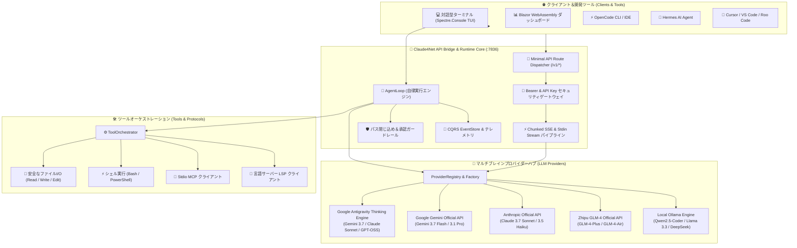

# ⚡ Claude4Net

<p align="center">
  
</p>

<p align="center">
  <strong>次世代 .NET 10 自律型AIエージェントランタイム＆マルチブレインオーケストレーション基盤</strong><br>
  <em>決定論的ツール実行 • データ漏洩ゼロの安全ガードレール • 汎用OpenAI APIブリッジ • リアルタイムBlazor観測コントロールプレーン</em>
</p>

<p align="center">
  <a href="https://dotnet.microsoft.com/download"></a>
  <a href="https://learn.microsoft.com/en-us/dotnet/csharp/"></a>
  <a href="LICENSE"></a>
  <a href="https://github.com/Terkiss/Claude4Net/actions"></a>
  <a href="https://modelcontextprotocol.io/"></a>
  <a href="https://openai.com/"></a>
</p>

<p align="center">
  <a href="README.md">🇺🇸 <strong>English</strong></a> •
  <a href="README.ko.md">🇰🇷 <strong>한국어</strong></a> •
  <a href="README.ja.md">🇯🇵 <strong>日本語</strong></a>
</p>

---

## 📖 概要 (Overview)

**Claude4Net** は、**.NET 10** と **C# 13** をベースに構築されたエンタープライズグレードの高性能自律型AIエージェントランタイムおよび**汎用マルチLLMオーケストレーター**です。

完全オフラインのローカルLLMから最高峰のクラウド推論モデル（Gemini 3.7 Thinking、Claude Sonnet Thinking）まで、あらゆるAIブレインを標準化された安全なローカル実行環境とシームレスに結合します。

イベントソーシング（Event-Sourcing）によるCQRSアーキテクチャ、厳格なパス閉じ込めサンドボックス、ネイティブMCP（Model Context Protocol）サポート、リアルタイムBlazor WebAssemblyダッシュボード、そして **OpenCode / Hermes / Cursor / Roo Code** のための組み込み **OpenAI互換APIサーバー** をワンクリックで提供します。

> [!TIP]
> **完全オフライン＆データ漏洩ゼロ**: Claude4Netはローカルの **Ollama** モデルと即座に連携し、外部ネットワーク接続のない環境でも完全なペアプログラミングと自律コーディングを実現します。

---

## ✨ 主な特長 (Key Highlights)

| 特長 | 説明 | 価値 |
| :--- | :--- | :--- |
| 🌐 **汎用OpenAI APIブリッジ** | OpenCode、Hermes、Cursor、Roo Code向けに標準OpenAIエンドポイントを提供 (`:7836`) | 最新Thinkingモデルをあらゆる開発環境で活用 |
| 🧠 **マルチプロバイダーマトリクス** | Claude、Gemini 3.7 Native、GLM-4、Ollama、Antigravity CLI、OpenAI互換 | `/provider` コマンドで遅延なしに即時ホットスワップ |
| 🎯 **自律ゴールループ** | 自己診断と多段階修正を行う自律エージェントループ (`!goal`) | 複雑な要求事項の無人連続開発と自動テスト検証 |
| 🛡️ **堅牢なセキュリティガードレール** | パス閉じ込め（Path Confinement）、破壊的コマンド検知、冪等承認エンジン | 企業基準のデータ保全性と偶発的データ損失ゼロ |
| 🔌 **標準プロトコル内蔵** | StdioベースのMCP (Model Context Protocol) & コードインテリジェンス用LSP | 拡張可能なツールエコシステムと精密なコード解析 |
| 📊 **リアルタイムBlazor管理画面** | ASP.NET Core & Blazor WebAssemblyによるSignalRライブテレメトリ | リアルタイムトークン統計、エージェントタイムライン、再生機能 |
| 🩺 **自己治癒 (Self-Healing)** | エラー自動分類、反省（Reflection）記録、テスト駆動自動パッチエンジン | ビルド/実行エラー時の自律原因究明と自動復旧 |
| 💾 **イベントソーシング永続化** | 全てのツール呼び出しとイベントを永続ログとして記録・決定論的に再生 | 100%の実行再現性と完全なセキュリティ監査ログ |

---

## 🏛️ システムアーキテクチャ (Architecture)

<p align="center">
  
</p>



---

## 🖥️ UI & ダッシュボード観測性 (Observability)

<p align="center">
  
</p>

Claude4Netは、洗練されたターミナル操作とWebダッシュボードを同時に提供します:
* **Rich Spectre.Console TUI**: シンタックスハイライト、進捗カード、Thinking思考ストリームのリアルタイム描画。
* **Blazor Web Dashboard (`:5000`)**: SignalRリアルタイムグラフ、アクティブエージェント監視、トークン消費分析、タイムライン再生。

---

## 🤖 対応LLMプロバイダー

Claude4Netは **1クラス = 1専用プロバイダー** のクリーンアーキテクチャに基づき、各モデルの機能を最大限に引き出します。

| プロバイダー識別子 | 主要対応モデル (2026年最新) | 通信プロトコル | 特長 |
| :--- | :--- | :--- | :--- |
| **`antigravity/*`** | `gemini-3.7-flash-high`, `claude-sonnet-4-6-thinking`, `gpt-oss-120b-high` | Subprocess Stdin IPC Stream | Deep Thinking、広大なコンテキスト窓、ハーネススキル統合 |
| **`google/*`** | `gemini-3.7-flash`, `gemini-3.6-flash`, `gemini-3.5-flash`, `gemini-3.1-pro` | Direct Google REST API (SSE) | 超高速マルチモーダル推論、ネイティブグラウンディング |
| **`anthropic/*`** | `claude-3-7-sonnet`, `claude-3-5-sonnet`, `claude-3-5-haiku` | Direct Anthropic REST API | 拡張思考(Thinking)、業界最高峰のツール呼び出し、高精度コード生成 |
| **`glm/*`** | `glm-4-plus`, `glm-4-flash`, `glm-4-air` | Zhipu Open REST API | 高い並列処理能力、高度な多段階推論 |
| **`ollama/*`** | `qwen2.5-coder`, `llama3.3`, `deepseek-r1` | Local Ollama REST API | 100%オフライン動作、ローカルGPUアクセラレーション、データ漏洩ゼロ |
| **`openai/*`** | 任意のOpenAI互換エンドポイント (DeepSeek, Groq, vLLM, LocalAI) | OpenAI Chat Completions REST | 汎用エンドポイント接続、カスタムBase URL指定 |

---

## 🚀 クイックスタート (Quick Start)

### 1. 必要環境
* [.NET 10 SDK](https://dotnet.microsoft.com/download) (Version 10.0 以上)
* (任意) [Ollama](https://ollama.ai/) — ローカルオフライン実行時

### 2. ビルド＆テスト
```bash
# 1. リポジトリのクローン
git clone https://github.com/Terkiss/Claude4Net.git
cd Claude4Net

# 2. ソリューションのビルド
dotnet build Claude4Net.slnx -c Release

# 3. 全978件のテスト検証 (100% Pass)
dotnet test Claude4Net.Tests/Claude4Net.Tests.csproj
```

---

## 💻 実行モード (Run Modes)

### モード A: 対話型ペアプログラミング CLI
```bash
dotnet run --project Claude4Net.Cli
```

### モード B: Blazor Webダッシュボード付きで起動
```bash
dotnet run --project Claude4Net.Cli -- --dashboard
```
> 🌐 ブラウザで `http://localhost:5000` にアクセス

### モード C: OpenAI互換APIサーバー起動
```bash
dotnet run --project Claude4Net.Cli -- --api on --api-port 7836 --api-key c4n-sk-mykey
```
> またはCLI内の対話型コマンド: `/api on 7836 c4n-sk-mykey --api-timeout 1800`

---

## 🔌 外部クライアント連携 (OpenCode & Hermes)

Claude4Net APIサーバー(`http://127.0.0.1:7836/v1`)を起動すると、あらゆる外部AIエージェントと即座に連携可能です。

### 1. OpenCode (`opencode.json`) 設定
プロジェクトルートまたは `~/.config/opencode/opencode.json` に下記設定を貼り付けてください:

```json
{
  "$schema": "https://opencode.ai/config.json",
  "provider": {
    "claude4net": {
      "npm": "@ai-sdk/openai-compatible",
      "name": "Claude4Net AI Hub",
      "options": {
        "baseURL": "http://127.0.0.1:7836/v1",
        "apiKey": "c4n-sk-mykey"
      },
      "models": {
        "antigravity/gemini-3.7-flash-high": {
          "name": "Gemini 3.7 Flash (High Thinking)"
        },
        "antigravity/claude-sonnet-4-6-thinking": {
          "name": "Claude Sonnet 4.6 (Thinking)"
        },
        "antigravity/gpt-oss-120b-high": {
          "name": "GPT-OSS 120B (High)"
        },
        "google/gemini-3.7-flash": {
          "name": "Google Gemini 3.7 Flash (Official)"
        }
      }
    }
  }
}
```

### 2. Hermes および Cursor / Roo Code 設定
* **API Base URL**: `http://127.0.0.1:7836/v1`
* **API Key**: `c4n-sk-mykey`
* **Model ID**: `antigravity/gemini-3.7-flash-high` または `antigravity/claude-sonnet-4-6-thinking`

---

## ⌨️ CLI コマンドリファレンス

### ⚙️ システム＆セッション管理
| コマンド | 説明 | 例 |
| :--- | :--- | :--- |
| `/help` | コマンド一覧と使い方の表示 | `/help` |
| `/provider` | アクティブなLLMプロバイダーの切り替え | `/provider Gemini` |
| `/model` | プロバイダー内のモデル選択 | `/model gemini-3.7-flash` |
| `/api` | APIサーバーの起動/停止/状態確認 | `/api on 7836 mykey --api-timeout 1800` |
| `/dashboard` | Blazor Webダッシュボードのオンデマンド起動 | `/dashboard` |
| `/status` | システムリソース、稼働時間、メモリの診断 | `/status` |
| `/clear` | ターミナル画面のクリア | `/clear` |

### 🎯 エージェント＆自律タスク
| コマンド | 説明 | 例 |
| :--- | :--- | :--- |
| `!goal <タスク>` | 自律ゴールループ開始（計画と検証ゲート） | `!goal REST APIエンドポイントの実装とテスト` |
| `!login <プロバイダー> <キー>` | プロバイダーAPIキーをキーストアに安全保存 | `!login gemini AIzaSy...` |
| `!skills` | 発見されたエージェントスキル一覧の表示 | `!skills` |
| `!yolo` | 承認プロンプトのスキップ切替 (注意) | `!yolo` |

---

## 🧪 品質およびテスト保証 (Quality & Tests)

Claude4Netは徹底したエンタープライズ品質ゲートの下で開発されています:

* **ビルド無欠性**: .NET 10 Releaseビルド `0 Errors, 0 Warnings`。
* **ユニット＆統合テスト**: **978 / 978 Tests 100% Pass** (リグレッション率0%)。
* **ブラックボックスSDK検証**: 公式OpenAI .NET SDK、Python SDK、Node.js SDKとの完全互換性を検証済み。
* **セキュリティガードレール**: パストラバーサル防止、SSRF遮断、平文データ漏洩防止を完備。

---

## 📄 ライセンス (License)

本プロジェクトは [MIT License](LICENSE) の下で公開されています。
