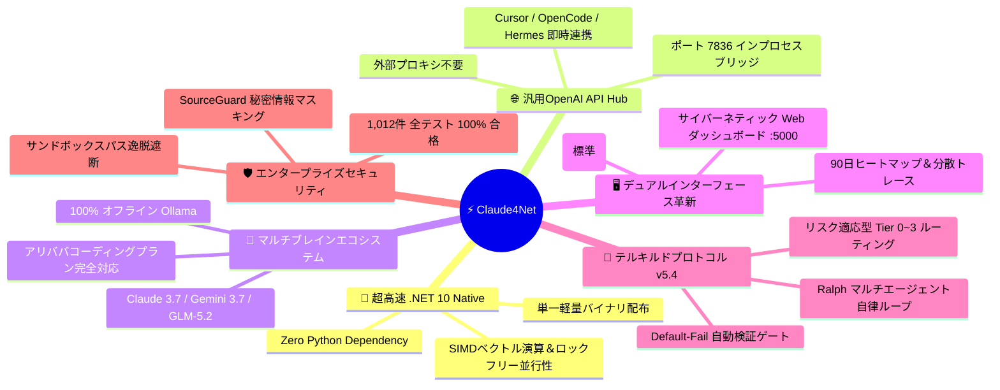
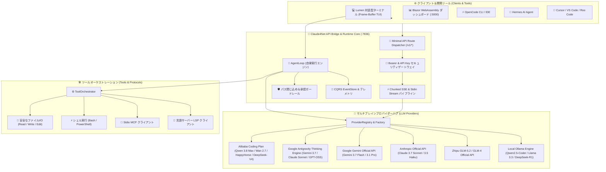

# ⚡ Claude4Net

<p align="center">
  
</p>

<p align="center">
  <strong>次世代 .NET 10 自律型AIエージェントランタイム＆マルチブレインオーケストレーション基盤</strong><br>
  <em>決定論的ツール実行 • データ漏洩ゼロの安全ガードレール • 汎用OpenAI APIブリッジ • リアルタイムBlazor観測コントロールプレーン</em>
</p>

<p align="center">
  <a href="https://dotnet.microsoft.com/download"></a>
  <a href="https://learn.microsoft.com/en-us/dotnet/csharp/"></a>
  <a href="LICENSE"></a>
  <a href="https://github.com/Terkiss/Claude4Net/actions"></a>
  <a href="https://modelcontextprotocol.io/"></a>
  <a href="https://openai.com/"></a>
  <a href="https://alibabacloud.com/"></a>
</p>

<p align="center">
  <a href="README.md">🇺🇸 <strong>English</strong></a> •
  <a href="README.ko.md">🇰🇷 <strong>한국어</strong></a> •
  <a href="README.ja.md">🇯🇵 <strong>日本語</strong></a>
</p>

---

## 🌟 なぜ Claude4Net を使うべきなのか？ (Why Claude4Net?)

数多くのAIツールやフレームワークが存在する中、**Claude4Net** は単なるLLMラッパーではなく、**圧倒的な高速性、堅牢なセキュリティ、汎用互換性** を極限まで追求した次世代のエンジニアリング基盤です。



### 1. 🚀 Pythonオーバーヘッド皆無の極限 .NET 10 ネイティブ性能
* **Zero Python Overhead**: Python系フレームワーク(LangChain, CrewAI, AutoGen等)特有のGILボトルネック、巨大なメモリリーク、仮想環境依存を完全排除。
* **超低遅延**: C# 13のSIMDベクトル化演算とロックフリー非同期ストリーミングにより、ミリ秒単位の極めて高速な応答を実現。
* **単一バイナリ配布**: 依存関係のない1つの実行ファイル(`Claude4Net.Cli.exe`)だけで即座に動作。

### 2. 🌐 インプロセス OpenAI 互換 API ゲートウェイ (`:7836`)
* **あらゆるIDE・ツールと即時連携**: Cursor, OpenCode, Hermes, VS Code, Roo Code, Aider など既存のOpenAI SDK対応ツールからローカルアドレス(`http://127.0.0.1:7836/v1`)でClaude4Netの推論エンジンを呼び出し可能。
* **組み込み軽量ブリッジ**: 外部プロキシなしでCLI内部から安全に稼働。

### 3. 🧠 アリババコーディングプラン (Alibaba Coding Plan) ＆ 6大LLMネイティブ対応
* **2026年最新 Alibaba Coding Plan 公式対応**: `qwen3.8-max`, `qwen3.7-plus`, `qwen3.6-flash`, `wan2.7-image`, `happyhorse-1.1`, `deepseek-v4-pro`, `glm-5.2` を標準搭載。
* **ベンダーロックイン排除**: Anthropic Claude 3.7 Sonnet Thinking, Google Gemini 3.7 Pro, Zhipu GLM-5.2, ローカル Ollama をコマンド1つ(`/model`)で自由自在に切り替え可能。

### 4. 🖥️ デュアルインターフェース: Lumen TUI + Webテレメトリ管理画面 (`:5000`)
* **Lumen Interactive TUI (標準モード)**: 会話履歴とプロンプト入力欄を分離したフレームバッファ分割ビュー、リアルタイム思考(Thought)ストリーム、インラインセキュリティ承認ダイアログ。
* **TeruTeruPandas リアルタイム管理画面**: 90日GitHub風トークン活動ヒートマップ、時間帯別トークン消費分析、分散トレース(Distributed Tracing)ウォーターフォール。

### 5. 👑 テルキルドプロトコル(Terukirdo Protocol v5.4) ＆ Ralph 自律ループ
* **Adaptive Risk Tiers (Tier 0~3)**: 作業リスクに応じて Companion から First Reviewer, Tech Expert, Final Controller までの検証フローを動的に統制。
* **Default-Fail 自動検証ゲート (`!verify`)**: コード修正時に `dotnet build` と `dotnet test` を読み取り専用サンドボックスで自動実行。
* **SeedSpec 仕様管理 (`!spec`)**: 要件定義、受入基準、ブロッカー質問を構造化して管理。

### 6. 🛡️ 堅牢なセキュリティガードレール ＆ 1,012件テスト完全合格
* **SourceGuard ＆ パス隔離**: APIキーやパスワードの自動マスキング、ワークスペース外アクセスの完全防止。
* **シミュレーションモード (`/plan`)**: 変更を適用する前にドライランで事前シミュレーション。
* **完全な検証済み品質**: **全 1,012 件のユニット・統合テスト 100% 合格**。

---

## 📖 概要 (Overview)

**Claude4Net** は、**.NET 10** と **C# 13** をベースに構築されたエンタープライズグレードの高性能自律型AIエージェントランタイムおよび**汎用マルチLLMオーケストレーター**です。

イベントソーシングCQRSアーキテクチャ、厳格なサンドボックスセキュリティ、ネイティブ Stdio MCP、TeruTeruPandas リアルタイムダッシュボード、そして **OpenCode / Hermes / Cursor / Roo Code** のための組み込み **OpenAI互換APIサーバー** を一体型で提供します。

> [!TIP]
> **完全オフライン＆データ漏洩ゼロ**: Claude4Netはローカルの **Ollama** モデルと即座に連携し、外部ネットワーク接続のない環境でも完全なペアプログラミングと自律コーディングを実現します。

---

## ✨ 主な特長 (Key Highlights)

| 特長 | 説明 | 価値 |
| :--- | :--- | :--- |
| 🌐 **汎用OpenAI APIブリッジ** | OpenCode、Hermes、Cursor、Roo Code向けに標準OpenAIエンドポイントを提供 (`:7836`) | 最新Thinkingモデルをあらゆる開発環境で活用 |
| 🧠 **アリババ＆マルチプロバイダー** | Alibaba Coding Plan (Qwen 3.8/Wan/HappyHorse), Claude, Gemini, GLM, Ollama | `/model` および `/login` コマンドで即時切り替え |
| 🎯 **自律ゴールループ** | 自己診断と多段階修正を行う自律エージェントループ (`!goal`, `!coordinate`) | 複雑な要求事項の無人連続開発と自動テスト検証 |
| 🛡️ **堅牢なセキュリティガードレール** | パス閉じ込め（Path Confinement）、破壊的コマンド検知、SourceGuardマスキング | 企業基準のデータ保全性と偶発的データ損失ゼロ |
| 🔌 **標準プロトコル内蔵** | StdioベースのMCP (Model Context Protocol) & コードインテリジェンス用LSP | 拡張可能なツールエコシステムと精密なコード解析 |
| 📊 **リアルタイムBlazor管理画面** | ASP.NET Core & Blazor WebAssemblyによるSignalRライブテレメトリ | 90日ヒートマップ、トークン統計、トレースウォーターフォール |
| 🩺 **自己治癒 (Self-Healing)** | エラー自動分類、反省（Reflection）記録、テスト駆動自動パッチエンジン | ビルド/実行エラー時の自律原因究明と自動復旧 |
| 💾 **イベントソーシング永続化** | 全てのツール呼び出しとイベントを永続ログとして記録・決定論的に再生 | 100%の実行再現性と完全なセキュリティ監査ログ |

---

## 🏛️ システムアーキテクチャ (Architecture)

<p align="center">
  
</p>



---

## 🖥️ UI & ダッシュボード観測性 (Observability)

<p align="center">
  
</p>

Claude4Netは、洗練されたターミナル操作とWebダッシュボードを同時に提供します:
* **Lumen Interactive TUI (標準モード)**: 分割ビュー、ショートカットキー(`ESC`, `Ctrl+L`, `Ctrl+C`, `PgUp/PgDn`)、Thinking思考ストリームのリアルタイム描画。
* **Blazor Web Dashboard (`:5000`)**: 90日ヒートマップ、時間帯別トークン消費グラフ、リアルタイム分散トレースウォーターフォール。

---

## 🤖 対応LLMプロバイダー

| プロバイダー識別子 | 主要対応モデル (2026年最新) | 通信プロトコル | 特長 |
| :--- | :--- | :--- | :--- |
| **`qwen/*`**, **`alibaba/*`** | `qwen3.8-max`, `qwen3.7-plus`, `qwen3.6-flash`, `deepseek-v4-pro`, `glm-5.2` | Alibaba Coding Plan API (SSE) | アリババ公式コーディングプラン、マルチモーダル＆高度推論 |
| **`antigravity/*`** | `gemini-3.7-flash-high`, `claude-sonnet-4-6-thinking`, `gpt-oss-120b-high` | Subprocess Stdin IPC Stream | Deep Thinking、広大なコンテキスト窓、ハーネススキル統合 |
| **`google/*`** | `gemini-3.7-flash`, `gemini-3.6-flash`, `gemini-3.5-flash`, `gemini-3.1-pro` | Direct Google REST API (SSE) | 超高速マルチモーダル推論、ネイティブグラウンディング |
| **`anthropic/*`** | `claude-3-7-sonnet`, `claude-3-5-sonnet`, `claude-3-5-haiku` | Direct Anthropic REST API | 拡張思考(Thinking)、業界最高峰のツール呼び出し、高精度コード生成 |
| **`glm/*`** | `glm-5.2`, `glm-4-plus`, `glm-4-flash`, `glm-4-air` | Zhipu Open REST API | 高い並列処理能力、高度な多段階推論 |
| **`ollama/*`** | `qwen2.5-coder`, `llama3.3`, `deepseek-r1` | Local Ollama REST API | 100%オフライン動作、ローカルGPUアクセラレーション、データ漏洩ゼロ |
| **`openai/*`** | 任意のOpenAI互換エンドポイント (DeepSeek, Groq, vLLM, LocalAI) | OpenAI Chat Completions REST | 汎用エンドポイント接続、カスタムBase URL指定 |

---

## 🚀 クイックスタート (Quick Start)

### 1. 必要環境
* [.NET 10 SDK](https://dotnet.microsoft.com/download) (Version 10.0 以上)
* (任意) [Ollama](https://ollama.ai/) — ローカルオフライン実行時

### 2. ビルド＆テスト
```bash
# 1. リポジトリのクローン
git clone https://github.com/Terkiss/Claude4Net.git
cd Claude4Net

# 2. ソリューションのビルド
dotnet build Claude4Net.slnx -c Release

# 3. 全1,012件のテスト検証 (100% Pass)
dotnet test
```

---

## 💻 実行モード (Run Modes)

### モード A: Lumen 対話型 TUI (標準)
```bash
dotnet run --project Claude4Net.Cli
```

### モード B: レガシークラシック CLI モード (CI/自動化用)
```bash
dotnet run --project Claude4Net.Cli -- --legacy-cli
```

### モード C: OpenAI 互換 API サーバー起動
```bash
dotnet run --project Claude4Net.Cli -- --api on --api-port 7836 --api-key-env OPENAI_API_KEY
```
> またはCLI内の対話型コマンド: `/api on 7836`

---

## 🔌 外部クライアント連携 (OpenCode & Hermes)

Claude4Net APIサーバー(`http://127.0.0.1:7836/v1`)を起動すると、あらゆる外部AIエージェントと即座に連携可能です。

### 1. OpenCode (`opencode.json`) 設定
```json
{
  "$schema": "https://opencode.ai/config.json",
  "provider": {
    "claude4net": {
      "npm": "@ai-sdk/openai-compatible",
      "name": "Claude4Net AI Hub",
      "options": {
        "baseURL": "http://127.0.0.1:7836/v1",
        "apiKey": "c4n-sk-mykey"
      },
      "models": {
        "qwen/qwen3.8-max": {
          "name": "Alibaba Qwen 3.8 Max (Coding Plan)"
        },
        "antigravity/gemini-3.7-flash-high": {
          "name": "Gemini 3.7 Flash (High Thinking)"
        },
        "antigravity/claude-sonnet-4-6-thinking": {
          "name": "Claude Sonnet 4.6 (Thinking)"
        }
      }
    }
  }
}
```

### 2. Hermes および Cursor / Roo Code 設定
* **API Base URL**: `http://127.0.0.1:7836/v1`
* **API Key**: 任意の文字列または環境変数設定値
* **Model ID**: `qwen/qwen3.8-max` または `antigravity/claude-sonnet-4-6-thinking`

---

## ⌨️ CLI コマンドリファレンス

| コマンド | 説明 | 例 |
| :--- | :--- | :--- |
| `/help` | コマンド一覧と使い方の表示 | `/help` |
| `/login` | プロバイダーAPIキーの安全保存 (`qwen`, `alibaba`, `gemini`, `claude`, `glm`, `ollama`) | `/login qwen sk-...` |
| `/model` | LLMモデル一覧の表示および切り替え | `/model qwen3.8-max` |
| `/usage` | APIトークン使用量、コスト、コンテキスト残量の確認 | `/usage` |
| `/api` | OpenAI互換APIサーバーの制御 | `/api on 7836` |
| `/doctor` | システム依存性および環境状態の診断 | `/doctor` |
| `/audit` | セキュリティ監査ログの照会 | `/audit` |
| `/plan` | シミュレーションモードの切り替え (変更の事前プレビュー) | `/plan` |
| `/setworkspace` | プロジェクト作業空間ルートパスの指定 | `/setworkspace D:\Projects\App` |
| `/goal` | 自律ゴールループ開始 (`goal <目標> \| show \| clear`) | `/goal 認証APIの実装` |
| `/coordinate` | 計画・実行・検証の3段階タスク調整 | `/coordinate list` |
| `/verify` | ビルドおよびユニットテストの自動検証 | `/verify` |
| `/spec` | SeedSpec仕様および受入基準の管理 | `/spec show` |
| `/skill` | スキルおよび進化提案の管理 | `/skill analyze` |
| `/maid`, `/terukirdo` | テルキルドオーケストレーター管理 | `/maid status` |
| `/yolo` | 承認バイパスモード切替 (注意) | `/yolo` |
| `/clear` | 画面クリア | `/clear` |
| `/exit` | 安全に終了 | `/exit` |

---

## 🧪 品質およびテスト保証 (Quality & Tests)

Claude4Netは徹底したエンタープライズ品質ゲートの下で開発されています:

* **ビルド無欠性**: .NET 10 Releaseビルド `0 Errors, 0 Warnings`。
* **ユニット＆統合テスト**: **1,012 / 1,012 Tests 100% Pass** (リグレッション率0%)。
* **ブラックボックスSDK検証**: 公式OpenAI .NET SDK、Python SDK、Node.js SDKとの完全互換性を検証済み。
* **セキュリティガードレール**: パストラバーサル防止、SSRF遮断、平文データ漏洩防止を完備。

---

## 📄 ライセンス (License)

本プロジェクトは [MIT License](LICENSE) の下で公開されています。
