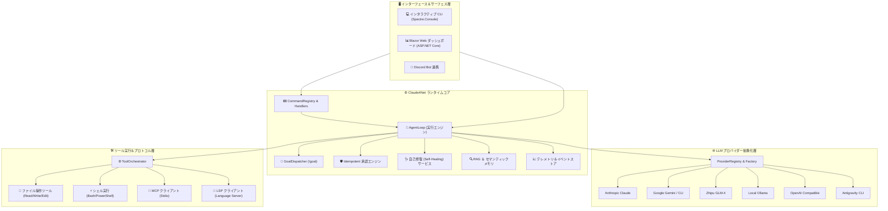

# ⚡ Claude4Net

<p align="center">
  
</p>

<p align="center">
  <strong>次世代 .NET 10 自律型AIエージェントランタイム＆可観測性（Observability）プラットフォーム</strong><br>
  <em>決定論的ツール実行、弾力的な自己修復（Self-Healing）、そして柔軟なマルチLLMオーケストレーション</em>
</p>

<p align="center">
  <a href="https://dotnet.microsoft.com/download"></a>
  <a href="https://learn.microsoft.com/en-us/dotnet/csharp/"></a>
  <a href="LICENSE"></a>
  <a href="https://github.com/Terkiss/Claude4Net/actions"></a>
  <a href="https://modelcontextprotocol.io/"></a>
</p>

<p align="center">
  <a href="README.md">🇺🇸 <strong>English</strong></a> •
  <a href="README.ko.md">🇰🇷 <strong>한국어</strong></a> •
  <a href="README.ja.md">🇯🇵 <strong>日本語</strong></a>
</p>

---

## 📖 概要 (Overview)

**Claude4Net** は、**.NET 10** および **C# 13** で構築されたエンタープライズグレードの高機能ローカルAIエージェントランタイムです。イベントソーシング（Event-Sourced）アーキテクチャ、堅牢なセキュリティガードレール、ネイティブなMCP（Model Context Protocol）サポート、セマンティックRAG、そしてリアルタイムBlazor Webダッシュボードにより、主要な大規模言語モデル（LLM）とローカル実行環境をシームレスに統合します。

対話型のCLIペアプログラマー、複数ステップの自律型ゴール実行（`!goal`）、バックグラウンド自動化ルーチンスケジューラなど、どの用途においても厳格なセキュリティ境界と自己修復（Self-Healing）インテリジェンスを備えた決定論的（Deterministic）なツールオーケストレーションを提供します。

> [!TIP]
> **ゼロ構成でのローカル実行**: Claude4Net はローカルの **Ollama** モデルと直接連携し、外部へのデータ送信が一切ない 100% 完全オフライン環境でもパワフルに動作します。

---

## ✨ 主な特長 (Key Highlights)

| 機能 | 詳細説明 | 特長・メリット |
| :--- | :--- | :--- |
| 🧠 **マルチプロバイダー対応** | Claude, Gemini, GLM-4, Ollama, OpenAI互換, Antigravity CLI | `/provider <name>` で瞬時にホットスワップ |
| 🎯 **自律型ゴール実行ループ** | 自己修正および段階的進捗追跡を備えた自律ループ (`!goal`) | 複雑な複数ステップタスクの無人実行 |
| 🛡️ **堅牢なセキュリティガード** | パストラバーサル防止、危険コマンド傍受、ドライランシミュレーション | 企業の安全性基準と誤操作防止を両立 |
| 🔌 **標準プロトコルの内蔵** | Stdio ベースの MCP (Model Context Protocol) および LSP 対応 | 標準化されたツールエコシステムとコード理解 |
| 📊 **Blazor 制御パネル** | SignalR リアルタイムストリーミング対応の ASP.NET Core & Blazor UI | リアルタイム監視とチェックポイント巻き戻し |
| 🩺 **自己修復 (Self-Healing)** | エラー分類、セマンティック省察、自動パッチ適用エンジン | 障害発生時の自律診断とテスト駆動修復 |
| 💾 **イベントソーシング永続化** | 決定論的セッション再生、実行軌跡 (Trajectory) 追跡と状態復元 | 完全な実行再現性と監査証跡の確保 |
| ⚡ **モジュール型プラグイン** | カスタムツールやインターセプターを追加可能な拡張設計 (`Claude4Net.MyPlugins`) | 依存性の注入とパイプラインフックの分離 |

---

## 🏛️ システムアーキテクチャ (Architecture)



---

## 🤖 サポートされている LLM プロバイダー

Claude4Net は **1クラス ＝ 1専用プロバイダー** の設計原則に従い、各プロバイダー専用の `ILLMProvider` 独立クラスで実装されています。

| プロバイダー | 主な対応モデル | 通信プロトコル | 主な特徴 |
| :--- | :--- | :--- | :--- |
| **Anthropic Claude** | `claude-3-7-sonnet`, `claude-3-5-haiku`, `claude-3-opus` | Direct REST API (SSE) | 拡張思考（Thinking）、高度なツール呼び出し、ストリーミング |
| **Google Gemini** | `gemini-2.5-pro`, `gemini-2.5-flash`, `gemini-2.0-flash` | REST API / Gemini CLI | マルチモーダル、グラウンディング、超高速推論 |
| **Zhipu GLM** | `glm-4-plus`, `glm-4-flash`, `glm-4-air` | Open-API REST (Bearer Auth) | 高並列処理、論理推論、関数呼び出し（Tool Call） |
| **Local Ollama** | `qwen2.5-coder`, `llama3.3`, `deepseek-r1` など | Local HTTP API | 100% オフライン実行、完全プライベート、データ漏洩ゼロ |
| **OpenAI-Compatible** | 任意の互換エンドポイント (DeepSeek, Groq, vLLM, LocalAI) | OpenAI Chat Completions API | 広範な互換性、カスタムベースURL対応 |
| **Antigravity CLI** | Antigravity Native Engine | Subprocess IPC / Stdio | エージェントハーネスワークフローとの統合 |

---

## 📦 ソリューションおよびプロジェクト構成

```text
Claude4Net/
├── Claude4Net.Cli/               # リッチな TUI を備えた対話型ターミナル
├── Claude4Net.Runtime/           # コア実行ループ、ハンドラー、サービスおよび DI パイプライン
│   ├── Handlers/                 # ドメイン別コマンドハンドラー (Agent, Goal, File, Provider, System)
│   ├── Services/                 # RAG, Telemetry, SelfHealing, ToolSecurity サービス
│   └── Server/                   # プロキシサーバーおよび IPC 通信エンドポイント
├── Claude4Net.Api/               # 専用 LLM アダプター (Claude, Gemini, GLM, Ollama など)
├── Claude4Net.SDK/               # ドメインインターフェース、イベントスキーマ、DTO、システム規約
├── Claude4Net.Commands/          # 軽量コマンドディスパッチャー＆レジストリ
├── Claude4Net.Tools/             # ファイル(Read/Write/Edit)、シェル(Bash)、LSP および MCP ツールセット
├── Claude4Net.Dashboard/         # ASP.NET Core 可観測性バックエンド＆ SignalR ハブ
├── Claude4Net.Dashboard.Client/  # Blazor WebAssembly 制御パネル UI
├── Claude4Net.MyPlugins/         # ユーザー拡張プラグインのサンプル
├── Claude4Net.Discord/           # Discord ボット連携
└── Claude4Net.Tests/             # 網羅的な xUnit 単体・統合テストおよび回帰ベンチマーク
```

---

## 🚀 はじめに (Getting Started)

### 前提条件

- [.NET 10 SDK](https://dotnet.microsoft.com/download) (Version 10.0 以上)
- (任意) ローカルオフライン実行用の [Ollama](https://ollama.ai/)
- (任意) 各種モデルの API キー (Anthropic, Google, Zhipu 等)

### インストールとビルド

```bash
# 1. リポジトリのクローン
git clone https://github.com/Terkiss/Claude4Net.git
cd Claude4Net

# 2. NuGet 依存関係の復元
dotnet restore Claude4Net.slnx

# 3. ソリューション全体のリリースビルド
dotnet build Claude4Net.slnx -c Release

# 4. 全体テストの実行
dotnet test Claude4Net.Tests/Claude4Net.Tests.csproj
```

---

## 💻 アプリケーションの実行

### 1. 対話型 CLI モード

ターミナル対話型シェルを起動します:

```bash
dotnet run --project Claude4Net.Cli
```

### 2. Web ダッシュボードの同時起動

CLI と一緒にリアルタイム Blazor Web ダッシュボードを起動します:

```bash
dotnet run --project Claude4Net.Cli -- --dashboard
```
> 🌐 Web ブラウザで `http://localhost:5000` (または設定されたポート) にアクセスしてダッシュボードを利用できます。

---

## 🔐 認証と環境設定

Claude4Net は、API キーが環境変数やコミットログに漏洩するのを防ぐため、`api_key.json` を用いたセキュアな認証方式を採用しています。

```bash
# Claude4Net CLI 内でインタラクティブにキーを設定します:
> !login anthropic sk-ant-api03-...
> !login gemini AIzaSy...
> !login glm your-zhipu-api-key...
> !login openai sk-...
```

> [!NOTE]
> 自動化スクリプト向けに環境変数のフォールバックもサポートされていますが、対話型キーストアが常に優先されます。

---

## ⌨️ コマンドリファレンス (Command Reference)

Claude4Net は、スラッシュ (`/`) および感嘆符 (`!`) コマンドによる高度な操作を提供します:

### ⚙️ セッション＆システム制御

| コマンド | 説明 |
| :--- | :--- |
| `/help` | コマンド一覧と利用ガイドを表示 |
| `/status` | 実行状態、アクティブなプロバイダー、トークン使用量、メモリ状態を表示 |
| `/session [new\|list\|switch <id>]` | マルチセッションの作成、一覧、切り替え |
| `/resume <sessionId>` | 過去のセッションの復元と再接続 |
| `/plan` | **ドライラン (Dry-Run) モード**の切り替え（ディスク変更を行わないシミュレーション） |
| `/clear` | ターミナル画面のクリア |

### 🎯 自律型エージェント＆ゴール

| コマンド | 説明 |
| :--- | :--- |
| `!goal <目標の説明>` | 完了まで自律的に判断・実行を繰り返すゴールループを開始 |
| `!goal status` | 実行中の自律型ゴールのステップ別進捗状況を確認 |
| `!goal cancel` | 実行中の自律型ゴールループを安全に中断 |
| `!replay [steps]` | イベントソーシングによる実行履歴と軌跡を再生 |
| `!rewind <checkpointId>` | セッション状態およびワークスペースを特定チェックポイントへ巻き戻し |

### 🔌 ツール、スキル＆プロバイダー

| コマンド | 説明 |
| :--- | :--- |
| `/providers` | 利用可能なすべてのビルトイン・外部 LLM プロバイダーを表示 |
| `/provider <name>` | アクティブなプロバイダーを即座に切り替え (例: `/provider glm`) |
| `!skills` | `.agents/skills` 内のインデックス化されたスキル一覧を表示 |
| `!rag search <query>` | ローカルコードベースの埋め込みによるセマンティック検索を実行 |
| `!heal` | 直近のエラーに対する自己修復診断分析および解決策を提示 |

---

## 🛡️ セキュリティ、承認エンジンおよびガードレール

<details>
<summary><b>セキュリティ詳細を展開する</b></summary>

1. **パストラバーサル防止 (Path Safety)**: ワークスペース外部への不正アクセス (`../`, symlink) を自動ブロック。
2. **危険コマンドの傍受 (Command Interception)**: 破壊的なシェルコマンド（`rm -rf /` など）を検知し、ユーザー確認ダイアログを強制表示。
3. **Idempotent 承認エンジン**: 操作ごとの承認キャッシュと検証により、過度なプロンプト疲れを防ぎつつ安全性を維持。
4. **ドライランシミュレーション**: `/plan` モードでは、ファイル変更やコマンド実行が仮想 Diff としてプレビューされます。

</details>

---

## 🩺 自己修復 (Self-Healing) と省察メカニズム

<details>
<summary><b>自己修復メカニズム詳細を展開する</b></summary>

ツール実行中にエラー（ビルドエラー、シェルエラー、APIタイムアウト等）が発生した場合:
1. **エラー分類**: `ErrorClassifier` がエラータイプ（構造、実行時、構文、権限等）を分析。
2. **省察の生成**: `SelfHealingService` が失敗の軌跡をキャプチャし、修正プロンプトを構築。
3. **自動パッチ適用**: エージェントが的確なコード修正を行い、テストで検証した上で耐久メモリ台帳に記録。

</details>

---

## 🧪 テストと品質保証

```bash
# 単体テストおよび統合テストの実行
dotnet test Claude4Net.Tests/Claude4Net.Tests.csproj

# 特定のプロバイダーテストのみを実行
dotnet test Claude4Net.Tests/Claude4Net.Tests.csproj --filter "FullyQualifiedName~GlmProviderTests"
dotnet test Claude4Net.Tests/Claude4Net.Tests.csproj --filter "FullyQualifiedName~GoalDispatcherTests"
```

---

## 🤝 コントリビューション (Contributing)

プルリクエストや Issue の報告を歓迎します！

1. リポジトリをフォークします。
2. フィーチャーブランチを作成します (`git checkout -b feature/amazing-feature`)。
3. テストを実行して成功を確認します (`dotnet test`)。
4. 変更をコミットします (`git commit -m 'feat: add amazing feature'`).
5. ブランチにプッシュします (`git push origin feature/amazing-feature`).
6. プルリクエストを作成します。

---

## 📄 ライセンス (License)

本プロジェクトは **MIT License** のもとで公開されています。詳細は [LICENSE](LICENSE) をご参照ください。

<p align="center">
  Crafted with ❤️ by <strong>Terkiss</strong> and the <strong>Claude4Net Community</strong>
</p>
