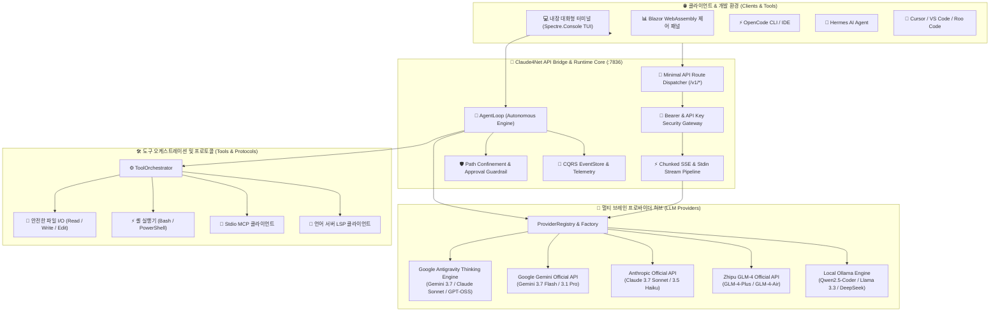

# ⚡ Claude4Net

<p align="center">
  
</p>

<p align="center">
  <strong>차세대 .NET 10 고성능 자율 AI 에이전트 런타임 & 멀티 브레인 오케스트레이션 플랫폼</strong><br>
  <em>결정론적 도구 실행 • 제로-데이터 유출 가드레일 • 범용 OpenAI API 브릿지 • 실시간 Blazor 관측 제어 패널</em>
</p>

<p align="center">
  <a href="https://dotnet.microsoft.com/download"></a>
  <a href="https://learn.microsoft.com/en-us/dotnet/csharp/"></a>
  <a href="LICENSE"></a>
  <a href="https://github.com/Terkiss/Claude4Net/actions"></a>
  <a href="https://modelcontextprotocol.io/"></a>
  <a href="https://openai.com/"></a>
</p>

<p align="center">
  <a href="README.md">🇺🇸 <strong>English</strong></a> •
  <a href="README.ko.md">🇰🇷 <strong>한국어</strong></a> •
  <a href="README.ja.md">🇯🇵 <strong>日本語</strong></a>
</p>

---

## 📖 개요 (Overview)

**Claude4Net**은 **.NET 10**과 **C# 13**의 최첨단 성능을 기반으로 구축된 엔터프라이즈급 오픈소스 AI 에이전트 런타임이자 **범용 멀티 LLM 오케스트레이터**입니다.

로컬 오프라인 LLM부터 최상위 클라우드 사고 모델(Gemini 3.7 Thinking, Claude Sonnet Thinking)에 이르기까지, 모든 인공지능 두뇌를 표준화된 도구 실행 환경과 연결합니다.

이벤트 소싱(Event-Sourcing) 기반의 CQRS 아키텍처, 엄격한 샌드박스 보안 가드레일, 네이티브 MCP(Model Context Protocol), 실시간 Blazor WebAssembly 대시보드, 그리고 **OpenCode / Hermes / Cursor / Roo Code**를 위한 내장 **OpenAI-Compatible API 서버**를 원클릭으로 제공합니다.

> [!TIP]
> **100% 오프라인 & 완전 프라이버시 보장**: Claude4Net은 로컬 **Ollama** 모델과 즉시 연동되어 외부 네트워크 연결이 없는 폐쇄망 환경에서도 완벽한 자율 코딩 페어 프로그래밍을 지원합니다.

---

## ✨ 핵심 기능 (Key Highlights)

| 특장점 | 설명 | 핵심 가치 |
| :--- | :--- | :--- |
| 🌐 **범용 OpenAI API 브릿지** | OpenCode, Hermes, Cursor, Roo Code 등 외부 도구에 표준 OpenAI 엔드포인트 제공 (`:7836`) | 안티그래비티 3.7 Thinking 및 최신 모델을 모든 IDE에서 활용 |
| 🧠 **멀티 프로바이더 매트릭스** | Claude, Gemini 3.7 Native, GLM-4, Ollama, Antigravity CLI, OpenAI 호환 | `/provider` 명령으로 지연 없는 핫스왑 전환 |
| 🎯 **자율 목표 실행 루프** | 자가 진단 및 다단계 교정을 수행하는 자율 에이전트 루프 (`!goal`) | 복잡한 요구사항의 무인 연속 코딩 및 자동 검증 |
| 🛡️ **철통 보안 가드레일** | 작업 경로 격리(Path Confinement), 파괴적 명령 인터셉터, 멱등성 승인 체계 | 기업 수준의 무결성 보장 및 데이터 손실 0% 달성 |
| 🔌 **표준 프로토콜 내장** | Stdio 기반 MCP (Model Context Protocol) 및 코드 분석용 LSP 지원 | 확장 가능한 도구 생태계 및 정밀한 코드 인텔리전스 |
| 📊 **실시간 Blazor 관측 패널** | ASP.NET Core & Blazor WebAssembly 기반 실시간 SignalR 텔레메트리 | 실시간 토큰 지표, 에이전트 타임라인, 세션 되감기 |
| 🩺 **자가 치유 (Self-Healing)** | 에러 자동 분류기, 반추(Reflection) 캡처, 테스트 주도 자동 패치 엔진 | 빌드/실행 실패 시 자율 원인 분석 및 자동 복구 |
| 💾 **이벤트 소싱 영속성** | 모든 도구 호출과 이벤트를 영구 기록하고 결정론적으로 재생 | 100% 실행 재현성 및 완벽한 보안 감사 추적 |

---

## 🏛️ 시스템 아키텍처 (System Architecture)

<p align="center">
  
</p>



---

## 🖥️ UI & 대시보드 관측성 (Observability)

<p align="center">
  
</p>

Claude4Net은 직관적인 터미널 환경과 강력한 웹 관측 제어 패널을 동시에 제공합니다:
* **Rich Spectre.Console TUI**: 구문 강조(Syntax Highlighting), 진행 상태 카드, 사고(Thinking) 스트림 실시간 렌더링.
* **Blazor Web Dashboard (`:5000`)**: 실시간 SignalR 지표 차트, 활성 에이전트 상태, 토큰 소비량 분석, 세션 이벤트 타임라인 리플레이.

---

## 🤖 지원 LLM 프로바이더 라인업

Claude4Net은 견고한 **1 Class = 1 Dedicated Provider** 원칙으로 설계되어 각 프로바이더의 고유한 기능을 완벽하게 지원합니다.

| 프로바이더 식별자 | 주요 지원 모델 라인업 (2026) | 전송 방식 | 주요 특징 |
| :--- | :--- | :--- | :--- |
| **`antigravity/*`** | `gemini-3.7-flash-high`, `claude-sonnet-4-6-thinking`, `gpt-oss-120b-high` | Subprocess Stdin IPC Stream | 딥 씽킹(Deep Thinking), 무제한 토큰 컨텍스트, 하네스 스킬 통합 |
| **`google/*`** | `gemini-3.7-flash`, `gemini-3.6-flash`, `gemini-3.5-flash`, `gemini-3.1-pro` | Direct Google REST API (SSE) | 초고속 멀티모달 추론, 구글 네이티브 그라운딩 |
| **`anthropic/*`** | `claude-3-7-sonnet`, `claude-3-5-sonnet`, `claude-3-5-haiku` | Direct Anthropic REST API | 확장 생각(Thinking), 업계 표준 툴콜링, 고신뢰 코드 생성 |
| **`glm/*`** | `glm-4-plus`, `glm-4-flash`, `glm-4-air` | Zhipu Open REST API | 높은 동시성 처리, 강력한 중국어/다국어 추론 |
| **`ollama/*`** | `qwen2.5-coder`, `llama3.3`, `deepseek-r1` | Local Ollama REST API | 100% 오프라인 동작, 로컬 GPU 가속, 데이터 유출 제로 |
| **`openai/*`** | 임의의 호환 엔드포인트 (DeepSeek, Groq, vLLM, LocalAI) | OpenAI Chat Completions REST | 범용 엔드포인트 연결, 커스텀 Base URL 지정 |

---

## 🚀 빠른 시작 가이드 (Quick Start)

### 1. 사전 요구사항
* [.NET 10 SDK](https://dotnet.microsoft.com/download) (Version 10.0 이상)
* (선택) [Ollama](https://ollama.ai/) — 로컬 오프라인 실행 시

### 2. 빌드 및 테스트
```bash
# 1. 저장소 클론
git clone https://github.com/Terkiss/Claude4Net.git
cd Claude4Net

# 2. 솔루션 빌드
dotnet build Claude4Net.slnx -c Release

# 3. 978개 전체 테스트 검증 (100% All Pass)
dotnet test Claude4Net.Tests/Claude4Net.Tests.csproj
```

---

## 💻 실행 모드 (Run Modes)

### 모드 A: 대화형 페어 프로그래밍 CLI
```bash
dotnet run --project Claude4Net.Cli
```

### 모드 B: Blazor 웹 대시보드와 함께 실행
```bash
dotnet run --project Claude4Net.Cli -- --dashboard
```
> 🌐 웹 브라우저에서 `http://localhost:5000` 접속

### 모드 C: OpenAI 호환 API 서버 가동
```bash
dotnet run --project Claude4Net.Cli -- --api on --api-port 7836 --api-key c4n-sk-mykey
```
> 또는 CLI 내부에서 대화형 명령: `/api on 7836 c4n-sk-mykey --api-timeout 1800`

---

## 🔌 외부 클라이언트 연동 (OpenCode & Hermes)

Claude4Net API 서버(`http://127.0.0.1:7836/v1`)를 가동하면 모든 외부 코딩 에이전트와 완벽히 연동됩니다.

### 1. OpenCode (`opencode.json`) 설정
프로젝트 루트 또는 `~/.config/opencode/opencode.json`에 아래 설정을 붙여넣으십시오:

```json
{
  "$schema": "https://opencode.ai/config.json",
  "provider": {
    "claude4net": {
      "npm": "@ai-sdk/openai-compatible",
      "name": "Claude4Net AI Hub",
      "options": {
        "baseURL": "http://127.0.0.1:7836/v1",
        "apiKey": "c4n-sk-mykey"
      },
      "models": {
        "antigravity/gemini-3.7-flash-high": {
          "name": "Gemini 3.7 Flash (High Thinking)"
        },
        "antigravity/claude-sonnet-4-6-thinking": {
          "name": "Claude Sonnet 4.6 (Thinking)"
        },
        "antigravity/gpt-oss-120b-high": {
          "name": "GPT-OSS 120B (High)"
        },
        "google/gemini-3.7-flash": {
          "name": "Google Gemini 3.7 Flash (Official)"
        }
      }
    }
  }
}
```

### 2. Hermes 및 Cursor / Roo Code 설정
* **API Base URL**: `http://127.0.0.1:7836/v1`
* **API Key**: `c4n-sk-mykey`
* **Model ID**: `antigravity/gemini-3.7-flash-high` 또는 `antigravity/claude-sonnet-4-6-thinking`

---

## ⌨️ CLI 명령어 치트시트 (Command Reference)

Claude4Net은 직관적인 슬래시(`/`) 및 뱅(`!`) 명령어를 제공합니다:

### ⚙️ 시스템 및 세션 제어
| 명령어 | 설명 | 예시 |
| :--- | :--- | :--- |
| `/help` | 전체 명령어 목록 및 사용법 안내 | `/help` |
| `/provider` | 활성 LLM 프로바이더 즉시 전환 | `/provider Gemini` |
| `/model` | 프로바이더 내 세부 모델 선택 | `/model gemini-3.7-flash` |
| `/api` | OpenAI API 서버 시작/중지/상태 확인 | `/api on 7836 mykey --api-timeout 1800` |
| `/dashboard` | Blazor 웹 대시보드 온디맨드 실행 | `/dashboard` |
| `/status` | 시스템 리소스, 가동 시간, 메모리 진단 | `/status` |
| `/clear` | 터미널 화면 정리 | `/clear` |

### 🎯 에이전트 & 자율 작업
| 명령어 | 설명 | 예시 |
| :--- | :--- | :--- |
| `!goal <목표>` | 자율 목표 루프 시작 (단계별 계획 및 자동 검증) | `!goal REST API 엔드포인트 구현 및 테스트` |
| `!login <프로바이더> <키>` | 프로바이더 API 키 안전 저장 | `!login gemini AIzaSy...` |
| `!skills` | 발견된 에이전트 스킬 목록 확인 | `!skills` |
| `!yolo` | 승인 프롬프트 건너뛰기 (주의 필요) | `!yolo` |

---

## 🧪 품질 및 무결성 보증 (Quality & Tests)

Claude4Net은 철저한 엔터프라이즈 품질 게이트 하에 개발됩니다:

* **빌드 무결성**: .NET 10 Release 모드 `0 Errors, 0 Warnings`.
* **단위 및 통합 테스트**: **978 / 978 Tests 100% Pass** (회귀율 0%).
* **블랙박스 SDK 검증**: 공식 OpenAI .NET SDK, Python SDK, Node.js SDK 호환성 전수 통과.
* **보안 가드레일**: 경로 탈출(Path Traversal), SSRF 방지, 평문 egress 차단 완비.

---

## 📄 라이선스 (License)

이 프로젝트는 [MIT 라이선스](LICENSE) 하에 자유롭게 사용할 수 있습니다.
