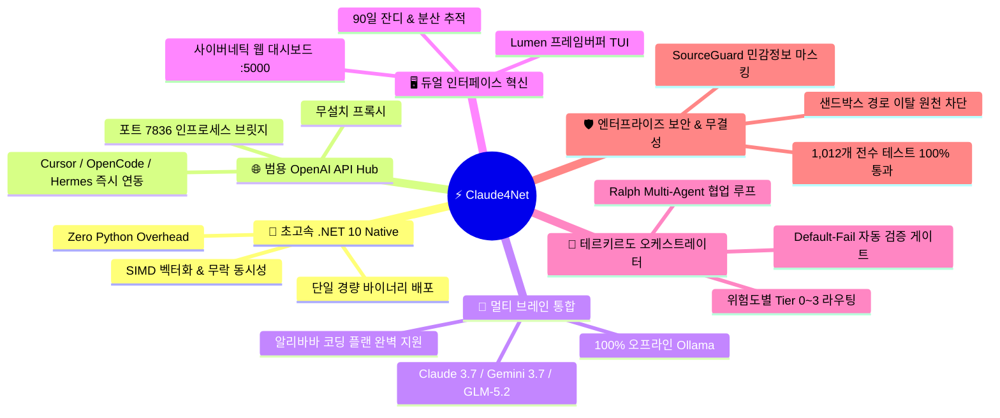
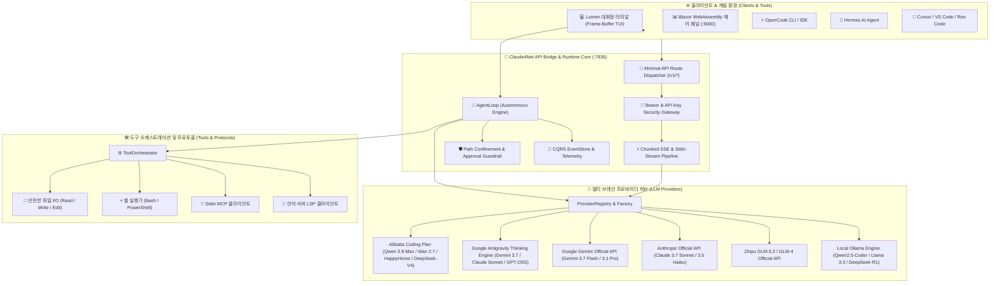

# ⚡ Claude4Net

<p align="center">
  
</p>

<p align="center">
  <strong>차세대 .NET 10 고성능 자율 AI 에이전트 런타임 & 멀티 브레인 오케스트레이션 플랫폼</strong><br>
  <em>결정론적 도구 실행 • 제로-데이터 유출 가드레일 • 범용 OpenAI API 브릿지 • 실시간 Blazor 관측 제어 패널</em>
</p>

<p align="center">
  <a href="https://dotnet.microsoft.com/download"></a>
  <a href="https://learn.microsoft.com/en-us/dotnet/csharp/"></a>
  <a href="LICENSE"></a>
  <a href="https://github.com/Terkiss/Claude4Net/actions"></a>
  <a href="https://modelcontextprotocol.io/"></a>
  <a href="https://openai.com/"></a>
  <a href="https://alibabacloud.com/"></a>
</p>

<p align="center">
  <a href="README.md">🇺🇸 <strong>English</strong></a> •
  <a href="README.ko.md">🇰🇷 <strong>한국어</strong></a> •
  <a href="README.ja.md">🇯🇵 <strong>日本語</strong></a>
</p>

---

## 🌟 왜 Claude4Net을 반드시 사용해야 하는가? (Why Claude4Net?)

수많은 AI 도구와 에이전트 프레임워크가 쏟아지는 현재, **Claude4Net**은 단순한 또 하나의 LLM 래퍼가 아닌 **압도적인 성능, 무결점 보안, 범용 호환성**을 갖춘 차세대 엔지니어링 플랫폼입니다.



### 1. 🚀 파이썬 오버헤드가 전혀 없는 극강의 .NET 10 네이티브 성능
* **Zero Python Dependency**: 파이썬 기반 프레임워크(LangChain, CrewAI, AutoGen 등)의 고질적인 GIL 병목, 수백 MB 메모리 누수, 복잡한 가상환경 종속성을 완전히 제거했습니다.
* **초저지연(Ultra-Low Latency)**: C# 13의 SIMD 벡터화 연산과 락-프리(Lock-Free) 비동기 파이프라인으로 수십 밀리초(ms) 단위의 신속한 응답을 보장합니다.
* **단일 바이너리(Self-Contained Executable)**: 복잡한 설치 없이 단 하나의 파일(`Claude4Net.Cli.exe`)만으로 즉시 구동됩니다.

### 2. 🌐 인프로세스 OpenAI 호환 API 게이트웨이 (`:7836`)
* **모든 IDE 및 AI 도구 즉시 연동**: Cursor, OpenCode, Hermes, VS Code, Roo Code, Aider 등 **기존의 모든 OpenAI SDK 기반 도구**에서 Claude4Net의 강력한 추론 모델을 로컬 주소(`http://127.0.0.1:7836/v1`) 하나로 즉시 활용할 수 있습니다.
* **무설치 경량 브릿지**: 별도의 프록시 서버나 복잡한 포워더 없이 CLI 내부에서 인프로세스로 안전하게 실행됩니다.

### 3. 🧠 알리바바 코딩 플랜(Alibaba Coding Plan) & 글로벌 6대 LLM 완벽 지원
* **2026 최신 Alibaba Coding Plan 공식 지원**: `qwen3.8-max`, `qwen3.7-plus`, `qwen3.6-flash`, `wan2.7-image`, `happyhorse-1.1`, `deepseek-v4-pro`, `glm-5.2` 등 알리바바 토큰 플랜 모델을 기본 탑재했습니다.
* **벤더 락인 제로(No Vendor Lock-In)**: Anthropic Claude 3.7 Sonnet Thinking, Google Gemini 3.7 Pro, Zhipu GLM-5.2, 로컬 Ollama(Qwen 2.5 Coder, Llama 3.3)까지 단 한 번의 명령(`/provider`, `/model`)으로 자유롭게 핫스왑할 수 있습니다.

### 4. 🖥️ 듀얼 인터페이스: Lumen TUI + 사이버네틱 웹 관제 대시보드 (`:5000`)
* **Lumen Interactive TUI (기본 모드)**: 대화 영역과 프롬프트 입력기가 분리된 프레임버퍼 기반 상/하단 분할 뷰, 실시간 AI 사고(Thought) 셀, 인라인 보안 결재 팝업을 제공합니다.
* **TeruTeruPandas 실시간 대시보드**: 90일 GitHub 스타일 활동 히트맵 잔디, 00~23시 시간대별 토큰 소모 분석, 분산 추적(Distributed Tracing) 워터폴 차트, 웹 실시간 결재 큐를 제공합니다.

### 5. 👑 테르키르도 프로토콜(Terukirdo Protocol v5.4) & Ralph 자율 에이전트 루프
* **Adaptive Risk Tiers (Tier 0~3)**: 작업 위험도에 따라 Companion(Tier 0)부터 First Reviewer, Tech Expert, Final Controller(Tier 2~3)까지 검증 단계를 지능적으로 동적 조율합니다.
* **Default-Fail 자동 검증 게이트 (`!verify`)**: 코드 수정 후 `dotnet build`와 `dotnet test`를 읽기 전용 샌드박스에서 자동 실행하여 결함이 있는 코드는 절대 통과시키지 않습니다.
* **SeedSpec 사양 관리 (`!spec`)**: 요구사항, 수락 기준, 블로킹 질의를 체계적으로 잠금(Lock) 및 추적합니다.

### 6. 🛡️ 철통 보안 가드레일 & 1,012개 테스트 100% 무결점 통과
* **SourceGuard & 샌드박스**: API 키 및 비밀번호 자동 마스킹, 워크스페이스 외부 경로 탈출(Path Traversal) 원천 차단.
* **사전 시뮬레이션 모드 (`/plan`)**: 실제 파일 쓰기 전에 에이전트의 작업 계획을 안전하게 드라이 런으로 사전 검증.
* **엔터프라이즈 신뢰성**: **전체 1,012개 단위 및 통합 테스트 슈트 100% All-Pass**.

---

## 📖 개요 (Overview)

**Claude4Net**은 **.NET 10**과 **C# 13**의 고성능 플랫폼 위에서 작동하는 엔터프라이즈급 오픈소스 AI 에이전트 런타임이자 **범용 멀티 LLM 오케스트레이터**입니다.

이벤트 소싱(Event-Sourcing) CQRS 아키텍처, 엄격한 샌드박스 보안 가드레일, 네이티브 Stdio MCP(Model Context Protocol), TeruTeruPandas 실시간 텔레메트리 대시보드, 그리고 **OpenCode / Hermes / Cursor / Roo Code**를 위한 내장 **OpenAI-Compatible API 서버**를 일체형으로 제공합니다.

> [!TIP]
> **100% 오프라인 & 완전 프라이버시 보장**: Claude4Net은 로컬 **Ollama** 모델과 즉시 연동되어 외부 네트워크 연결이 없는 폐쇄망 환경에서도 완벽한 자율 코딩 페어 프로그래밍을 지원합니다.

---

## ✨ 핵심 기능 매트릭스 (Key Highlights)

| 특장점 | 설명 | 핵심 가치 |
| :--- | :--- | :--- |
| 🌐 **범용 OpenAI API 브릿지** | OpenCode, Hermes, Cursor, Roo Code 등 외부 도구에 표준 OpenAI 엔드포인트 제공 (`:7836`) | 안티그래비티 3.7 Thinking 및 최신 모델을 모든 IDE에서 활용 |
| 🧠 **알리바바 & 멀티 프로바이더** | Alibaba Coding Plan (Qwen 3.8/Wan/HappyHorse), Claude, Gemini, GLM, Ollama | `/model` 및 `/login` 명령으로 지연 없는 핫스왑 전환 |
| 🎯 **자율 목표 실행 루프** | 자가 진단 및 다단계 교정을 수행하는 자율 에이전트 루프 (`!goal`, `!coordinate`) | 복잡한 요구사항의 무인 연속 코딩 및 자동 검증 |
| 🛡️ **철통 보안 가드레일** | 작업 경로 격리(Path Confinement), 파괴적 명령 인터셉터, SourceGuard 마스킹 | 기업 수준의 무결성 보장 및 데이터 손실 0% 달성 |
| 🔌 **표준 프로토콜 내장** | Stdio 기반 MCP (Model Context Protocol) 및 코드 분석용 LSP 지원 | 확장 가능한 도구 생태계 및 정밀한 코드 인텔리전스 |
| 📊 **실시간 Blazor 관측 패널** | ASP.NET Core & Blazor WebAssembly 기반 실시간 SignalR 텔레메트리 | 90일 잔디 히트맵, 실시간 토큰 지표, 분산 추적 워터폴 |
| 🩺 **자가 치유 (Self-Healing)** | 에러 자동 분류기, 반추(Reflection) 캡처, 테스트 주도 자동 패치 엔진 | 빌드/실행 실패 시 자율 원인 분석 및 자동 복구 |
| 💾 **이벤트 소싱 영속성** | 모든 도구 호출과 이벤트를 영구 기록하고 결정론적으로 재생 | 100% 실행 재현성 및 완벽한 보안 감사 추적 |

---

## 🏛️ 시스템 아키텍처 (System Architecture)

<p align="center">
  
</p>



---

## 🖥️ UI & 대시보드 관측성 (Observability)

<p align="center">
  
</p>

Claude4Net은 직관적인 터미널 환경과 강력한 웹 관측 제어 패널을 동시에 제공합니다:
* **Lumen Interactive TUI (기본값)**: 프레임버퍼 기반 대화창/입력기 분할 뷰, 단축키(`ESC`, `Ctrl+L`, `Ctrl+C`, `PgUp/PgDn`), 실시간 사고(Thinking) 셀 렌더링.
* **Blazor Web Dashboard (`:5000`)**: 90일 토큰 활동 히트맵 잔디, 00~23시 시간대별 토큰 소모량 드릴다운, 실시간 분산 추적(Distributed Traces) 워터폴, 브라우저 실시간 결재 큐.

---

## 🤖 지원 LLM 프로바이더 라인업

| 프로바이더 식별자 | 주요 지원 모델 라인업 (2026) | 전송 방식 | 주요 특징 |
| :--- | :--- | :--- | :--- |
| **`qwen/*`**, **`alibaba/*`** | `qwen3.8-max`, `qwen3.7-plus`, `qwen3.6-flash`, `deepseek-v4-pro`, `glm-5.2` | Alibaba Coding Plan API (SSE) | 알리바바 공식 코딩 플랜, 멀티모달 & 고성능 추론 |
| **`antigravity/*`** | `gemini-3.7-flash-high`, `claude-sonnet-4-6-thinking`, `gpt-oss-120b-high` | Subprocess Stdin IPC Stream | 딥 씽킹(Deep Thinking), 무제한 토큰 컨텍스트, 하네스 스킬 통합 |
| **`google/*`** | `gemini-3.7-flash`, `gemini-3.6-flash`, `gemini-3.5-flash`, `gemini-3.1-pro` | Direct Google REST API (SSE) | 초고속 멀티모달 추론, 구글 네이티브 그라운딩 |
| **`anthropic/*`** | `claude-3-7-sonnet`, `claude-3-5-sonnet`, `claude-3-5-haiku` | Direct Anthropic REST API | 확장 생각(Thinking), 업계 표준 툴콜링, 고신뢰 코드 생성 |
| **`glm/*`** | `glm-5.2`, `glm-4-plus`, `glm-4-flash`, `glm-4-air` | Zhipu Open REST API | 높은 동시성 처리, 강력한 다국어 추론 |
| **`ollama/*`** | `qwen2.5-coder`, `llama3.3`, `deepseek-r1` | Local Ollama REST API | 100% 오프라인 동작, 로컬 GPU 가속, 데이터 유출 제로 |
| **`openai/*`** | 임의의 호환 엔드포인트 (DeepSeek, Groq, vLLM, LocalAI) | OpenAI Chat Completions REST | 범용 엔드포인트 연결, 커스텀 Base URL 지정 |

---

## 🚀 빠른 시작 가이드 (Quick Start)

### 1. 사전 요구사항
* [.NET 10 SDK](https://dotnet.microsoft.com/download) (Version 10.0 이상)
* (선택) [Ollama](https://ollama.ai/) — 로컬 오프라인 실행 시

### 2. 빌드 및 테스트
```bash
# 1. 저장소 클론
git clone https://github.com/Terkiss/Claude4Net.git
cd Claude4Net

# 2. 솔루션 빌드
dotnet build Claude4Net.slnx -c Release

# 3. 1,012개 전체 테스트 검증 (100% All Pass)
dotnet test
```

---

## 💻 실행 모드 (Run Modes)

### 모드 A: Lumen 인터랙티브 TUI (기본 실행)
```bash
dotnet run --project Claude4Net.Cli
```

### 모드 B: 레거시 클래식 CLI 모드 (스크립트/CI용)
```bash
dotnet run --project Claude4Net.Cli -- --legacy-cli
```

### 모드 C: OpenAI 호환 API 서버 가동
```bash
dotnet run --project Claude4Net.Cli -- --api on --api-port 7836 --api-key-env OPENAI_API_KEY
```
> 또는 CLI 내부에서 대화형 명령: `/api on 7836`

---

## 🔌 외부 클라이언트 연동 (OpenCode & Hermes)

Claude4Net API 서버(`http://127.0.0.1:7836/v1`)를 가동하면 모든 외부 코딩 에이전트와 완벽히 연동됩니다.

### 1. OpenCode (`opencode.json`) 설정
```json
{
  "$schema": "https://opencode.ai/config.json",
  "provider": {
    "claude4net": {
      "npm": "@ai-sdk/openai-compatible",
      "name": "Claude4Net AI Hub",
      "options": {
        "baseURL": "http://127.0.0.1:7836/v1",
        "apiKey": "c4n-sk-mykey"
      },
      "models": {
        "qwen/qwen3.8-max": {
          "name": "Alibaba Qwen 3.8 Max (Coding Plan)"
        },
        "antigravity/gemini-3.7-flash-high": {
          "name": "Gemini 3.7 Flash (High Thinking)"
        },
        "antigravity/claude-sonnet-4-6-thinking": {
          "name": "Claude Sonnet 4.6 (Thinking)"
        }
      }
    }
  }
}
```

### 2. Hermes 및 Cursor / Roo Code 설정
* **API Base URL**: `http://127.0.0.1:7836/v1`
* **API Key**: 임의의 문자열 또는 환경변수 설정값
* **Model ID**: `qwen/qwen3.8-max` 또는 `antigravity/claude-sonnet-4-6-thinking`

---

## ⌨️ CLI 명령어 치트시트 (Command Reference)

Claude4Net은 직관적인 슬래시(`/`) 및 뱅(`!`) 명령어를 제공합니다:

| 명령어 | 설명 | 예시 |
| :--- | :--- | :--- |
| `/help` | 도움말 및 CLI 사용 가이드 표시 | `/help` |
| `/login` | 프로바이더 로그인 및 API 키 등록 (`qwen`, `alibaba`, `gemini`, `claude`, `glm`, `ollama`) | `/login qwen sk-...` |
| `/model` | LLM 모델 목록 탐색 및 활성 모델 전환 | `/model qwen3.8-max` |
| `/usage` | API 토큰 소모량, 비용 및 실시간 컨텍스트 윈도우 잔여량 확인 | `/usage` |
| `/api` | 인프로세스 OpenAI 호환 API 서버 제어 | `/api on 7836` |
| `/doctor` | 시스템 의존성, 프로바이더 및 환경 상태 종합 진단 | `/doctor` |
| `/audit` | 최근 보안 감사 및 도구 실행 로그 조회 | `/audit` |
| `/plan` | Plan/Dry-Run 시뮬레이션 모드 토글 (파일/상태 변경 사전 검증) | `/plan` |
| `/setworkspace` | 에이전트 도구 실행을 위한 프로젝트 루트 작업 공간 지정 | `/setworkspace D:\Projects\App` |
| `/goal` | 자율 목표 에이전트 실행 (`goal <목표> \| show \| clear`) | `/goal 회원가입 API 구현` |
| `/coordinate` | 태스크 기획(Planning) -> 실행(Execution) -> 검증(Verification) 3단계 조정 | `/coordinate list` |
| `/verify` | 기본 실패 정책 기반 빌드 및 단위 테스트 무결성 자동 검증 | `/verify` |
| `/spec` | SeedSpec 요구사항 및 수락 기준 관리 | `/spec show` |
| `/skill` | 에이전트 스킬 및 진화 제안 관리 | `/skill analyze` |
| `/maid`, `/terukirdo` | 1급 메이드 오케스트레이터 테르키르도 관제 | `/maid status` |
| `/yolo` | 루트 권한 - 모든 보안 결재 및 권한 검사 우회 (주의 요망) | `/yolo` |
| `/clear` | 터미널 콘솔 화면 지우기 | `/clear` |
| `/exit` | CLI 애플리케이션 안전 종료 | `/exit` |

---

## 🧪 품질 및 무결성 보증 (Quality & Tests)

Claude4Net은 엄격한 엔터프라이즈 품질 게이트 하에 개발됩니다:

* **빌드 무결성**: .NET 10 Release 모드 `0 Errors, 0 Warnings`.
* **단위 및 통합 테스트**: **1,012 / 1,012 Tests 100% Pass** (회귀율 0%).
* **블랙박스 SDK 검증**: 공식 OpenAI .NET SDK, Python SDK, Node.js SDK 호환성 전수 통과.
* **보안 가드레일**: 경로 탈출(Path Traversal), SSRF 방지, 평문 egress 차단 완비.

---

## 📄 라이선스 (License)

이 프로젝트는 [MIT 라이선스](LICENSE) 하에 자유롭게 사용할 수 있습니다.
