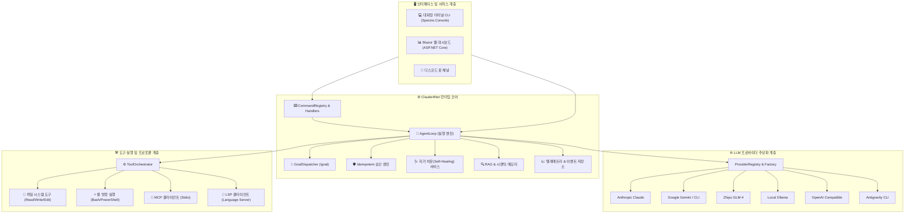

# ⚡ Claude4Net

<p align="center">
  
</p>

<p align="center">
  <strong>차세대 .NET 10 자율 AI 에이전트 런타임 & 관측(Observability) 플랫폼</strong><br>
  <em>결정론적 도구 실행, 탄력적인 자가 치유(Self-Healing), 그리고 유연한 멀티 LLM 오케스트레이션</em>
</p>

<p align="center">
  <a href="https://dotnet.microsoft.com/download"></a>
  <a href="https://learn.microsoft.com/en-us/dotnet/csharp/"></a>
  <a href="LICENSE"></a>
  <a href="https://github.com/Terkiss/Claude4Net/actions"></a>
  <a href="https://modelcontextprotocol.io/"></a>
</p>

<p align="center">
  <a href="README.md">🇺🇸 <strong>English</strong></a> •
  <a href="README.ko.md">🇰🇷 <strong>한국어</strong></a> •
  <a href="README.ja.md">🇯🇵 <strong>日本語</strong></a>
</p>

---

## 📖 개요 (Overview)

**Claude4Net**은 **.NET 10** 및 **C# 13** 기반으로 구축된 엔터프라이즈급 고성능 로컬 AI 에이전트 런타임입니다. 이벤트 소싱(Event-Sourced) 아키텍처, 강력한 보안 가드레일, 네이티브 MCP(Model Context Protocol) 지원, 시맨틱 RAG, 실시간 Blazor 웹 대시보드를 통해 최신 대규모 언어 모델(LLM)과 로컬 실행 환경을 완벽하게 연결합니다.

대화형 CLI 페어 프로그래머, 다단계 자율 목표 실행기(`!goal`), 백그라운드 자동화 루틴 스케줄러 등 어떤 용도로 실행하든 엄격한 보안 경계와 자가 치유(Self-Healing) 지능을 바탕으로 결정론적(Deterministic) 도구 오케스트레이션을 제공합니다.

> [!TIP]
> **무설정 로컬 실행 지원**: Claude4Net은 로컬 **Ollama** 모델과 즉시 연동되어 외부 데이터 유출이 전혀 없는 100% 완전 오프라인 환경에서도 강력하게 동작합니다.

---

## ✨ 핵심 기능 (Key Highlights)

| 기능 | 상세 설명 | 특장점 |
| :--- | :--- | :--- |
| 🧠 **멀티 프로바이더 매트릭스** | Claude, Gemini, GLM-4, Ollama, OpenAI 호환 게이트웨이, Antigravity CLI | `/provider <name>`으로 실시간 핫스왑 |
| 🎯 **자율 목표 실행 루프** | 자가 교정 및 단계별 진행 추적을 지원하는 자율 루프 (`!goal`) | 복잡한 다단계 작업의 무인 실행 |
| 🛡️ **방어적 보안 가드레일** | 경로 안전성 검증, 위험 명령어 인터셉터, 가상 드라이런 시뮬레이션 | 기업 환경에 맞춘 데이터 무결성 보장 |
| 🔌 **표준 프로토콜 내장** | Stdio 기반 MCP (Model Context Protocol) 및 코드 분석용 LSP 지원 | 표준화된 도구 생태계 및 코드 인텔리전스 |
| 📊 **Blazor 관측 제어 패널** | SignalR 실시간 스트리밍을 지원하는 ASP.NET Core & Blazor 대시보드 | 실시간 세션 모니터링 & 체크포인트 되감기 |
| 🩺 **자가 치유 (Self-Healing)** | 오류 분류기, 시맨틱 반추 캡처 및 자동 복구 코드 패칭 엔진 | 실패 시 자율 진단 및 테스트 기반 롤백/패치 |
| 💾 **이벤트 소싱 영속성** | 결정론적 세션 재생, 실행 궤적(Trajectory) 추적 및 스냅샷 복원 | 완벽한 실행 재현성 및 감사 추적 |
| ⚡ **모듈형 플러그인 엔진** | 커스텀 도구 및 인터셉터 추가를 위한 확장 아키텍처 (`Claude4Net.MyPlugins`) | 깔끔한 의존성 주입 및 파이프라인 훅 |

---

## 🏛️ 시스템 아키텍처 (Architecture)



---

## 🤖 지원 LLM 프로바이더

Claude4Net은 **클래스 1개 = 전용 프로바이더 1개** 원칙을 고수하여 각 프로바이더별 전용 `ILLMProvider` 독립 클래스로 구현되어 있습니다.

| 프로바이더 | 지원 주요 모델 | 전송 프로토콜 | 주요 특장점 |
| :--- | :--- | :--- | :--- |
| **Anthropic Claude** | `claude-3-7-sonnet`, `claude-3-5-haiku`, `claude-3-opus` | Direct REST API (SSE) | 확장 생각(Thinking), 정교한 툴콜, 스트리밍 |
| **Google Gemini** | `gemini-2.5-pro`, `gemini-2.5-flash`, `gemini-2.0-flash` | REST API / Gemini CLI | 멀티모달, 그라운딩, 초고속 추론 |
| **Zhipu GLM** | `glm-4-plus`, `glm-4-flash`, `glm-4-air` | Open-API REST (Bearer Auth) | 높은 동시성, 다단계 추론, 함수 호출 |
| **Local Ollama** | `qwen2.5-coder`, `llama3.3`, `deepseek-r1` 등 | Local HTTP API | 100% 오프라인 완전 비공개, 데이터 유출 제로 |
| **OpenAI-Compatible** | 임의의 엔드포인트 (DeepSeek, Groq, vLLM, LocalAI) | OpenAI Chat Completions API | 폭넓은 호환성, 커스텀 base URL 지원 |
| **Antigravity CLI** | Antigravity Native Engine | Subprocess IPC / Stdio | 전문 에이전트 하네스 워크플로우 통합 |

---

## 📦 프로젝트 및 솔루션 구성

```text
Claude4Net/
├── Claude4Net.Cli/               # 대화형 터미널 TUI 인터페이스
├── Claude4Net.Runtime/           # 핵심 실행 루프, 핸들러, 서비스 및 DI 파이프라인
│   ├── Handlers/                 # 도메인별 명령 핸들러 (Agent, Goal, File, Provider, System)
│   ├── Services/                 # RAG, Telemetry, SelfHealing, ToolSecurity 서비스
│   └── Server/                   # 프록시 서버 및 IPC 엔드포인트
├── Claude4Net.Api/               # 전용 LLM 어댑터 (Claude, Gemini, GLM, Ollama 등)
├── Claude4Net.SDK/               # 도메인 인터페이스, 이벤트 스키마, DTO 및 시스템 계약
├── Claude4Net.Commands/          # 경량 명령 디스패처 및 레지스트리
├── Claude4Net.Tools/             # 파일(Read/Write/Edit), 셸(Bash), LSP 및 MCP 도구 세트
├── Claude4Net.Dashboard/         # ASP.NET Core 관측 백엔드 & SignalR 허브
├── Claude4Net.Dashboard.Client/  # Blazor WebAssembly 제어 패널 UI
├── Claude4Net.MyPlugins/         # 사용자 정의 플러그인 확장 예제
├── Claude4Net.Discord/           # 디스코드 봇 인터페이스
└── Claude4Net.Tests/             # 종합 xUnit 단위/통합 테스트 및 회귀 벤치마크
```

---

## 🚀 시작하기

### 요구 사항

- [.NET 10 SDK](https://dotnet.microsoft.com/download) (Version 10.0 이상)
- (선택) 로컬 오프라인 실행을 위한 [Ollama](https://ollama.ai/)
- (선택) 프로바이더 API 키 (Anthropic, Google, Zhipu 등)

### 설치 및 빌드

```bash
# 1. 저장소 복제
git clone https://github.com/Terkiss/Claude4Net.git
cd Claude4Net

# 2. 의존성 복원
dotnet restore Claude4Net.slnx

# 3. 솔루션 전체 릴리즈 빌드
dotnet build Claude4Net.slnx -c Release

# 4. 전체 테스트 실행
dotnet test Claude4Net.Tests/Claude4Net.Tests.csproj
```

---

## 💻 애플리케이션 실행

### 1. 대화형 CLI 모드

터미널 대화형 셸을 실행합니다:

```bash
dotnet run --project Claude4Net.Cli
```

### 2. 웹 대시보드 동시 실행

CLI와 함께 실시간 Blazor 웹 대시보드를 동시에 구동합니다:

```bash
dotnet run --project Claude4Net.Cli -- --dashboard
```
> 🌐 웹 브라우저에서 `http://localhost:5000` (또는 설정된 포트)으로 대시보드에 접속할 수 있습니다.

---

## 🔐 인증 및 환경 설정

Claude4Net은 민감한 API 키가 환경 변수나 커밋 로그에 유출되는 것을 방지하기 위해 `api_key.json` 기반의 제로-리크 보안 인증을 사용합니다.

```bash
# Claude4Net CLI 내부에서 대화형으로 키를 등록합니다:
> !login anthropic sk-ant-api03-...
> !login gemini AIzaSy...
> !login glm your-zhipu-api-key...
> !login openai sk-...
```

> [!NOTE]
> 자동화 환경을 위해 환경 변수 폴백도 지원하지만, 대화형 키 저장소가 항상 우선권을 갖습니다.

---

## ⌨️ 명령어 레퍼런스 (Command Reference)

Claude4Net은 슬래시(`/`) 및 뱅(`!`) 명령어를 통해 풍부한 제어 기능을 제공합니다:

### ⚙️ 세션 및 시스템 제어

| 명령어 | 설명 |
| :--- | :--- |
| `/help` | 전체 명령어 목록 및 사용 가이드 출력 |
| `/status` | 런타임 상태, 활성 프로바이더, 토큰 메트릭 및 메모리 상태 조회 |
| `/session [new\|list\|switch <id>]` | 멀티 세션 생성, 목록 확인 및 전환 |
| `/resume <sessionId>` | 과거 세션 복원 및 재연결 |
| `/plan` | **드라이런(Dry-Run) 모드** 토글 (실제 파일 수정 없이 가상 시뮬레이션) |
| `/clear` | 터미널 화면 정리 |

### 🎯 자율 에이전트 & 목표

| 명령어 | 설명 |
| :--- | :--- |
| `!goal <목표 설명>` | 완료될 때까지 자동으로 판단하고 실행하는 자율 목표 루프 시작 |
| `!goal status` | 현재 실행 중인 자율 목표의 단계별 진행 상황 확인 |
| `!goal cancel` | 실행 중인 자율 목표 루프 안전하게 중단 |
| `!replay [steps]` | 이벤트 소싱 기반 실행 궤적 및 히스토리 재생 |
| `!rewind <checkpointId>` | 세션 상태 및 작업 공간을 특정 체크포인트로 되감기 |

### 🔌 도구, 스킬 & 프로바이더

| 명령어 | 설명 |
| :--- | :--- |
| `/providers` | 등록된 모든 내장/외부 LLM 프로바이더 목록 확인 |
| `/provider <name>` | 활성 프로바이더 실시간 교체 (예: `/provider glm`) |
| `!skills` | `.agents/skills` 디렉터리에 색인된 에이전트 스킬 목록 확인 |
| `!rag search <query>` | 로컬 코드베이스 임베딩 기반 시맨틱 검색 수행 |
| `!heal` | 최근 발생한 오류에 대한 자가 치유 진단 분석 및 해결책 제안 |

---

## 🛡️ 안전성, 승인 엔진 및 가드레일

<details>
<summary><b>보안 가드레일 상세 펼치기</b></summary>

1. **경로 안전성 (Path Safety)**: 작업 디렉터리를 벗어나는 경로 탐색 공격(`../`, symlink) 자동 차단.
2. **명령어 가드레일 (Command Interception)**: 파괴적인 셸 명령(예: `rm -rf /`, `format`) 감지 시 필수 사용자 확인 대화상자 호출.
3. **Idempotent 승인 엔진**: 작업별 승인 캐싱 및 검증을 통해 과도한 프롬프트 피로를 방지하면서 안전성 유지.
4. **드라이런 시뮬레이션**: `/plan` 모드에서는 파일 변경 및 셸 실행이 디스크에 반영되지 않고 가상 Diff로 시뮬레이션됨.

</details>

---

## 🩺 자가 치유(Self-Healing) & 반추 메커니즘

<details>
<summary><b>자가 치유 메커니즘 상세 펼치기</b></summary>

도구 실행 중 오류(컴파일 에러, 셸 실패, API 타임아웃 등)가 발생하면:
1. **오류 분류**: `ErrorClassifier`가 오류 유형(구조적, 런타임, 문법, 권한 등)을 분석합니다.
2. **반추 생성**: `SelfHealingService`가 실패 궤적을 캡처하고 반추 프롬프트를 구성합니다.
3. **자동 복구**: 에이전트가 코드를 외과적으로 수정하고, 테스트를 통해 검증한 뒤 메모리 원장에 지속 기록합니다.

</details>

---

## 🧪 테스트 및 품질 검증

```bash
# 단위 및 통합 테스트 실행
dotnet test Claude4Net.Tests/Claude4Net.Tests.csproj

# 특정 프로바이더 테스트만 필터링 실행
dotnet test Claude4Net.Tests/Claude4Net.Tests.csproj --filter "FullyQualifiedName~GlmProviderTests"
dotnet test Claude4Net.Tests/Claude4Net.Tests.csproj --filter "FullyQualifiedName~GoalDispatcherTests"
```

---

## 🤝 기여하기 (Contributing)

기여는 언제나 환영합니다!

1. 저장소를 Fork 합니다.
2. 기능 브랜치를 생성합니다 (`git checkout -b feature/amazing-feature`).
3. 테스트를 실행하여 통과를 확인합니다 (`dotnet test`).
4. 변경 사항을 커밋합니다 (`git commit -m 'feat: add amazing feature'`).
5. 브랜치에 푸시합니다 (`git push origin feature/amazing-feature`).
6. Pull Request를 생성합니다.

---

## 📄 라이선스 (License)

이 프로젝트는 **MIT License**를 따릅니다. 자세한 내용은 [LICENSE](LICENSE) 파일을 참조하세요.

<p align="center">
  Crafted with ❤️ by <strong>Terkiss</strong> and the <strong>Claude4Net Community</strong>
</p>
