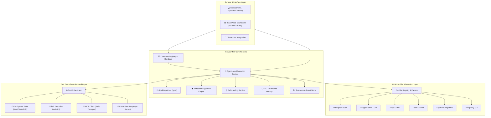

# ⚡ Claude4Net

<p align="center">
  
</p>

<p align="center">
  <strong>Next-Generation .NET 10 Autonomous AI Agent Runtime & Observability Platform</strong>
</p>

<p align="center">
  <a href="https://dotnet.microsoft.com/download"></a>
  <a href="https://learn.microsoft.com/en-us/dotnet/csharp/"></a>
  <a href="LICENSE"></a>
  <a href="https://github.com/Terkiss/Claude4Net/actions"></a>
  <a href="https://modelcontextprotocol.io/"></a>
</p>

---

## 📖 Overview

**Claude4Net** is an enterprise-grade, high-performance local AI agent runtime built on **.NET 10** and **C# 13**. It bridges leading Large Language Models (LLMs) with local execution environments through an event-sourced architecture, robust safety guardrails, native Model Context Protocol (MCP) support, semantic RAG, and an interactive Blazor Web Dashboard.

Whether running as an interactive CLI companion, orchestrating autonomous multi-step goals (`!goal`), or operating as a background automation service, Claude4Net delivers deterministic tool orchestration with strict security boundaries and self-healing intelligence.

---

## ✨ Key Highlights

- 🧠 **Multi-Provider LLM Matrix**: Seamlessly switch between Anthropic Claude, Google Gemini (API & CLI), Zhipu GLM, Ollama (Local LLM), OpenAI-compatible gateways, and Antigravity CLI.
- 🎯 **Autonomous Goal Execution (`!goal`)**: Goal-driven loop with adaptive self-correction, progress tracking, and idempotent approval gates.
- 🛡️ **Defensive Security & Approval Engine**: Path safety validation, dangerous command interceptors, fine-grained permission levels, and dry-run execution modes.
- 🔌 **Native Protocol Support (MCP & LSP)**: First-class integration for Model Context Protocol (stdio/IPC) and Language Server Protocol for deep codebase semantic navigation.
- 📊 **Real-time Observability Dashboard**: ASP.NET Core & Blazor-powered control plane for live session streaming, checkpoint rewind, provider metrics, and telemetry inspection.
- 🩺 **Autonomous Self-Healing Loop**: Real-time error classification, semantic failure triage, reflection capture, and actionable remediation strategies.
- 💾 **Event-Sourced Session Persistence**: Deterministic session replay, state snapshots, rewind capabilities, and structured trajectory logging.
- ⚡ **Extensible Plugin Engine**: Modular plugin architecture (`Claude4Net.MyPlugins`) allowing dynamic tool registration and custom pipeline interceptors.

---

## 🏛️ System Architecture



---

## 🤖 Supported LLM Providers

Claude4Net follows a clean **1 Class = 1 Dedicated Provider** architecture with dedicated `ILLMProvider` implementations.

| Provider | Supported Models | Transport / Protocol | Key Features |
| :--- | :--- | :--- | :--- |
| **Anthropic Claude** | `claude-3-7-sonnet`, `claude-3-5-haiku`, `claude-3-opus` | Direct REST API (SSE) | Extended thinking, tool calling, streaming |
| **Google Gemini** | `gemini-2.5-pro`, `gemini-2.5-flash`, `gemini-2.0-flash` | REST API / Gemini CLI | Multimodal, grounding, high-speed inference |
| **Zhipu GLM** | `glm-4-plus`, `glm-4-flash`, `glm-4-air` | Open-API REST (Bearer Auth) | High-concurrency, reasoning, tool execution |
| **Local Ollama** | `qwen2.5-coder`, `llama3.3`, `deepseek-r1`, custom models | Local HTTP API | 100% offline, zero data egress, customizable |
| **OpenAI-Compatible** | Any standard endpoint (DeepSeek, Groq, vLLM, LocalAI) | OpenAI Chat Completions API | Universal compatibility, custom base URLs |
| **Antigravity CLI** | Antigravity Native Engine | Subprocess IPC / Stdio | Agentic harness integration |

---

## 📦 Solution & Project Layout

```text
Claude4Net/
├── Claude4Net.Cli/               # Interactive terminal interface with rich TUI
├── Claude4Net.Runtime/           # Core execution engine, handlers, services, and DI pipeline
│   ├── Handlers/                 # Command domain handlers (Agent, Goal, File, Provider, System)
│   ├── Services/                 # RAG, Telemetry, SelfHealing, ToolSecurity services
│   └── Server/                   # Proxy server and IPC communication endpoints
├── Claude4Net.Api/               # Dedicated LLM provider adapters (Claude, Gemini, GLM, Ollama, etc.)
├── Claude4Net.SDK/               # Domain interfaces, event schemas, DTOs, and system contracts
├── Claude4Net.Commands/          # Lightweight CLI command dispatcher & registry
├── Claude4Net.Tools/             # Core toolset: File (Read/Write/Edit), Shell (Bash), LSP & MCP
├── Claude4Net.Dashboard/         # ASP.NET Core observability backend & SignalR hubs
├── Claude4Net.Dashboard.Client/  # Blazor WebAssembly control plane UI
├── Claude4Net.MyPlugins/         # Sample user plugin extensions and custom skills
├── Claude4Net.Discord/           # Discord bot integration channel
└── Claude4Net.Tests/             # Comprehensive xUnit test suite & regression benchmarks
```

---

## 🚀 Getting Started

### Prerequisites

- [.NET 10 SDK](https://dotnet.microsoft.com/download) (Version 10.0 or later)
- (Optional) [Ollama](https://ollama.ai/) for offline local execution
- (Optional) Model API keys (Anthropic, Google, Zhipu, etc.)

### Installation & Build

```bash
# 1. Clone the repository
git clone https://github.com/Terkiss/Claude4Net.git
cd Claude4Net

# 2. Restore NuGet dependencies
dotnet restore Claude4Net.slnx

# 3. Build entire solution
dotnet build Claude4Net.slnx -c Release

# 4. Run full test suite
dotnet test Claude4Net.Tests/Claude4Net.Tests.csproj
```

---

## 💻 Running the Application

### 1. Interactive CLI Mode

Launch the interactive terminal:

```bash
dotnet run --project Claude4Net.Cli
```

### 2. Launch with Web Dashboard

Start both the CLI and the real-time Blazor Web Dashboard:

```bash
dotnet run --project Claude4Net.Cli -- --dashboard
```
> 🌐 The Dashboard will be accessible at `http://localhost:5000` (or configured port).

---

## 🔐 Authentication & Configuration

Claude4Net uses a zero-leak secure credentials store via `api_key.json` and interactive commands, preventing sensitive API keys from spilling into environment variables or commit logs.

```bash
# Authenticate your providers interactively inside Claude4Net CLI:
> !login anthropic sk-ant-api03-...
> !login gemini AIzaSy...
> !login glm your-zhipu-api-key...
> !login openai sk-...
```

You can view current provider registration and active credentials with:

```bash
> /providers
> /status
```

---

## ⌨️ Command Reference

Claude4Net provides a rich set of Slash (`/`) and Bang (`!`) commands organized by domain:

### ⚙️ Session & System Control

| Command | Description |
| :--- | :--- |
| `/help` | Display comprehensive command list and usage hints |
| `/status` | View runtime health, active provider, token metrics, and memory status |
| `/session [new|list|switch <id>]` | Manage multi-agent chat sessions |
| `/resume <sessionId>` | Reconnect to and restore a previous execution session |
| `/plan` | Toggle **Dry-Run Mode** (validates tool execution without disk mutations) |
| `/clear` | Clear the current terminal buffer |

### 🎯 Autonomous Agent & Goals

| Command | Description |
| :--- | :--- |
| `!goal <task description>` | Start autonomous goal dispatcher loop until completion |
| `!goal status` | Inspect current autonomous goal breakdown and step progress |
| `!goal cancel` | Safely terminate running autonomous loop |
| `!replay [steps]` | Replay event-sourced execution transcript with timestamps |
| `!rewind <checkpointId>` | Rewind session state and workspace to a specific checkpoint |

### 🔌 Tools, Skills & Providers

| Command | Description |
| :--- | :--- |
| `/providers` | List all available built-in and external LLM providers |
| `/provider <name>` | Switch active model provider on the fly (e.g. `/provider glm`) |
| `!skills` | List all indexed agent skills from `.agents/skills` |
| `!rag search <query>` | Perform semantic search over local codebase embeddings |
| `!heal` | Run self-healing diagnostic analysis on recent errors |

---

## 🛡️ Safety, Approval & Guardrails

Claude4Net is designed with security-first execution boundaries:

1. **Path Safety**: Path traversal attacks (`../`, symlink escapes) outside the workspace root are automatically blocked.
2. **Command Interception**: Destructive shell commands (e.g., `rm -rf /`, `format`, raw partition access) trigger mandatory interactive approval prompts.
3. **Idempotent Approvals**: Tool approvals can be verified, cached, and validated per-operation to prevent redundant prompt fatigue while maintaining safety.
4. **Dry-Run Simulation**: In `/plan` mode, file modifications and shell executions are mocked and diffed before touching real storage.

---

## 🩺 Self-Healing & Reflection Architecture

When tool execution encounters errors (compilation failures, shell errors, API timeouts):
1. **Error Classification**: The `ErrorClassifier` categorizes the incident into structural, runtime, syntax, or permission errors.
2. **Reflection Generation**: `SelfHealingService` captures the failed trajectory, generates a remediation prompt, and consults the reflection index.
3. **Autonomous Patching**: The agent applies surgical code edits, verifies changes with tests, and updates the durable memory ledger.

---

## 🧪 Testing & Quality Assurance

Claude4Net maintains a strict quality gate with zero-regression policies:

```bash
# Run unit & integration tests
dotnet test Claude4Net.Tests/Claude4Net.Tests.csproj

# Run specific provider tests
dotnet test Claude4Net.Tests/Claude4Net.Tests.csproj --filter "FullyQualifiedName~GlmProviderTests"
dotnet test Claude4Net.Tests/Claude4Net.Tests.csproj --filter "FullyQualifiedName~GoalDispatcherTests"
```

---

## 🤝 Contributing

Contributions are welcome! Please follow these steps:

1. Fork the repository.
2. Create your feature branch (`git checkout -b feature/amazing-feature`).
3. Ensure all tests pass (`dotnet test`).
4. Commit your changes (`git commit -m 'feat: add amazing feature'`).
5. Push to the branch (`git push origin feature/amazing-feature`).
6. Open a Pull Request.

---

## 📄 License

This project is licensed under the **MIT License** - see the [LICENSE](LICENSE) file for details.

<p align="center">
  Crafted with ❤️ by <strong>Terkiss</strong> and the <strong>Claude4Net Community</strong>
</p>
