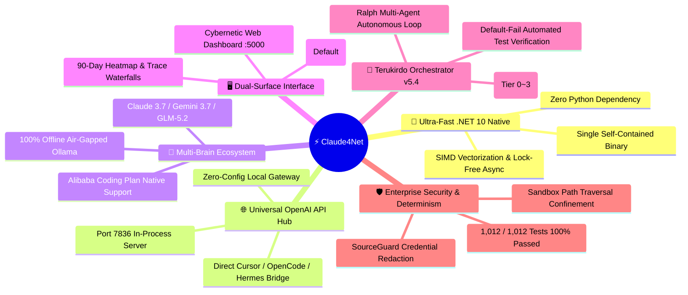
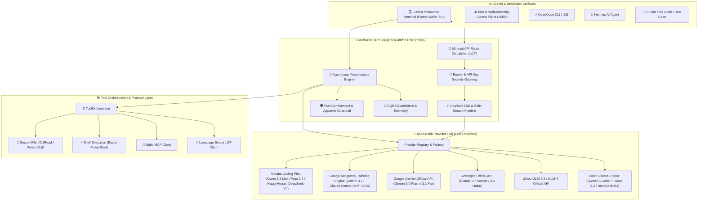

# ⚡ Claude4Net

<p align="center">
  
</p>

<p align="center">
  <strong>Next-Generation .NET 10 Autonomous AI Agent Runtime & Multi-Brain Orchestration Platform</strong><br>
  <em>Deterministic Tool Execution • Zero Data Egress Safety Guardrails • Universal OpenAI API Hub • Real-Time Blazor Control Plane</em>
</p>

<p align="center">
  <a href="https://dotnet.microsoft.com/download"></a>
  <a href="https://learn.microsoft.com/en-us/dotnet/csharp/"></a>
  <a href="LICENSE"></a>
  <a href="https://github.com/Terkiss/Claude4Net/actions"></a>
  <a href="https://modelcontextprotocol.io/"></a>
  <a href="https://openai.com/"></a>
  <a href="https://alibabacloud.com/"></a>
</p>

<p align="center">
  <a href="README.md">🇺🇸 <strong>English</strong></a> •
  <a href="README.ko.md">🇰🇷 <strong>한국어</strong></a> •
  <a href="README.ja.md">🇯🇵 <strong>日本語</strong></a>
</p>

---

## 🌟 Why Claude4Net? (The Ultimate Value Proposition)

In a crowded ecosystem of AI tools and agent frameworks, **Claude4Net** is not just another LLM wrapper. It is an engineering powerhouse designed from the ground up for **extreme performance, uncompromising safety, and universal developer workflow compatibility**.



### 1. 🚀 Blazing Fast .NET 10 Native Performance (Zero Python Overhead)
* **Zero Python Bottlenecks**: Eliminates GIL deadlocks, slow interpreter cold starts, multi-hundred MB memory bloat, and fragile virtualenv setup common in Python frameworks (LangChain, CrewAI, AutoGen).
* **Ultra-Low Latency**: Leverages C# 13 SIMD vectorized operations, lock-free memory mapping, and async streaming pipelines for sub-millisecond dispatch overhead.
* **Single Self-Contained Executable**: Ships as a lightweight, zero-dependency binary (`Claude4Net.Cli.exe`) ready to run anywhere.

### 2. 🌐 In-Process OpenAI-Compatible API Hub (`:7836`)
* **Instant Compatibility with Any IDE & Tool**: Connect Cursor, OpenCode, Hermes, VS Code, Roo Code, or Aider directly to your local endpoint (`http://127.0.0.1:7836/v1`) without modifying client code.
* **Embedded Zero-Proxy Architecture**: Runs in-process alongside your CLI/daemon with automated request validation, streaming chunk parsers, and zero external proxy dependencies.

### 3. 🧠 Alibaba Coding Plan & Global Multi-Brain Matrix
* **Official Alibaba Coding Plan Integration**: Full native support for Alibaba Cloud Token Plan models (`qwen3.8-max`, `qwen3.7-plus`, `qwen3.6-flash`, `wan2.7-image`, `happyhorse-1.1`, `deepseek-v4-pro`, `glm-5.2`).
* **Zero Vendor Lock-In**: Seamlessly hot-swap across Anthropic Claude 3.7 Sonnet Thinking, Google Gemini 3.7 Pro, Zhipu GLM-5.2, and local offline Ollama models with a single `/model` command.

### 4. 🖥️ Dual-Surface Interface: Lumen TUI + Web Telemetry Dashboard (`:5000`)
* **Lumen Interactive TUI (Default)**: Frame-buffered split-pane view separating live chat history and multi-line prompt editing, real-time AI Thought cells, and inline approval dialogs.
* **TeruTeruPandas Real-Time Web Control Plane**: 90-day GitHub-style token activity heatmaps, 24-hour hourly token drill-downs, distributed trace waterfalls, and live web approval queues.

### 5. 👑 Terukirdo Protocol v5.4 & Ralph Autonomous Agent Loop
* **Adaptive Risk Tiers (Tier 0 ~ Tier 3)**: Dynamically routes tasks through Companion (Tier 0), First Reviewer, Tech Expert, and Final Approach Control (Tier 2~3) based on risk factors.
* **Default-Fail Automated Test Verification (`!verify`)**: Automatically runs non-destructive builds and unit test suites before any code change is accepted.
* **SeedSpec Requirement Management (`!spec`)**: Formalizes acceptance criteria and blocking questions into enforceable machine-readable contracts.

### 6. 🛡️ Enterprise-Grade Security & 1,012 Tests 100% Pass
* **SourceGuard & Sandboxed Path Confinement**: Automatic API key and token masking in logs, strict workspace boundary enforcement, and destructive command interception.
* **Dry-Run Simulation Mode (`/plan`)**: Previews and simulates file modifications before applying them to disk.
* **Proven Production Reliability**: Verified with **1,012 / 1,012 passing automated test cases** (0 failures, 0 regressions).

---

## 📖 Overview

**Claude4Net** is an enterprise-grade, high-performance open-source AI agent runtime and **Universal Multi-Brain Orchestrator** built on **.NET 10** and **C# 13**.

From 100% offline local LLMs to top-tier cloud reasoning models (Gemini 3.7 Thinking, Claude Sonnet Thinking, Alibaba Qwen 3.8 Max), Claude4Net bridges intelligence with local execution environments through an event-sourced CQRS architecture, defensive path-confinement sandboxes, native Stdio Model Context Protocol (MCP), a real-time Blazor dashboard, and a built-in **OpenAI-Compatible API Server** for **OpenCode, Hermes, Cursor, and Roo Code**.

> [!TIP]
> **100% Air-Gapped & Zero Data Egress**: Claude4Net pairs seamlessly with local **Ollama** models out of the box, providing a private, secure developer experience in completely disconnected environments.

---

## ✨ Key Highlights

| Highlight | Description | Core Value |
| :--- | :--- | :--- |
| 🌐 **Universal OpenAI API Bridge** | Standard OpenAI REST endpoints (`:7836`) for OpenCode, Hermes, Cursor, Roo Code | Harness Thinking models in any IDE instantly |
| 🧠 **Alibaba & Multi-Provider Matrix** | Alibaba Coding Plan (Qwen 3.8/Wan/HappyHorse), Claude, Gemini, GLM, Ollama | Instant hot-swapping via `/model` and `/login` |
| 🎯 **Autonomous Goal Loop** | Goal-driven autonomous execution loop (`!goal`, `!coordinate`) with adaptive remediation | Unattended multi-step development & automated verification |
| 🛡️ **Defensive Guardrails** | Strict path confinement, destructive command interceptors, SourceGuard masking | Enterprise data integrity & zero accidental data loss |
| 🔌 **Native Protocols** | Stdio MCP (Model Context Protocol) & LSP (Language Server Protocol) | Standardized tool ecosystem & rich code intelligence |
| 📊 **Real-Time Blazor Control Plane** | ASP.NET Core & Blazor WebAssembly dashboard with live SignalR streaming | 90-day activity heatmap, real-time token telemetry & trace waterfalls |
| 🩺 **Self-Healing Loop** | Error classifier, semantic reflection capture, and test-driven auto-patching | Autonomous diagnostic & automated test-driven fix loop |
| 💾 **Event Sourcing Persistence** | Full trajectory persistence, snapshot rewind, and replay capabilities | 100% deterministic reproducibility & security audit trails |

---

## 🏛️ System Architecture

<p align="center">
  
</p>



---

## 🖥️ UI & Dashboard Observability

<p align="center">
  
</p>

Claude4Net delivers both a modern terminal user interface and an interactive web control plane:
* **Lumen Interactive TUI (Default Mode)**: Split-screen chat surface, multiline prompt composer, keyboard navigation (`ESC`, `Ctrl+L`, `Ctrl+C`, `PgUp/PgDn`), and real-time reasoning Thought cells.
* **Blazor Web Dashboard (`:5000`)**: 90-day contribution heatmap, 24-hour hourly token drill-down, distributed trace waterfalls, and live security approval queues.

---

## 🤖 Supported LLM Providers

| Provider Identifier | Lineup (2026 Releases) | Protocol / Transport | Highlights |
| :--- | :--- | :--- | :--- |
| **`qwen/*`**, **`alibaba/*`** | `qwen3.8-max`, `qwen3.7-plus`, `qwen3.6-flash`, `deepseek-v4-pro`, `glm-5.2` | Alibaba Coding Plan API (SSE) | Alibaba Cloud official coding plan, multimodal & deep reasoning |
| **`antigravity/*`** | `gemini-3.7-flash-high`, `claude-sonnet-4-6-thinking`, `gpt-oss-120b-high` | Subprocess Stdin IPC Stream | Deep Thinking, unlimited context window, harness skill sync |
| **`google/*`** | `gemini-3.7-flash`, `gemini-3.6-flash`, `gemini-3.5-flash`, `gemini-3.1-pro` | Direct Google REST API (SSE) | Ultra-fast multimodal inference, Google native grounding |
| **`anthropic/*`** | `claude-3-7-sonnet`, `claude-3-5-sonnet`, `claude-3-5-haiku` | Direct Anthropic REST API | Extended Thinking, gold-standard tool calling, robust code generation |
| **`glm/*`** | `glm-5.2`, `glm-4-plus`, `glm-4-flash`, `glm-4-air` | Zhipu Open REST API | High concurrency, multi-step reasoning, tool execution |
| **`ollama/*`** | `qwen2.5-coder`, `llama3.3`, `deepseek-r1` | Local Ollama REST API | 100% offline, local GPU acceleration, zero data egress |
| **`openai/*`** | Any compatible endpoint (DeepSeek, Groq, vLLM, LocalAI) | OpenAI Chat Completions REST | Universal compatibility, custom Base URLs |

---

## 🚀 Quick Start

### 1. Prerequisites
* [.NET 10 SDK](https://dotnet.microsoft.com/download) (Version 10.0 or later)
* (Optional) [Ollama](https://ollama.ai/) for offline local execution

### 2. Build & Test
```bash
# 1. Clone the repository
git clone https://github.com/Terkiss/Claude4Net.git
cd Claude4Net

# 2. Build solution
dotnet build Claude4Net.slnx -c Release

# 3. Run full test suite (1,012 / 1,012 passed)
dotnet test
```

---

## 💻 Running Modes

### Mode A: Lumen Interactive TUI (Default)
```bash
dotnet run --project Claude4Net.Cli
```

### Mode B: Legacy Classic CLI Mode (Automation / CI)
```bash
dotnet run --project Claude4Net.Cli -- --legacy-cli
```

### Mode C: Launch OpenAI-Compatible API Server
```bash
dotnet run --project Claude4Net.Cli -- --api on --api-port 7836 --api-key-env OPENAI_API_KEY
```
> Or interactively inside CLI REPL: `/api on 7836`

---

## 🔌 External Client Integration (OpenCode & Hermes)

Claude4Net serves standard OpenAI REST API endpoints (`http://127.0.0.1:7836/v1`) ready for external AI agent integration.

### 1. OpenCode (`opencode.json`) Configuration
```json
{
  "$schema": "https://opencode.ai/config.json",
  "provider": {
    "claude4net": {
      "npm": "@ai-sdk/openai-compatible",
      "name": "Claude4Net AI Hub",
      "options": {
        "baseURL": "http://127.0.0.1:7836/v1",
        "apiKey": "c4n-sk-mykey"
      },
      "models": {
        "qwen/qwen3.8-max": {
          "name": "Alibaba Qwen 3.8 Max (Coding Plan)"
        },
        "antigravity/gemini-3.7-flash-high": {
          "name": "Gemini 3.7 Flash (High Thinking)"
        },
        "antigravity/claude-sonnet-4-6-thinking": {
          "name": "Claude Sonnet 4.6 (Thinking)"
        }
      }
    }
  }
}
```

### 2. Hermes & Cursor / Roo Code Settings
* **API Base URL**: `http://127.0.0.1:7836/v1`
* **API Key**: Any placeholder string or environment variable
* **Model ID**: `qwen/qwen3.8-max` or `antigravity/claude-sonnet-4-6-thinking`

---

## ⌨️ Command Cheat Sheet

Claude4Net provides intuitive Slash (`/`) and Bang (`!`) commands:

| Command | Description | Example |
| :--- | :--- | :--- |
| `/help` | Display command reference and usage guide | `/help` |
| `/login` | Log in and store provider API keys (`qwen`, `alibaba`, `gemini`, `claude`, `glm`, `ollama`) | `/login qwen sk-...` |
| `/model` | Browse and change active LLM model | `/model qwen3.8-max` |
| `/usage` | Show API token usage, costs, and context capacity | `/usage` |
| `/api` | Control in-process OpenAI API server | `/api on 7836` |
| `/doctor` | Run comprehensive system and provider diagnostics | `/doctor` |
| `/audit` | Show recent security audit logs | `/audit` |
| `/plan` | Toggle Plan/Dry-Run simulation mode | `/plan` |
| `/setworkspace` | Set working directory workspace path | `/setworkspace D:\Projects\App` |
| `/goal` | Set autonomous goal loop (`goal <objective> \| show \| clear`) | `/goal Implement authentication API` |
| `/coordinate` | Orchestrate tasks through Planning -> Execution -> Verification | `/coordinate list` |
| `/verify` | Run default-fail verification check on code & tests | `/verify` |
| `/spec` | Manage SeedSpec requirements and acceptance criteria | `/spec show` |
| `/skill` | Manage skills and evolution proposals | `/skill analyze` |
| `/maid`, `/terukirdo` | 1st Class Maid Orchestrator Terukirdo control | `/maid status` |
| `/yolo` | Toggle ROOT YOLO permission mode | `/yolo` |
| `/clear` | Clear terminal console screen | `/clear` |
| `/exit` | Exit CLI application safely | `/exit` |

---

## 🧪 Quality Assurance & Benchmarks

Claude4Net is built under strict enterprise quality verification:

* **Build Integrity**: .NET 10 Release build with `0 Errors, 0 Warnings`.
* **Unit & Integration Suite**: **1,012 / 1,012 Tests 100% Pass** (0 regressions).
* **Black-Box SDK Verification**: Full compliance verified with official OpenAI .NET, Python, and Node.js SDKs.
* **Security Guardrails**: Strict path-traversal prevention, SSRF filtering, and plaintext egress blocks.

---

## 📄 License

This project is licensed under the [MIT License](LICENSE).
