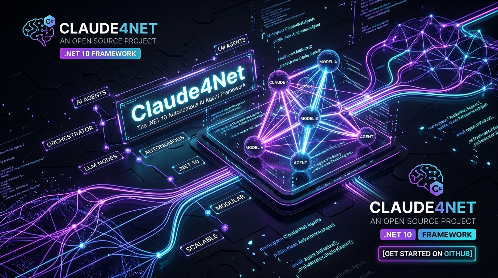
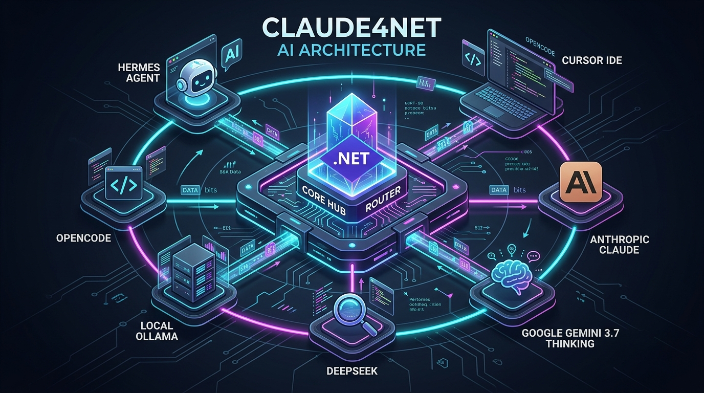
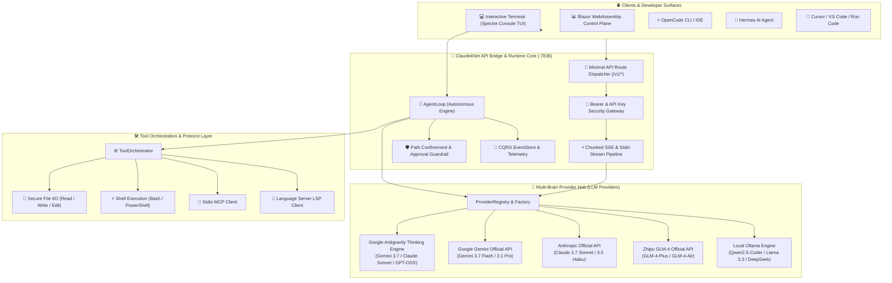
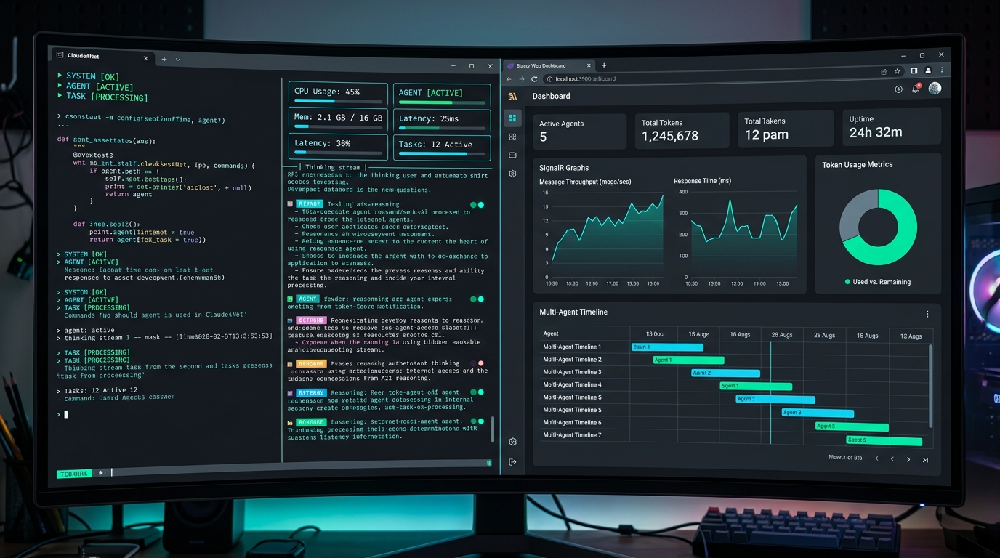

# ⚡ Claude4Net

<p align="center">
  
</p>

<p align="center">
  <strong>Next-Generation .NET 10 Autonomous AI Agent Runtime & Multi-Brain Orchestration Platform</strong><br>
  <em>Deterministic Tool Execution • Zero Data Egress Safety Guardrails • Universal OpenAI API Hub • Real-Time Blazor Control Plane</em>
</p>

<p align="center">
  <a href="https://dotnet.microsoft.com/download"></a>
  <a href="https://learn.microsoft.com/en-us/dotnet/csharp/"></a>
  <a href="LICENSE"></a>
  <a href="https://github.com/Terkiss/Claude4Net/actions"></a>
  <a href="https://modelcontextprotocol.io/"></a>
  <a href="https://openai.com/"></a>
</p>

<p align="center">
  <a href="README.md">🇺🇸 <strong>English</strong></a> •
  <a href="README.ko.md">🇰🇷 <strong>한국어</strong></a> •
  <a href="README.ja.md">🇯🇵 <strong>日本語</strong></a>
</p>

---

## 📖 Overview

**Claude4Net** is an enterprise-grade, high-performance open-source AI agent runtime and **Universal Multi-Brain Orchestrator** built on **.NET 10** and **C# 13**.

From 100% offline local LLMs to top-tier cloud reasoning models (Gemini 3.7 Thinking, Claude Sonnet Thinking), Claude4Net bridges intelligence with local execution environments through an event-sourced CQRS architecture, defensive path-confinement sandboxes, native Stdio Model Context Protocol (MCP), a real-time Blazor WebAssembly dashboard, and a built-in **OpenAI-Compatible API Server** for **OpenCode, Hermes, Cursor, and Roo Code**.

> [!TIP]
> **100% Air-Gapped & Zero Data Egress**: Claude4Net pairs seamlessly with local **Ollama** models out of the box, providing a private, secure developer experience in completely disconnected environments.

---

## ✨ Key Highlights

| Highlight | Description | Core Value |
| :--- | :--- | :--- |
| 🌐 **Universal OpenAI API Bridge** | Standard OpenAI REST endpoints (`:7836`) for OpenCode, Hermes, Cursor, Roo Code | Harness Antigravity Thinking models in any IDE |
| 🧠 **Multi-Provider Matrix** | Claude, Gemini 3.7 Native, GLM-4, Ollama, Antigravity CLI, OpenAI-compatible | Instant hot-swapping via `/provider` command |
| 🎯 **Autonomous Goal Loop** | Goal-driven autonomous execution loop (`!goal`) with adaptive remediation | Unattended multi-step development & automated verification |
| 🛡️ **Defensive Guardrails** | Strict path confinement, destructive command interceptors, idempotent approvals | Enterprise data integrity & zero accidental data loss |
| 🔌 **Native Protocols** | Stdio MCP (Model Context Protocol) & LSP (Language Server Protocol) | Standardized tool ecosystem & rich code intelligence |
| 📊 **Real-Time Blazor Control Plane** | ASP.NET Core & Blazor WebAssembly dashboard with live SignalR streaming | Real-time token analytics, agent timelines & session replay |
| 🩺 **Self-Healing Loop** | Error classifier, semantic reflection capture, and test-driven auto-patching | Autonomous diagnostic & automated test-driven fix loop |
| 💾 **Event Sourcing Persistence** | Full trajectory persistence, snapshot rewind, and replay capabilities | 100% deterministic reproducibility & security audit trails |

---

## 🏛️ System Architecture

<p align="center">
  
</p>



---

## 🖥️ UI & Dashboard Observability

<p align="center">
  
</p>

Claude4Net delivers both a modern terminal user interface and an interactive web control plane:
* **Rich Spectre.Console TUI**: Syntax highlighting, live status cards, and real-time reasoning thinking streams.
* **Blazor Web Dashboard (`:5000`)**: Live SignalR metric graphs, active agent monitors, token telemetry, and interactive timeline event replay.

---

## 🤖 Supported LLM Providers

Claude4Net follows a strict **1 Class = 1 Dedicated Provider** architecture with dedicated `ILLMProvider` implementations.

| Provider Identifier | Lineup (2026 Releases) | Protocol / Transport | Highlights |
| :--- | :--- | :--- | :--- |
| **`antigravity/*`** | `gemini-3.7-flash-high`, `claude-sonnet-4-6-thinking`, `gpt-oss-120b-high` | Subprocess Stdin IPC Stream | Deep Thinking, unlimited context window, harness skill sync |
| **`google/*`** | `gemini-3.7-flash`, `gemini-3.6-flash`, `gemini-3.5-flash`, `gemini-3.1-pro` | Direct Google REST API (SSE) | Ultra-fast multimodal inference, Google native grounding |
| **`anthropic/*`** | `claude-3-7-sonnet`, `claude-3-5-sonnet`, `claude-3-5-haiku` | Direct Anthropic REST API | Extended Thinking, gold-standard tool calling, robust code generation |
| **`glm/*`** | `glm-4-plus`, `glm-4-flash`, `glm-4-air` | Zhipu Open REST API | High concurrency, multi-step reasoning, tool execution |
| **`ollama/*`** | `qwen2.5-coder`, `llama3.3`, `deepseek-r1` | Local Ollama REST API | 100% offline, local GPU acceleration, zero data egress |
| **`openai/*`** | Any compatible endpoint (DeepSeek, Groq, vLLM, LocalAI) | OpenAI Chat Completions REST | Universal compatibility, custom Base URLs |

---

## 🚀 Quick Start

### 1. Prerequisites
* [.NET 10 SDK](https://dotnet.microsoft.com/download) (Version 10.0 or later)
* (Optional) [Ollama](https://ollama.ai/) for offline local execution

### 2. Build & Test
```bash
# 1. Clone the repository
git clone https://github.com/Terkiss/Claude4Net.git
cd Claude4Net

# 2. Build solution
dotnet build Claude4Net.slnx -c Release

# 3. Run full test suite (978 / 978 passed)
dotnet test Claude4Net.Tests/Claude4Net.Tests.csproj
```

---

## 💻 Running Modes

### Mode A: Interactive Pair Programmer CLI
```bash
dotnet run --project Claude4Net.Cli
```

### Mode B: Launch with Blazor Web Dashboard
```bash
dotnet run --project Claude4Net.Cli -- --dashboard
```
> 🌐 Access the dashboard at `http://localhost:5000`

### Mode C: Launch OpenAI-Compatible API Server
```bash
dotnet run --project Claude4Net.Cli -- --api on --api-port 7836 --api-key c4n-sk-mykey
```
> Or interactively inside CLI REPL: `/api on 7836 c4n-sk-mykey --api-timeout 1800`

---

## 🔌 External Client Integration (OpenCode & Hermes)

Claude4Net serves standard OpenAI REST API endpoints (`http://127.0.0.1:7836/v1`) ready for external AI agent integration.

### 1. OpenCode (`opencode.json`) Configuration
Add the following configuration to your project root or `~/.config/opencode/opencode.json`:

```json
{
  "$schema": "https://opencode.ai/config.json",
  "provider": {
    "claude4net": {
      "npm": "@ai-sdk/openai-compatible",
      "name": "Claude4Net AI Hub",
      "options": {
        "baseURL": "http://127.0.0.1:7836/v1",
        "apiKey": "c4n-sk-mykey"
      },
      "models": {
        "antigravity/gemini-3.7-flash-high": {
          "name": "Gemini 3.7 Flash (High Thinking)"
        },
        "antigravity/claude-sonnet-4-6-thinking": {
          "name": "Claude Sonnet 4.6 (Thinking)"
        },
        "antigravity/gpt-oss-120b-high": {
          "name": "GPT-OSS 120B (High)"
        },
        "google/gemini-3.7-flash": {
          "name": "Google Gemini 3.7 Flash (Official)"
        }
      }
    }
  }
}
```

### 2. Hermes & Cursor / Roo Code Settings
* **API Base URL**: `http://127.0.0.1:7836/v1`
* **API Key**: `c4n-sk-mykey`
* **Model ID**: `antigravity/gemini-3.7-flash-high` or `antigravity/claude-sonnet-4-6-thinking`

---

## ⌨️ Command Cheat Sheet

Claude4Net provides intuitive Slash (`/`) and Bang (`!`) commands:

### ⚙️ System & Session Control
| Command | Description | Example |
| :--- | :--- | :--- |
| `/help` | Display command reference and usage guide | `/help` |
| `/provider` | Switch active LLM provider seamlessly | `/provider Gemini` |
| `/model` | Select active model under the current provider | `/model gemini-3.7-flash` |
| `/api` | Start, stop, or check API server status | `/api on 7836 mykey --api-timeout 1800` |
| `/dashboard` | Launch Blazor Web Dashboard on-demand | `/dashboard` |
| `/status` | Diagnose system resources, uptime, and memory | `/status` |
| `/clear` | Clear terminal console screen | `/clear` |

### 🎯 Agent & Autonomous Tasks
| Command | Description | Example |
| :--- | :--- | :--- |
| `!goal <task>` | Start autonomous goal loop with plan & test gates | `!goal Implement and test REST endpoint` |
| `!login <provider> <key>` | Save provider API key securely in keystore | `!login gemini AIzaSy...` |
| `!skills` | List discovered agent skills | `!skills` |
| `!yolo` | Toggle YOLO approval bypass mode | `!yolo` |

---

## 🧪 Quality Assurance & Benchmarks

Claude4Net is built under strict enterprise quality verification:

* **Build Integrity**: .NET 10 Release build with `0 Errors, 0 Warnings`.
* **Unit & Integration Suite**: **978 / 978 Tests 100% Pass** (0 regressions).
* **Black-Box SDK Verification**: Full compliance verified with official OpenAI .NET, Python, and Node.js SDKs.
* **Security Guardrails**: Strict path-traversal prevention, SSRF filtering, and plaintext egress blocks.

---

## 📄 License

This project is licensed under the [MIT License](LICENSE).
