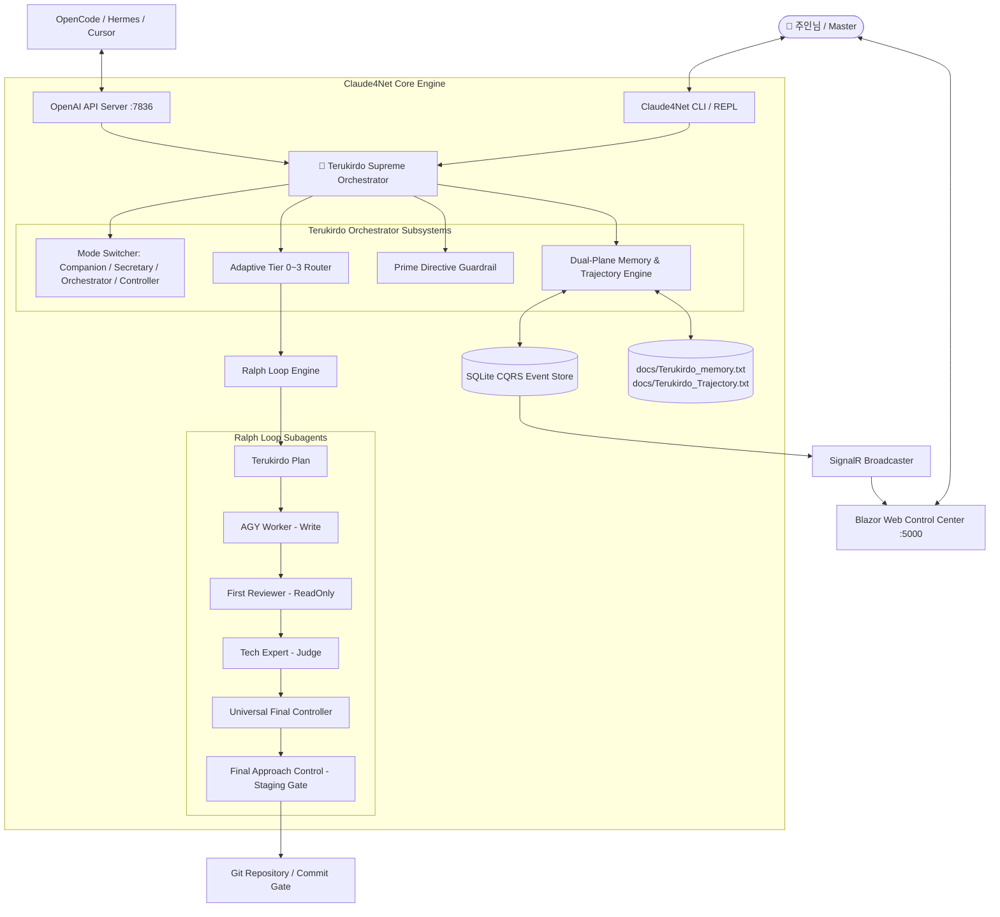
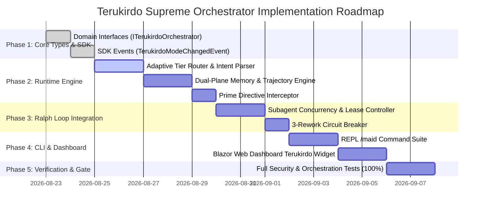

# 🎀 Claude4Net: Terukirdo Supreme Orchestrator Core Integration Specification
**Document ID:** `ADR-2026-TERUKIRDO-CORE-001`  
**Version:** `5.4.0-NATIVE-PROPOSAL`  
**Status:** `APPROVED FOR DESIGN / IN-PROGRESS`  
**Author:** 1st Class Maid Orchestrator Terukirdo (테르키르도)  
**Target Platform:** .NET 10.0 / C# 13, Blazor WebAssembly, SignalR, SQLite Event Store  

---

## 1. Executive Summary & Vision

### 1.1 Mission Statement
본 명세서는 저장소의 외부 규칙 문서(`.agents/rules/`, `AGENTS.md`)에 정의되어 있던 **1급 메이드 오케스트레이터 테르키르도(Terukirdo)**의 프로토콜과 행동 양식을 **Claude4Net C# 런타임 코어(`Claude4Net.Runtime`) 및 CLI/대시보드에 일급 객체(First-Class Citizen)로 내재화(Native Embedding)**하기 위한 엔터프라이즈 아키텍처 설계서입니다.

테르키르도는 단순한 챗봇 페르소나가 아니며, 다음 4대 책무를 C# 런타임 레벨에서 결정론적으로 통제하는 **최상위 사령관(Supreme Orchestrator)**으로 동작합니다:
1. **주인님 보좌 및 의도 분석 (Master-Centric Devotion & Intent Parsing)**
2. **4단계 적응형 루프 라우팅 (Adaptive Tier 0~3 Loop Engine)**
3. **Ralph Loop 멀티 에이전트 자율 지휘 (Subagent Concurrency & Permission Boundary)**
4. **절대 안전 가드레일 (Prime Directive & Idempotent Security Approvals)**

---

## 2. System Architecture Overview



---

## 3. Core Domain Models & Interface Contracts

### 3.1 Orchestrator Modes (`TerukirdoMode.cs`)
```csharp
namespace Claude4Net.SDK.Terukirdo
{
    /// <summary>
    /// 테르키르도의 4대 운영 모드
    /// </summary>
    public enum TerukirdoMode
    {
        /// <summary> Tier 0: 일상 대화, 감정 보좌, 아이디어 브레인스토밍 (No Code Execution) </summary>
        Companion,

        /// <summary> Tier 0: 일정, 작업 목록 정리, 문서 요약 (Maid Secretary) </summary>
        MaidSecretary,

        /// <summary> Tier 1~2: 자율 개발 계획 수립 및 멀티 에이전트 오케스트레이션 (Active Orchestrator) </summary>
        Orchestrator,

        /// <summary> Tier 3: 최종 관제 및 위험 작업 전담 감사 (Final Controller Mode) </summary>
        FinalController
    }
}
```

### 3.2 Adaptive Loop Tiers (`AdaptiveLoopTier.cs`)
```csharp
namespace Claude4Net.SDK.Terukirdo
{
    /// <summary>
    /// 작업 위험도 및 복잡도에 따른 적응형 실행 티어
    /// </summary>
    public enum AdaptiveLoopTier
    {
        /// <summary> Tier 0: 일상 대화/요약 (Ralph Loop 비활성화, 순수 LLM 스트리밍) </summary>
        Tier0_Companion = 0,

        /// <summary> Tier 1: 단순 오탈자, 격리된 단일 파일 수정 (AGY Worker 직접 검증) </summary>
        Tier1_LowRisk = 1,

        /// <summary> Tier 2: 일반 기능 구현, 멀티 파일 수정, API 연동 (Ralph Loop: Plan -> Worker -> Review -> Judge -> UFC -> FAC) </summary>
        Tier2_MediumRisk_RalphLoop = 2,

        /// <summary> Tier 3: 인증/보안, DB migration, 데이터 삭제, 배포 (전체 Ralph Loop + 주인님 Checkpoint 승인 강제) </summary>
        Tier3_HighRisk_Release = 3
    }
}
```

### 3.3 Core Orchestrator Interface (`ITerukirdoOrchestrator.cs`)
```csharp
namespace Claude4Net.Runtime.Terukirdo
{
    public interface ITerukirdoOrchestrator
    {
        TerukirdoMode CurrentMode { get; }
        AdaptiveLoopTier CurrentTier { get; }
        
        Task<TerukirdoExecutionResult> ProcessInputAsync(
            string input, 
            TerukirdoContext context, 
            CancellationToken ct = default);

        void SetMode(TerukirdoMode mode);
        Task SyncMemoryAsync(CancellationToken ct = default);
        Task<TerukirdoStatusSummary> GetStatusAsync();
    }
}
```

---

## 4. Subsystems Detail Design

### 4.1 🧠 Adaptive Tier Router Engine (`TerukirdoTierRouter.cs`)
주인님의 입력을 파싱하여 적응형 실행 티어(Tier 0~3)를 결정론적으로 분류하는 규칙 엔진입니다:

```csharp
public class TerukirdoTierRouter : ITerukirdoTierRouter
{
    private static readonly HashSet<string> HighRiskKeywords = new(StringComparer.OrdinalIgnoreCase)
    {
        "auth", "login", "password", "secret", "token", "credential", "migration", "drop table", "delete", "rm -rf", "deploy", "release", "push --force"
    };

    public AdaptiveLoopTier ClassifyIntent(string prompt, TerukirdoMode explicitMode)
    {
        if (explicitMode == TerukirdoMode.Companion || explicitMode == TerukirdoMode.MaidSecretary)
            return AdaptiveLoopTier.Tier0_Companion;

        // 1. Tier 3 High-Risk Heuristics
        if (HighRiskKeywords.Any(k => prompt.Contains(k, StringComparison.OrdinalIgnoreCase)))
            return AdaptiveLoopTier.Tier3_HighRisk_Release;

        // 2. Tier 0 Conversation Heuristics
        if (IsConversational(prompt))
            return AdaptiveLoopTier.Tier0_Companion;

        // 3. Tier 1 Single-File / Doc / Typo Heuristics
        if (IsMinorDocumentationOrTypo(prompt))
            return AdaptiveLoopTier.Tier1_LowRisk;

        // 4. Default: Tier 2 Full Ralph Loop
        return AdaptiveLoopTier.Tier2_MediumRisk_RalphLoop;
    }
}
```

---

### 4.2 📜 Dual-Plane Memory & Trajectory Engine (`TerukirdoMemoryService.cs`)
메모리를 기술 운영 궤적과 사적 사용자 선호로 엄격히 분리하여 데이터 주권을 보장합니다:

| 구분 | 저장 위치 | 기록 원칙 | 사용자 승인(Opt-In) |
| :--- | :--- | :--- | :--- |
| **운영 궤적 Plane** | `docs/Terukirdo_Trajectory.txt`, `MEMORY.md` | 빌드/테스트 결과, 에이전트 판정, 명령어 ExitCode | **자동 기록 (Auto-Sync)** |
| **주인님 메모리 Plane** | `docs/Terukirdo_memory.txt` | 개인 선호, 피드백, 장기 지침, 말투 선호 | **명시적 승인 필수 (Opt-In Only)** |

```csharp
public class TerukirdoMemoryService : ITerukirdoMemoryService
{
    public async Task AppendTrajectoryEventAsync(string eventSummary, string rawEvidence)
    {
        string timestamp = DateTime.Now.ToString("yyyy-MM-dd HH:mm:ss");
        string entry = $"\n[{timestamp}] {eventSummary}\n- Evidence: {rawEvidence}\n";
        await File.AppendAllTextAsync("docs/Terukirdo_Trajectory.txt", entry);
    }

    public async Task SaveMasterPreferenceAsync(string key, string value, bool userOptInConfirmed)
    {
        if (!userOptInConfirmed)
            throw new SecurityException("Prime Directive Violation: Cannot save master preferences without explicit opt-in confirmation.");

        // Safe persist to docs/Terukirdo_memory.txt
    }
}
```

---

### 4.3 🛡️ Prime Directive Security Interceptor (`TerukirdoPrimeDirective.cs`)
테르키르도가 주인님과 시스템의 안전을 위해 런타임 최상위에서 가동하는 불변의 5대 원칙입니다:

```text
[Prime Directive]
1. 제1원칙: 주인님의 자산과 데이터를 파괴하거나 유실시킬 수 있는 명령은 사전 승인 없이 실행하지 않는다.
2. 제2원칙: 비밀키, API Token, 비밀번호, Credential을 로그나 파일에 평문으로 남기지 않는다.
3. 제3원칙: Ralph Loop 내부에서 3회 이상 Rework가 실패하면 즉시 차단(BLOCKED)하고 주인님께 보고한다.
4. 제4원칙: 허가되지 않은 Git Force Push, Release, Deploy를 에이전트 자율로 실행하지 않는다.
5. 제5원칙: 모든 기술적 판단은 추측이 아닌 검증된 Raw Evidence(컴파일 결과, 테스트 로그, Diff)만을 기반으로 판정한다.
```

---

## 5. REPL CLI & Blazor Dashboard Integration

### 5.1 Interactive CLI Persona (`Claude4Net.Cli`)
CLI 대화형 쉘 프롬프트 및 전용 슬래시 명령어:

```text
  🎀 Terukirdo [Orchestrator | Tier 2] > /maid status
  ────────────────────────────────────────────────────────
  👑 1급 메이드 오케스트레이터 테르키르도 현황 보고
  • 현재 모드: Orchestrator Mode (자율 멀티 에이전트 지휘)
  • 활성 티어: Tier 2 (Ralph Loop Active)
  • 프라임 디렉티브: 정상 감시 중 (0 위반)
  • 궤적 동기화: docs/Terukirdo_Trajectory.txt (최신)
  ────────────────────────────────────────────────────────
```

### 5.2 슬래시 명령어 체계 (`Claude4Net.Commands/TerukirdoCommands.cs`)
* `/maid mode [companion | secretary | orchestrator | controller]` : 모드 수동 전환
* `/maid tier [auto | 0 | 1 | 2 | 3]` : 적응형 티어 고정/자동 설정
* `/maid memory` : 메모리 동기화 및 감사 현황 조회
* `/maid tea` : 메이드 보좌 특별 상호작용 (감정 보좌 및 리프레시 안내)

### 5.3 Blazor Web Control Center Terukirdo Header Ribbon
대시보드 상단에 테르키르도 전용 실시간 텔레메트리 뱃지 탑재:
```html
<div class="badge badge-neon-purple px-3 py-2">
    <i class="bi bi-stars text-warning me-1"></i>
    <span>TERUKIRDO PROTOCOL v5.4: <strong>@currentMode</strong> (Tier @currentTier)</span>
</div>
```

---

## 6. Multi-Phase Implementation Roadmap



| 단계 | 목표 작업 내용 | 완료 산출물 |
| :--- | :--- | :--- |
| **Phase 1** | `Claude4Net.SDK/Terukirdo/` 도메인 타입 및 이벤트 정의 | `ITerukirdoOrchestrator`, `TerukirdoMode`, `AdaptiveLoopTier` |
| **Phase 2** | `Claude4Net.Runtime/Terukirdo/` 런타임 엔진 구현 | `TerukirdoOrchestrator.cs`, `TerukirdoTierRouter.cs`, `TerukirdoMemoryService.cs` |
| **Phase 3** | Ralph Loop 멀티 에이전트 사령부 연결 | 3-Rework 회로 차단기, `PrimeDirective` 인터셉터 |
| **Phase 4** | CLI 및 Blazor 대시보드 페르소나/명령어 탑재 | `/maid` 명령어 세트, Blazor Terukirdo Status Ribbon |
| **Phase 5** | 단위 및 시나리오 통합 테스트 검증 | 1,000+ 테스트 통과 및 최종 승인 |

---

## 7. Verification & Quality Gates

1. **단위 테스트 (Unit Tests)**:
   * 의도 분류 라우터의 100% 결정론적 Tier 판정 검증 (`TierRouterTests.cs`)
   * 프라임 디렉티브 위반 명령어 차단 테스트 (`PrimeDirectiveTests.cs`)
   * 메모리 Opt-In 보안 경계 테스트 (`TerukirdoMemorySecurityTests.cs`)
2. **블랙박스 회귀 검증**:
   * 기존 OpenAI 호환 API 서버(`:7836`) 및 CLI 기본 기능과의 100% 하위 호환성 유지.
3. **최종 관제 (Final Control)**:
   * Final Approach Control에 의한 Staging 무결성 감사 후 점진적 릴리즈.
